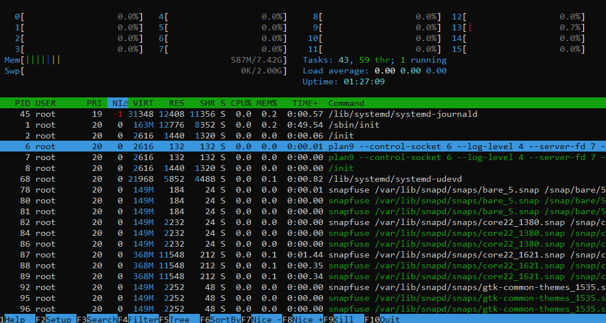
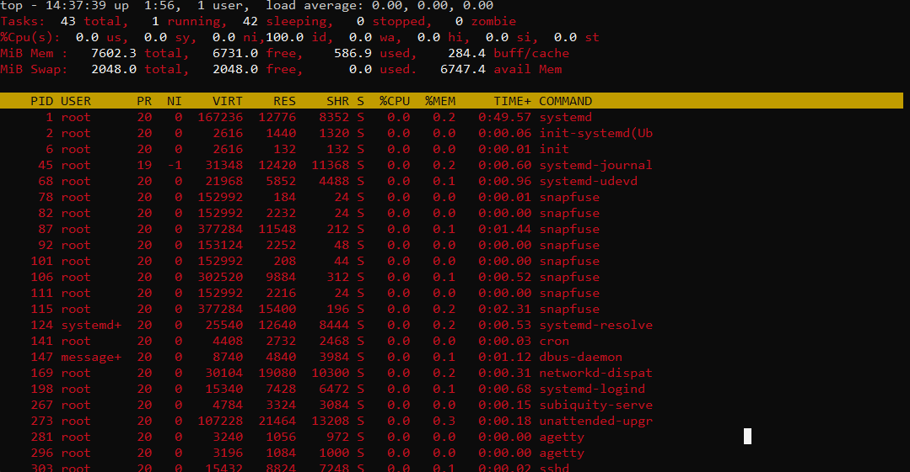
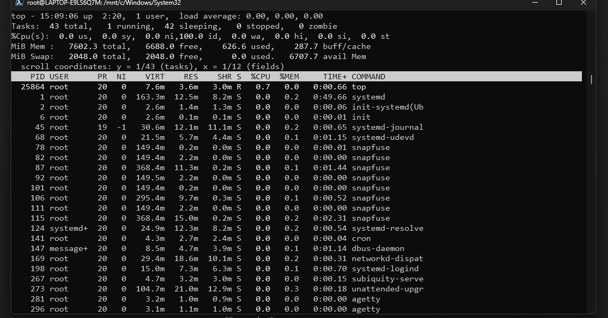
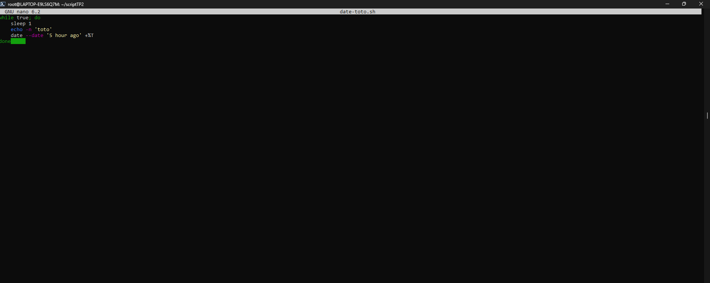
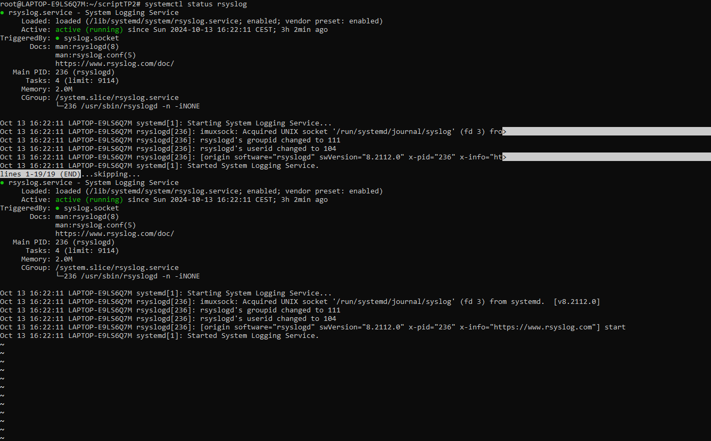

# [ LP LPW 2024 ] compte rendu TP2 UNIX :
DARRAS Loïc L3 PRO PROJET WEB ET MOBILE


# Présentation/Introduction du travail (avant la table des matières et les explications)


* Ici ce deuxième tp UNIX concene les services et les processus signaux.
* J'ai tout d'abord effectué une connexion ssh root, une authentification par clef (une génération de clefs, une connexion serveur, depuis la machine hôte) avec des explications sur la cybersécurié avec les attaques de type brute-force ssh et des méthodes pour lutter contre ceci
* Puis je me suis concentré sur les processus, sur l'arrèt de ces processus et enfin les tubes et le journal système rsyslog.
* Ce compte rendu est le résultat de la fusion des données issues de ma machine en cours et de ma machine personnelle

## Table des Matières


1. [Secure Shell : SSH](#i-secure-shell--ssh)
   - [1.1 Connexion SSH root et configuration](#11-connexion-ssh-root-et-configuration)
   - [1.2 Authentification par clé / Génération de clés](#12-authentification-par-clé--génération-de-clés)
   - [1.3 Authentification par clé / Connexion serveur](#13-authentification-par-clé--connexion-serveur)
   - [1.4 Authentification par clé depuis la machine hôte](#14-authentification-par-clé-depuis-la-machine-hôte)
   - [1.5 Sécurisation de l'accès SSH](#15-sécurisation-de-laccès-ssh)
2. [Processus](#ii--processus)
    - [2.1 Étude des processus UNIX](#21-exercice--etude-des-processus-unix)
      - [2.1.1 Affichage des processus](#211-affichage-des-processus)
      - [2.1.2 PPID et processus parent](#212-ppid-et-processus-parent)
      - [2.1.3 Commande `pstree`](#213-commande-pstree)
      - [2.1.4 Utilisation de la commande `top` et `htop`](#214-utilisation-de-la-commande-top-et-htop)
3. [Arrêt d'un processus](#iii-arrêt-dun-processus)
4. [Les tubes](#iv-les-tubes)
5. [Journal système rsyslog](#v-journal-système-rsyslog)
   


# I) Secure Shell : SSH

## 1.1 Connexion SSH root et configuration


 Comme le demande le tp, je me suis connecté en root et j'ai configuré le ssh . Pour cela j'ai utilisé les commandes **apt search** et **apt install** . (Ici ce sont des exmples fictifs avec WSL avec Windows car je n'ai pas enregisté ceci au moment des faits)


* apt install

```bash
No manual entry for sshd_config
root@LAPTOP-E9LS6Q7M:/mnt/c/Windows/System32# sudo apt install openssh-server
Reading package lists... Done
Building dependency tree... Done
Reading state information... Done
The following additional packages will be installed:
  libwrap0 ncurses-term openssh-sftp-server ssh-import-id
Suggested packages:
  molly-guard monkeysphere ssh-askpass
The following NEW packages will be installed:
  libwrap0 ncurses-term openssh-server openssh-sftp-server ssh-import-id
0 upgraded, 5 newly installed, 0 to remove and 0 not upgraded.
Need to get 799 kB of archives.
After this operation, 6157 kB of additional disk space will be used.
Do you want to continue? [Y/n] Y
Get:1 http://archive.ubuntu.com/ubuntu jammy-updates/main amd64 openssh-sftp-server amd64 1:8.9p1-3ubuntu0.10 [38.9 kB]
Get:2 http://archive.ubuntu.com/ubuntu jammy/main amd64 libwrap0 amd64 7.6.q-31build2 [47.9 kB]
Get:3 http://archive.ubuntu.com/ubuntu jammy-updates/main amd64 openssh-server amd64 1:8.9p1-3ubuntu0.10 [435 kB]
Get:4 http://archive.ubuntu.com/ubuntu jammy-updates/main amd64 ncurses-term all 6.3-2ubuntu0.1 [267 kB]
Get:5 http://archive.ubuntu.com/ubuntu jammy/main amd64 ssh-import-id all 5.11-0ubuntu1 [10.1 kB]
Fetched 799 kB in 2s (325 kB/s)
Preconfiguring packages ...
Selecting previously unselected package openssh-sftp-server.
(Reading database ... 26221 files and directories currently installed.)
Preparing to unpack .../openssh-sftp-server_1%3a8.9p1-3ubuntu0.10_amd64.deb ...
Unpacking openssh-sftp-server (1:8.9p1-3ubuntu0.10) ...
Selecting previously unselected package libwrap0:amd64.
Preparing to unpack .../libwrap0_7.6.q-31build2_amd64.deb ...
Unpacking libwrap0:amd64 (7.6.q-31build2) ...
Selecting previously unselected package openssh-server.
Preparing to unpack .../openssh-server_1%3a8.9p1-3ubuntu0.10_amd64.deb ...
Unpacking openssh-server (1:8.9p1-3ubuntu0.10) ...
Selecting previously unselected package ncurses-term.
Preparing to unpack .../ncurses-term_6.3-2ubuntu0.1_all.deb ...
Unpacking ncurses-term (6.3-2ubuntu0.1) ...
Selecting previously unselected package ssh-import-id.
Preparing to unpack .../ssh-import-id_5.11-0ubuntu1_all.deb ...
Unpacking ssh-import-id (5.11-0ubuntu1) ...
Setting up openssh-sftp-server (1:8.9p1-3ubuntu0.10) ...
Setting up ssh-import-id (5.11-0ubuntu1) ...
Setting up libwrap0:amd64 (7.6.q-31build2) ...
Setting up ncurses-term (6.3-2ubuntu0.1) ...
Setting up openssh-server (1:8.9p1-3ubuntu0.10) ...

Creating config file /etc/ssh/sshd_config with new version
Creating SSH2 RSA key; this may take some time ...
3072 SHA256:tm+znTuTeKjENfuVO1X4EuuIj7Xpg7CQvXvaqK+hS94 root@LAPTOP-E9LS6Q7M (RSA)
Creating SSH2 ECDSA key; this may take some time ...
256 SHA256:jIVcxJ/2FU6SvdAzagDmosVj4Iai+/qobohLNsDM3KQ root@LAPTOP-E9LS6Q7M (ECDSA)
Creating SSH2 ED25519 key; this may take some time ...
256 SHA256:ne35cQ2UeZYEpLLCHZDyDqjP8xzLE4MavncH+3tbwEA root@LAPTOP-E9LS6Q7M (ED25519)
Created symlink /etc/systemd/system/sshd.service → /lib/systemd/system/ssh.service.
Created symlink /etc/systemd/system/multi-user.target.wants/ssh.service → /lib/systemd/system/ssh.service.
rescue-ssh.target is a disabled or a static unit, not starting it.
ssh.socket is a disabled or a static unit, not starting it.
Processing triggers for ufw (0.36.1-4ubuntu0.1) ...
Processing triggers for man-db (2.10.2-1) ...
Processing triggers for libc-bin (2.35-0ubuntu3.8) ...
root@LAPTOP-E9LS6Q7M:/mnt/c/Windows/System32#
```


* apt search 


```bash
root@LAPTOP-E9LS6Q7M:/mnt/c/Windows/System32# apt search openssh
Sorting... Done
Full Text Search... Done
agent-transfer/jammy 0.43-3.1 amd64
  copy a secret key from GnuPG's gpg-agent to OpenSSH's ssh-agent

backuppc/jammy 4.4.0-5ubuntu2 amd64
  high-performance, enterprise-grade system for backing up PCs

cme/jammy 1.037-1 all
  Check or edit configuration data with Config::Model

connect-proxy/jammy 1.105-1.2 amd64
  Establish TCP connection using SOCKS4/5 or HTTP tunnel

crypto-policies/jammy 20190816git-1 all
  unify the crypto policies used by different applications and libraries

debian-goodies/jammy-updates,jammy-security 0.87ubuntu1.1 all
  Small toolbox-style utilities for Debian systems

diffoscope/jammy 205 all
  in-depth visual diff tool for files, archives and directories

diffoscope-minimal/jammy 205 all
  in-depth visual diff tool for files, archives and directories (minimal package)

fwknop-apparmor-profile/jammy 2.6.10-13build1 all
  FireWall KNock OPerator - Apparmor profile

fwknop-client/jammy 2.6.10-13build1 amd64
  FireWall KNock OPerator client side - C version

fwknop-server/jammy 2.6.10-13build1 amd64
  FireWall KNock OPerator server side - C version

gesftpserver/jammy 1~ds-3 amd64
  sftp server submodule for OpenSSH

golang-github-calmh-randomart-dev/jammy 1.1.0-2 all
  generates OpenSSH-style randomart (Go library)

golang-github-mikesmitty-edkey-dev/jammy 0.0~git20170222.3356ea4-1 all
  generates ED25519 private keys in the OpenSSH private key format (Go library)

keychain/jammy 2.8.5-2 all
  key manager for OpenSSH

kwalletcli/jammy 3.03-1 amd64
  command line interface to the KDE Wallet

lacme/jammy 0.8.0-2 all
  ACME client written with process isolation and minimal privileges in mind

lacme-accountd/jammy 0.8.0-2 all
  lacme account key manager

libconfig-model-cursesui-perl/jammy 1.107-1 all
  curses interface to edit config data through Config::Model

libconfig-model-openssh-perl/jammy 2.8.7.1-1 all
  configuration editor for OpenSsh

libconfig-model-tkui-perl/jammy 1.375-1 all
  Tk GUI to edit config data through Config::Model

libfko-doc/jammy 2.6.10-13build1 all
  FireWall KNock OPerator - documentation

libfko-perl/jammy 2.6.10-13build1 amd64
  FireWall KNock OPerator - Perl module

libfko3/jammy 2.6.10-13build1 amd64
  FireWall KNock OPerator - shared library

libfko3-dev/jammy 2.6.10-13build1 amd64
  FireWall KNock OPerator - development library

libjsch-agent-proxy-java/jammy 0.0.9-1 all
  Proxy to ssh-agent and Pageant in Java

libnet-openssh-compat-perl/jammy 0.09-1 all
  collection of compatibility modules for Net::OpenSSH

libnet-openssh-parallel-perl/jammy 0.12-1.1 all
  run SSH jobs in parallel

libnet-openssh-perl/jammy 0.80-1 all
  Perl SSH client package implemented on top of OpenSSH

libnet-sftp-foreign-perl/jammy 1.93+dfsg-1 all
  client for the Secure File Transfer Protocol

libnet-sftp-sftpserver-perl/jammy 1.1.0-6 all
  Secure File Transfer Protocol Server

libtrilead-putty-extension-java/jammy 1.2-2 all
  PuTTY key support for Trilead SSH2 library

login-duo/jammy 1.11.3-1build1 amd64
  login wrapper for Duo Security two-factor authentication

lxqt-openssh-askpass/jammy 0.17.0-0ubuntu1 amd64
  OpenSSH user/password GUI dialog for LXQt

lxqt-openssh-askpass-l10n/jammy 0.17.0-0ubuntu1 all
  Language package for lxqt-openssh-askpass

monkeysphere/jammy 0.43-3.1 all
  leverage the OpenPGP web of trust for SSH and TLS authentication

mysecureshell/jammy 2.0-2build1 amd64
  SFTP Server with ACL

node-sshpk/jammy 1.16.1+dfsg1-1 all
  library for finding and using SSH public keys

openssh-client/jammy-updates,jammy-security,now 1:8.9p1-3ubuntu0.10 amd64 [installed,automatic]
  secure shell (SSH) client, for secure access to remote machines

openssh-client-ssh1/jammy 1:7.5p1-13 amd64
  secure shell (SSH) client for legacy SSH1 protocol

openssh-known-hosts/jammy 0.6.2-1.1 all
  download, filter and merge known_hosts for OpenSSH

openssh-server/jammy-updates,jammy-security,now 1:8.9p1-3ubuntu0.10 amd64 [installed]
  secure shell (SSH) server, for secure access from remote machines

openssh-sftp-server/jammy-updates,jammy-security,now 1:8.9p1-3ubuntu0.10 amd64 [installed,automatic]
  secure shell (SSH) sftp server module, for SFTP access from remote machines

openssh-tests/jammy-updates,jammy-security 1:8.9p1-3ubuntu0.10 amd64
  OpenSSH regression tests

putty-tools/jammy 0.76-2 amd64
  command-line tools for SSH, SCP, and SFTP

python3-asyncssh/jammy 2.5.0-1 all
  asyncio-based client and server implementation of SSHv2 protocol

python3-scp/jammy 0.13.0-2 all
  scp module for paramiko (Python 3)

python3-setproctitle/jammy 1.2.2-2build1 amd64
  Setproctitle implementation for Python 3

python3-sshpubkeys/jammy 3.1.0-2.1 all
  SSH public key parser - Python 3

secpanel/jammy 1:0.6.1-3 all
  graphical user interface for SSH and SCP

ssh/jammy-updates,jammy-security 1:8.9p1-3ubuntu0.10 all
  secure shell client and server (metapackage)

ssh-askpass-gnome/jammy-updates,jammy-security 1:8.9p1-3ubuntu0.10 amd64
  interactive X program to prompt users for a passphrase for ssh-add

ssh-audit/jammy 2.5.0-1 all
  tool for ssh server auditing

sshpass/jammy 1.09-1 amd64
  Non-interactive ssh password authentication

```


* J'ai ensuite utilisé le **man sshd_config** dont voici le résultat : 

```bash
SSHD_CONFIG(5)                                 BSD File Formats Manual                                SSHD_CONFIG(5)

NAME
     sshd_config — OpenSSH daemon configuration file

DESCRIPTION
     sshd(8) reads configuration data from /etc/ssh/sshd_config (or the file specified with -f on the command line).
     The file contains keyword-argument pairs, one per line.  For each keyword, the first obtained value will be
     used.  Lines starting with ‘#’ and empty lines are interpreted as comments.  Arguments may optionally be en‐
     closed in double quotes (") in order to represent arguments containing spaces.

     Note that the Debian openssh-server package sets several options as standard in /etc/ssh/sshd_config which are
     not the default in sshd(8):

           •   Include /etc/ssh/sshd_config.d/*.conf
           •   KbdInteractiveAuthentication no
           •   X11Forwarding yes
           •   PrintMotd no
           •   AcceptEnv LANG LC_*
           •   Subsystem sftp /usr/lib/openssh/sftp-server
           •   UsePAM yes

     /etc/ssh/sshd_config.d/*.conf files are included at the start of the configuration file, so options set there
     will override those in /etc/ssh/sshd_config.

     The possible keywords and their meanings are as follows (note that keywords are case-insensitive and arguments
     are case-sensitive):

     AcceptEnv
 Manual page sshd_config(5) line 1 (press h for help or q to quit)

```


## 1.2 Authentification par clé / Génération de clés


 J'ai créé  une clef d’authentification pour me connecter directement a mon serveur Linux.:

```bash
1013781@ppti-24-308-17:~$ ssh-keygen
Generating public/private ed25519 key pair.
Enter file in which to save the key (/users/Etu1/1013781/.ssh/id_ed25519): /users/Etu1/1013781/.ssh/id_rsa
Enter passphrase (empty for no passphrase):
Enter same passphrase again:
Your identification has been saved in /users/Etu1/1013781/.ssh/id_rsa
Your public key has been saved in /users/Etu1/1013781/.ssh/id_rsa.pub
The key fingerprint is:
SHA256:EE4ER2qgZAv9DRyy7Ad8tVQWdjjXebgTfmH9k67JBG8 1013781@ppti-24-308-17
The key's randomart image is:
+--[ED25519 256]--+
|.+o.o=O.=o.. o . |
|++o+oB =o.. = + .|
|..=.+o+  o . = .o|
| . +. ..   .+ .o.|
|  . .   S   oo. .|
|   .         E . |
|            + o  |
|             +   |
|                 |
+----[SHA256]-----+

```


## 1.3 Authentification par clé / Connexion serveur

Ici j'ai copié la clé publique sur le serveur :

```bash 
ssh-copy-id root@10.20.0.188 
```

Je me suis connecté au serveur sans avoir besoin d'entrer de mot de passe avec l'aide de la commande suivante : 

```bash 
1013781@ppti-24-308-17:/users/nfs/Etu1/1013781$ ssh root@10.20.0.188
root@10.20.0.188's password:
Linux serveur-correction 6.1.0-12-amd64 #1 SMP PREEMPT_DYNAMIC Debian 6.1.52-1 (2023-09-07) x86_64

The programs included with the Debian GNU/Linux system are free software;
the exact distribution terms for each program are described in the
individual files in /usr/share/doc/*/copyright.

Debian GNU/Linux comes with ABSOLUTELY NO WARRANTY, to the extent
permitted by applicable law.
Last login: Wed Oct  9 15:38:10 2024
root@serveur-correction
```


J'ai bien généré une clé dans le dossser ".ssh" : 


```bash 
013781@ppti-24-308-17:~/.ssh$ ls -la
total 16
drwx------  2 1013781 1013781 4096 11 oct.  15:56 .
drwxr-xr-x 17 1013781 1013781 4096 11 oct.  14:04 ..
-rw-------  1 1013781 1013781  419 11 oct.  15:56 id_rsa
-rw-r--r--  1 1013781 1013781  104 11 oct.  15:56 id_rsa.pub
-rw-------  1 1013781 1013781    0 11 oct.  14:16 known_hosts
-rw-------  1 1013781 1013781    0 11 oct.  14:16 known_hosts.old
1013781@ppti-24-308-17:~/.ssh$ ssh-copy-id root@serveur-correction
/usr/bin/ssh-copy-id: INFO: attempting to log in with the new key(s), to filter out any that are already installed

/usr/bin/ssh-copy-id: ERROR: ssh: Could not resolve hostname serveur-correction: Name or service not known

1013781@ppti-24-308-17:~/.ssh$ ssh-copy-id root@10.20.0.188
The authenticity of host '10.20.0.188 (10.20.0.188)' can't be established.
ED25519 key fingerprint is SHA256:ZnqDicCb1/9DRN6O1faHyKbNW0S/OzwMwCumkD9mkXk.


```


## 1.4 Authentification par clé depuis la machine hôte

J'ai bien utilisé la commande **ssh -i maclef.pub root@ipserveur**


```bash 
1013781@ppti-24-308-17:~/.ssh$ ssh-copy-id -i id_rsa.pub root@10.20.0.188
/usr/bin/ssh-copy-id: INFO: Source of key(s) to be installed: "id_rsa.pub"
/usr/bin/ssh-copy-id: INFO: attempting to log in with the new key(s), to filter out any that are already installed

/usr/bin/ssh-copy-id: WARNING: All keys were skipped because they already exist on the remote system.
(if you think this is a mistake, you may want to use -f option)

```


## 1.5 Sécurisation de l'accès SSH
 
Source : Diamond Connect 

* Les attaques de type brute-force ssh sont des essaies (tentatives) de connexions SSH effectuant une succession d'essaies pour découvrir un couple utilisateur/mot de passe valide afin de prendre le contrôle de la machine .
* Il s'agit d'une attaque populaire et les machines victimes de celle-ci exposée sur Internet se verra attaquer en conséquence plusieurs fois par jour .
* La fréquence régulière de ces attaques a provoqué l'apparition de diverses méthodes de protection telle que :
    * l'utilisation d'un port non standard pour le serveur SSH. (Cela réduit la visibilité de votre service SSH aux attaquants, mais ne garantit pas une protection totale. C’est une solution simple et rapide qui augmente la sécurité sans effort significatif, particulièrement utile pour éviter les attaques opportunistes.)
    * l'utilisation d'outils comme **Fail2ban** qui analyse les journaux SSH pour trouver les adresses IP responsables de trop nombreux échecs de connexions et modifie la configuration du pare-feu pour bloquer les tentatives ultérieures. (Je l'ai choisi car cet outil analyse les journaux du serveur pour détecter les tentatives de connexion échouées répétées et bloque temporairement l’adresse IP de l’attaquant via le pare-feu. C'est donc une solution efficace pour automatiser la gestion des tentatives d’intrusion. C’est un bon complément à d'autres solutions comme la restriction d'accès par clé.)
* Encore d'autres méthodes  : 
    * Interdire les connexions SSH de l'utilisateur root à distance (selon it-connect.fr). En effet, il peut être risqué de laisser l'utilisateur rooy se **loguer** en SSH car cela peut ouvrir la porte à des brutes force qui donneront un accès direct au plus haut niveau de privilège de la machine. Il faut mettre dans ce cas **PermitRootLogin no** en décommentant et redémarrer le service SSH avec **service ssh restart** (Interdire les connexions SSH de root à distance réduit le risque d'attaques brute-force, car root est une cible privilégiée pour les pirates. Cela force l'utilisation de comptes utilisateurs standards avec sudo, ajoutant une couche de sécurité et de contrôle. Cette méthode limite aussi les erreurs critiques et encourage les meilleures pratiques en matière de gestion des privilèges administratifs.)
    * Limiter les accèes SSH par adresse IP.  Notamment avec TCP Wrapper. On peut par exemple refuser tous les accès dans le fichier **/etc/hosts.deny** : **sshd: ALL** et n'accepter dans le fichier /etc/hosts.allow que les connexions depuis des adresses IP validées : **sshd: 192.168.1.  221.10.140.10** (Je l'ai choisi car c’est une méthode très sécurisée, surtout dans les environnements où l’on peut prédéfinir les IP autorisées. Cela empêche toute tentative d'accès depuis des sources inconnues.)
    * On peut aussi sécuriser les connexions SSH par le parefeu. Un des meilleurs firewalls pour Linux est IPtables (associé à Netfilter) selon "https://www.alsacreations.com/tuto/lire/622-securite-firewall-iptables.html". Voici un script de configuration possible dans son cas.
         
         
   1) Utiliser la commande  **iptables -L -v**  pour lister les règles en place (3 chaînes : INPUT, FORWARD et OUTPUT).

   2) On va  créer un script qui sera lancé à chaque démarrage pour mettre en place des règles de base:

```bash 
vi /etc/init.d/firewall
```

  3) On active le filtrage et on redémarre, ou on  exécute **/etc/init.d/firewall** (L’utilisation d’un pare-feu est une méthode de base pour toute configuration serveur, et elle permet de protéger SSH contre des attaques en bloquant les adresses IP non autorisées. C’est une mesure de protection essentielle pour contrôler les connexions au serveur.)
      * Utiliser l'authentication à 2 facteurs (2FA) sur SSH (openclassroom) permet de réduire significativement les risques de compromission des comptes, pour ceci il faut **modifier le sshd_config et activer les méthodes d'authentication désirées.** ( Le 2FA est une solution incontournable pour les systèmes sensibles. Même si elle demande plus de gestion, elle apporte un niveau de sécurité bien supérieur aux méthodes traditionnelles.)
 


# II ) Processus 

## 2.1 .Exercice : Etude des processus UNIX


### 2.1.1 Affichage des processus


* Voici un exemple d'utilisation de la commande ps :


```bash 
This message is shown once a day. To disable it please create the
/root/.hushlogin file.
root@LAPTOP-E9LS6Q7M:/mnt/c/Windows/System32# ps
    PID TTY          TIME CMD
    420 pts/0    00:00:00 bash
    523 pts/0    00:00:00 ps
root@LAPTOP-E9LS6Q7M:/mnt/c/Windows/System32#
```

* Voici le résultat avec les informations demandées :

```bash 
root@LAPTOP-E9LS6Q7M:~/scriptTP2# ps -eo user,pid,%cpu,%mem,stat,start,time,command
USER         PID %CPU %MEM STAT  STARTED     TIME COMMAND
root           1  0.0  0.1 Ss   19:47:17 00:00:01 /sbin/init
root           2  0.0  0.0 Sl   19:47:17 00:00:00 /init
root           6  0.0  0.0 Sl   19:47:18 00:00:00 plan9 --control-socket 6 --log-level 4 --server-fd 7 --pipe-fd 9 --log-truncate
root          66  0.0  0.1 S<s  19:47:18 00:00:00 /lib/systemd/systemd-journald
root          89  0.0  0.0 Ss   19:47:19 00:00:01 /lib/systemd/systemd-udevd
root         102  0.0  0.0 Ssl  19:47:19 00:00:00 snapfuse /var/lib/snapd/snaps/bare_5.snap /snap/bare/5 -o ro,nodev,allow_other,suid
root         103  0.0  0.0 Ssl  19:47:19 00:00:00 snapfuse /var/lib/snapd/snaps/core22_1380.snap /snap/core22/1380 -o ro,nodev,allow_other,suid
root         104  0.0  0.1 Ssl  19:47:19 00:00:01 snapfuse /var/lib/snapd/snaps/core22_1621.snap /snap/core22/1621 -o ro,nodev,allow_other,suid
root         116  0.0  0.0 Ssl  19:47:19 00:00:00 snapfuse /var/lib/snapd/snaps/gtk-common-themes_1535.snap /snap/gtk-common-themes/1535 -o ro,nodev,allow_other,suid
root         123  0.0  0.0 Ssl  19:47:19 00:00:00 snapfuse /var/lib/snapd/snaps/snapd_20290.snap /snap/snapd/20290 -o ro,nodev,allow_other,suid
root         127  0.0  0.1 Ssl  19:47:19 00:00:00 snapfuse /var/lib/snapd/snaps/snapd_21759.snap /snap/snapd/21759 -o ro,nodev,allow_other,suid
root         133  0.0  0.0 Ssl  19:47:19 00:00:00 snapfuse /var/lib/snapd/snaps/ubuntu-desktop-installer_1276.snap /snap/ubuntu-desktop-installer/1276 -o ro,nodev,allow_other,suid
root         136  0.0  0.1 Ssl  19:47:19 00:00:02 snapfuse /var/lib/snapd/snaps/ubuntu-desktop-installer_1286.snap /snap/ubuntu-desktop-installer/1286 -o ro,nodev,allow_other,suid
systemd+     145  0.0  0.1 Ss   19:47:19 00:00:00 /lib/systemd/systemd-resolved
systemd+     146  0.0  0.0 Ssl  19:47:19 00:00:00 /lib/systemd/systemd-timesyncd
message+     230  0.0  0.0 Ss   19:47:19 00:00:00 @dbus-daemon --system --address=systemd: --nofork --nopidfile --systemd-activation --syslog-only
root         235  0.0  0.2 Ss   19:47:19 00:00:00 /usr/bin/python3 /usr/bin/networkd-dispatcher --run-startup-triggers
syslog       236  0.0  0.0 Ssl  19:47:19 00:00:00 /usr/sbin/rsyslogd -n -iNONE
root         241  0.0  0.5 Ssl  19:47:19 00:00:02 /usr/lib/snapd/snapd
root         242  0.0  0.0 Ss   19:47:19 00:00:00 /lib/systemd/systemd-logind
root         262  0.0  0.0 Ss   19:47:19 00:00:00 /bin/bash /snap/ubuntu-desktop-installer/1286/bin/subiquity-server
root         275  0.0  0.0 Ss+  19:47:19 00:00:00 /sbin/agetty -o -p -- \u --noclear --keep-baud console 115200,38400,9600 vt220
root         280  0.0  0.0 Ss+  19:47:19 00:00:00 /sbin/agetty -o -p -- \u --noclear tty1 linux
root         281  0.0  0.1 Ss   19:47:19 00:00:00 sshd: /usr/sbin/sshd -D [listener] 0 of 10-100 startups
root         311  0.0  0.2 Ssl  19:47:19 00:00:00 /usr/bin/python3 /usr/share/unattended-upgrades/unattended-upgrade-shutdown --wait-for-signal
root         323  0.0  1.1 Sl   19:47:19 00:00:06 /snap/ubuntu-desktop-installer/1286/usr/bin/python3.10 -m subiquity.cmd.server --use-os-prober --storage-version=2 --postinst-hooks-dir=/snap/ubuntu-desktop-installer/1286/etc/subiquity/p
postgres     338  0.0  0.3 Ss   19:47:19 00:00:00 /usr/lib/postgresql/14/bin/postgres -D /var/lib/postgresql/14/main -c config_file=/etc/postgresql/14/main/postgresql.conf
postgres     369  0.0  0.0 Ss   19:47:20 00:00:00 postgres: 14/main: checkpointer
postgres     370  0.0  0.0 Ss   19:47:20 00:00:00 postgres: 14/main: background writer
postgres     371  0.0  0.1 Ss   19:47:20 00:00:00 postgres: 14/main: walwriter
postgres     372  0.0  0.1 Ss   19:47:20 00:00:00 postgres: 14/main: autovacuum launcher
postgres     373  0.0  0.0 Ss   19:47:20 00:00:00 postgres: 14/main: stats collector
postgres     374  0.0  0.0 Ss   19:47:20 00:00:00 postgres: 14/main: logical replication launcher
root         438  0.0  0.0 Ss   19:47:23 00:00:00 /init
root         439  0.0  0.0 S    19:47:23 00:00:00 /init
root         444  0.0  0.0 Ss   19:47:23 00:00:00 -bash
root         445  0.0  0.0 Ss   19:47:23 00:00:00 /bin/login -f
root         499  0.0  0.1 Ss   19:47:24 00:00:00 /lib/systemd/systemd --user
root         500  0.0  0.0 S    19:47:24 00:00:00 (sd-pam)
root         505  0.0  0.0 S+   19:47:24 00:00:00 -bash
root        1783  0.0  0.0 Ss   21:32:38 00:00:00 /usr/sbin/cron -f -P
root        1873  0.0  0.0 R+   21:56:58 00:00:00 ps -eo user,pid,%cpu,%mem,stat,start,time,command
root@LAPTOP-E9LS6Q7M:~/scriptTP2#
```


* Voici donc des processus de ma machine : 
    * **/sbin/init (PID 1)** : Le processus d'initialisation du système. C'est le premier processus lancé par le noyau lors du démarrage.
   * **systemd-journald (PID 66)** : Un service qui gère les journaux du système.
   * **sshd (PID 281) :** Le serveur SSH qui permet les connexions à distance sécurisées.
**postgres (PID 338) :** Le processus principal du serveur de base de données PostgreSQL.

* Voici l'explication de l'information TIME :


```bash 
ime        TIME      Temps CPU cumulé, au format « [JJ-]HH:MM:SS » (alias cputime).
```


```bash 
E9LS6Q7M:/mnt/c/Windows/System32# top
top - 11:24:59 up 8 min,  1 user,  load average: 0.03, 0.04, 0.00
Tasks:  42 total,   1 running,  41 sleeping,   0 stopped,   0 zombie
%Cpu(s):  0.1 us,  0.1 sy,  0.0 ni, 99.7 id,  0.0 wa,  0.0 hi,  0.0 si,  0.0 st
MiB Mem :   7602.3 total,   6619.2 free,    572.7 used,    410.5 buff/cache
MiB Swap:   2048.0 total,   2048.0 free,      0.0 used.   6788.4 avail Mem

    PID USER      PR  NI    VIRT    RES    SHR S  %CPU  %MEM     TIME+ COMMAND
    312 root      20   0  154368  71104  17900 S   0.3   0.9   0:05.99 python3.10
      2 root      20   0    2616   1440   1320 S   0.0   0.0   0:00.01 init-systemd(Ub
      6 root      20   0    2616      4      0 S   0.0   0.0   0:00.00 init
     45 root      19  -1   31348  12108  11092 S   0.0   0.2   0:00.26 systemd-journal
     68 root      20   0   21968   5852   4488 S   0.0   0.1   0:00.38 systemd-udevd
     78 root      20   0  152992    184     24 S   0.0   0.0   0:00.00 snapfuse
     82 root      20   0  152992   2232     24 S   0.0   0.0   0:00.00 snapfuse
     87 root      20   0  377284  11216    212 S   0.0   0.1   0:01.09 snapfuse
     92 root      20   0  153124   2252     48 S   0.0   0.0   0:00.00 snapfuse
    101 root      20   0  152992    208     44 S   0.0   0.0   0:00.00 snapfuse
    106 root      20   0  302520   6828    312 S   0.0   0.1   0:00.24 snapfuse
    111 root      20   0  152992   2216     24 S   0.0   0.0   0:00.00 snapfuse
    115 root      20   0  302520  12844    196 S   0.0   0.2   0:02.16 snapfuse
    124 systemd+  20   0   25540  12640   8444 S   0.0   0.2   0:00.50 systemd-resolve
    141 root      20   0    4308   2704   2468 S   0.0   0.0   0:00.01 cron
    147 message+  20   0    8544   4584   3984 S   0.0   0.1   0:00.10 dbus-daemon
    169 root      20   0   30104  19080  10300 S   0.0   0.2   0:00.31 networkd-dispat
    170 syslog    20   0  222404   7088   4276 S   0.0   0.1   0:00.04 rsyslogd
    172 root      20   0 1984832  43396  18360 S   0.0   0.6   0:01.16 snapd
    198 root      20   0   15340   7428   6472 S   0.0   0.1   0:00.31 systemd-logind
    267 root      20   0    4784   3324   3084 S   0.0   0.0   0:00.15 subiquity-serve
    273 root      20   0  107228  21464  13208 S   0.0   0.3   0:00.18 unattended-upgr
    281 root      20   0    3240   1056    972 S   0.0   0.0   0:00.00 agetty 
```


* D'après les résultats de la commande top, le processus qui utilise le plus de CPU est effectivement python3.10, avec une utilisation de 0.3%. Voici un résumé :


```bash 
PID : 312
Utilisateur : root
Utilisation du CPU : 0.3%
Mémoire utilisée : 71 104 Ko
```

* Le premier processus lancée après le déemarrage du système :


```bash 
root@LAPTOP-E9LS6Q7M:/mnt/c/Windows/System32# ps -p 1
    PID TTY          TIME CMD
      1 ?        00:00:12 systemd
root@LAPTOP-E9LS6Q7M:/mnt/c/Windows/System32#

```

* Le premier processus lancé après le démarrage de mon système est **systemd**


* Heure 


```bash 
root@LAPTOP-E9LS6Q7M:/mnt/c/Windows/System32# who -b
         system boot  2024-10-13 11:16
root@LAPTOP-E9LS6Q7M:/mnt/c/Windows/System32#
```


* La sortie indique que mon système a démarré le 13 octobre 2024 à 11:16

Voici une autre commande : 

```bash 
root@LAPTOP-E9LS6Q7M:/mnt/c/Windows/System32# uptime
 11:39:06 up 23 min,  1 user,  load average: 0.06, 0.04, 0.00
root@LAPTOP-E9LS6Q7M:/mnt/c/Windows/System32#
```


* up 23 min : Cela indique que ma machine est en fonctionnement depuis 23 minutes.


```bash 
 root@LAPTOP-E9LS6Q7M:/mnt/c/Windows/System32# ps -e | wc -l
44
root@LAPTOP-E9LS6Q7M:/mnt/c/Windows/System32#
```

Il y a donc environ 44 processus actifs sur ma machine depuis son démarrage.


### 2.1.2 PPID et processus parent

Trouver une option de la commande ps permettant d’afficher le PPID d’un processus :

ps -ef


```bash 
UID          PID    PPID  C STIME TTY          TIME CMD
root           1       0  1 11:16 ?        00:00:29 /sbin/init
root           2       1  0 11:16 ?        00:00:00 /init
root           6       2  0 11:16 ?        00:00:00 plan9 --control-socket 6 --log-level 4 --server-fd 7 --pipe-fd 9 --l
root          45       1  0 11:16 ?        00:00:00 /lib/systemd/systemd-journald
root          68       1  0 11:16 ?        00:00:00 /lib/systemd/systemd-udevd
root          78       1  0 11:16 ?        00:00:00 snapfuse /var/lib/snapd/snaps/bare_5.snap /snap/bare/5 -o ro,nodev,a
root          82       1  0 11:16 ?        00:00:00 snapfuse /var/lib/snapd/snaps/core22_1380.snap /snap/core22/1380 -o
root          87       1  0 11:16 ?        00:00:01 snapfuse /var/lib/snapd/snaps/core22_1621.snap /snap/core22/1621 -o
root          92       1  0 11:16 ?        00:00:00 snapfuse /var/lib/snapd/snaps/gtk-common-themes_1535.snap /snap/gtk-
root         101       1  0 11:16 ?        00:00:00 snapfuse /var/lib/snapd/snaps/snapd_20290.snap /snap/snapd/20290 -o
root         106       1  0 11:16 ?        00:00:00 snapfuse /var/lib/snapd/snaps/snapd_21759.snap /snap/snapd/21759 -o
root         111       1  0 11:16 ?        00:00:00 snapfuse /var/lib/snapd/snaps/ubuntu-desktop-installer_1276.snap /sn
root         115       1  0 11:16 ?        00:00:02 snapfuse /var/lib/snapd/snaps/ubuntu-desktop-installer_1286.snap /sn
systemd+     124       1  0 11:16 ?        00:00:00 /lib/systemd/systemd-resolved
root         141       1  0 11:16 ?        00:00:00 /usr/sbin/cron -f -P
message+     147       1  0 11:16 ?        00:00:00 @dbus-daemon --system --address=systemd: --nofork --nopidfile --syst
root         169       1  0 11:16 ?        00:00:00 /usr/bin/python3 /usr/bin/networkd-dispatcher --run-startup-triggers
syslog       170       1  0 11:16 ?        00:00:00 /usr/sbin/rsyslogd -n -iNONE
root         172       1  0 11:16 ?        00:00:01 /usr/lib/snapd/snapd
root         198       1  0 11:16 ?        00:00:00 /lib/systemd/systemd-logind
root         267       1  0 11:16 ?        00:00:00 /bin/bash /snap/ubuntu-desktop-installer/1286/bin/subiquity-server
root         273       1  0 11:16 ?        00:00:00 /usr/bin/python3 /usr/share/unattended-upgrades/unattended-upgrade-s
root         281       1  0 11:16 hvc0     00:00:00 /sbin/agetty -o -p -- \u --noclear --keep-baud console 115200,38400,
root         296       1  0 11:16 tty1     00:00:00 /sbin/agetty -o -p -- \u --noclear tty1 linux
root         303       1  0 11:16 ?        00:00:00 sshd: /usr/sbin/sshd -D [listener] 0 of 10-100 startups
root         312     267  0 11:16 ?        00:00:08 /snap/ubuntu-desktop-installer/1286/usr/bin/python3.10 -m subiquity.
postgres     321       1  0 11:16 ?        00:00:00 /usr/lib/postgresql/14/bin/postgres -D /var/lib/postgresql/14/main -
postgres     349     321  0 11:16 ?        00:00:00 postgres: 14/main: checkpointer
postgres     350     321  0 11:16 ?        00:00:00 postgres: 14/main: background writer
postgres     351     321  0 11:16 ?        00:00:00 postgres: 14/main: walwriter
postgres     352     321  0 11:16 ?        00:00:00 postgres: 14/main: autovacuum launcher
postgres     353     321  0 11:16 ?        00:00:00 postgres: 14/main: stats collector
postgres     354     321  0 11:16 ?        00:00:00 postgres: 14/main: logical replication launcher
root         418       2  0 11:16 ?        00:00:00 /init
root         419     418  0 11:16 ?        00:00:00 /init
root         420     419  0 11:16 pts/0    00:00:00 -bash
root         421       2  0 11:16 pts/1    00:00:00 /bin/login -f
root         472       1  0 11:16 ?        00:00:00 /lib/systemd/systemd --user
root         477     472  0 11:16 ?        00:00:00 (sd-pam)
root         494     421  0 11:16 pts/1    00:00:00 -bash
root         509     312  0 11:16 ?        00:00:15 python3 /snap/ubuntu-desktop-installer/1286/usr/bin/cloud-init statu
root        9803     420  0 11:55 pts/0    00:00:00 ps -ef
root@LAPTOP-E9LS6Q7M:/mnt/c/Windows/System32#
```


* Donner la liste ordonnée de tous les processus ancêtres de la commande ps en cours d’exécution.


```bash 
root@LAPTOP-E9LS6Q7M:/mnt/c/Windows/System32# pstree -p 8946
root@LAPTOP-E9LS6Q7M:/mnt/c/Windows/System32#
```


* Cela peut ne rien retourner si ps n'a pas d'enfants.


### 2.1.3 Commande `pstree`


Commande `pstree`

```bash 
root@LAPTOP-E9LS6Q7M:~/scriptTP2# pstree -p $(pgrep -n ps)
systemd(1)─┬─agetty(275)
           ├─agetty(280)
           ├─cron(1783)
           ├─dbus-daemon(230)
           ├─init-systemd(Ub(2)─┬─SessionLeader(438)───Relay(444)(439)───bash(444)───pstree(2140)
           │                    ├─init(6)───{init}(7)
           │                    ├─login(445)───bash(505)
           │                    └─{init-systemd(Ub}(8)
           ├─networkd-dispat(235)
           ├─postgres(338)─┬─postgres(369)
           │               ├─postgres(370)
           │               ├─postgres(371)
           │               ├─postgres(372)
           │               ├─postgres(373)
           │               └─postgres(374)
           ├─rsyslogd(236)─┬─{rsyslogd}(246)
           │               ├─{rsyslogd}(247)
           │               └─{rsyslogd}(248)
           ├─snapd(241)─┬─{snapd}(249)
           │            ├─{snapd}(250)
           │            ├─{snapd}(251)
           │            ├─{snapd}(252)
           │            ├─{snapd}(253)
           │            ├─{snapd}(278)
           │            ├─{snapd}(284)
           │            ├─{snapd}(288)
           │            ├─{snapd}(289)
           │            ├─{snapd}(290)
           │            ├─{snapd}(309)
           │            ├─{snapd}(349)
           │            ├─{snapd}(350)
           │            ├─{snapd}(357)
           │            ├─{snapd}(361)
           │            ├─{snapd}(365)
           │            ├─{snapd}(1563)
           │            └─{snapd}(1944)
           ├─snapfuse(102)─┬─{snapfuse}(105)
           │               └─{snapfuse}(113)
           ├─snapfuse(103)─┬─{snapfuse}(107)
           │               └─{snapfuse}(109)
           ├─snapfuse(104)─┬─{snapfuse}(108)
           │               ├─{snapfuse}(110)
           │               ├─{snapfuse}(340)
           │               ├─{snapfuse}(341)
           │               └─{snapfuse}(518)
           ├─snapfuse(116)─┬─{snapfuse}(117)
           │               └─{snapfuse}(119)
           ├─snapfuse(123)─┬─{snapfuse}(125)
           │               └─{snapfuse}(126)
           ├─snapfuse(127)─┬─{snapfuse}(129)
           │               ├─{snapfuse}(132)
           │               ├─{snapfuse}(283)
           │               └─{snapfuse}(549)
           ├─snapfuse(133)─┬─{snapfuse}(134)
           │               └─{snapfuse}(135)
           ├─snapfuse(136)─┬─{snapfuse}(137)
           │               ├─{snapfuse}(138)
           │               ├─{snapfuse}(344)
           │               └─{snapfuse}(345)
           ├─sshd(281)
           ├─subiquity-serve(262)───python3.10(323)─┬─{python3.10}(534)
           │                                        ├─{python3.10}(536)
           │                                        ├─{python3.10}(537)
           │                                        └─{python3.10}(538)
           ├─systemd(499)───(sd-pam)(500)
           ├─systemd-journal(66)
           ├─systemd-logind(242)
           ├─systemd-resolve(145)
           ├─systemd-timesyn(146)───{systemd-timesyn}(225)
           ├─systemd-udevd(89)
           └─unattended-upgr(311)───{unattended-upgr}(342)
root@LAPTOP-E9LS6Q7M:~/scriptTP2#

```
* Ici on peut identifier les processus ancêtres suivants : 
   * pstree(2140) : Le processus pstree est un enfant du processus bash(444).
   * bash(444) : Le processus bash est un enfant de Relay(444).
   * Relay(444) : Ce processus est un enfant de SessionLeader(438).
   * SessionLeader(438) : Ce processus est un enfant de init-systemd(Ub(2)).
   * init-systemd(Ub(2)) : Ce processus est un enfant de systemd(1).


 J'ai utilisé **sudo apt update** 

```bash 
root@LAPTOP-E9LS6Q7M:/mnt/c/Windows/System32# sudo apt update
sudo apt install psmisc
Get:1 http://security.ubuntu.com/ubuntu jammy-security InRelease [129 kB]
Hit:2 http://archive.ubuntu.com/ubuntu jammy InRelease
Get:3 http://archive.ubuntu.com/ubuntu jammy-updates InRelease [128 kB]
Get:4 http://security.ubuntu.com/ubuntu jammy-security/main amd64 Packages [1854 kB]
Get:5 http://archive.ubuntu.com/ubuntu jammy-backports InRelease [127 kB]
Get:6 http://archive.ubuntu.com/ubuntu jammy-updates/main amd64 Packages [2072 kB]
Get:7 http://security.ubuntu.com/ubuntu jammy-security/main Translation-en [300 kB]
Get:8 http://security.ubuntu.com/ubuntu jammy-security/main amd64 c-n-f Metadata [13.3 kB]
Get:9 http://security.ubuntu.com/ubuntu jammy-security/restricted amd64 Packages [2451 kB]
Get:10 http://archive.ubuntu.com/ubuntu jammy-updates/main Translation-en [359 kB]
Get:11 http://archive.ubuntu.com/ubuntu jammy-updates/main amd64 c-n-f Metadata [17.9 kB]
Get:12 http://archive.ubuntu.com/ubuntu jammy-updates/restricted amd64 Packages [2511 kB]
Get:13 http://archive.ubuntu.com/ubuntu jammy-updates/restricted Translation-en [433 kB]
Get:14 http://security.ubuntu.com/ubuntu jammy-security/restricted Translation-en [422 kB]
Get:15 http://archive.ubuntu.com/ubuntu jammy-updates/restricted amd64 c-n-f Metadata [616 B]
Get:16 http://security.ubuntu.com/ubuntu jammy-security/restricted amd64 c-n-f Metadata [584 B]
Get:17 http://security.ubuntu.com/ubuntu jammy-security/universe amd64 Packages [910 kB]
Get:18 http://archive.ubuntu.com/ubuntu jammy-updates/universe amd64 Packages [1132 kB]
Get:19 http://security.ubuntu.com/ubuntu jammy-security/universe Translation-en [180 kB]
Get:20 http://security.ubuntu.com/ubuntu jammy-security/universe amd64 c-n-f Metadata [19.5 kB]
Get:21 http://security.ubuntu.com/ubuntu jammy-security/multiverse amd64 Packages [37.2 kB]
Get:22 http://security.ubuntu.com/ubuntu jammy-security/multiverse amd64 c-n-f Metadata [228 B]
Get:23 http://archive.ubuntu.com/ubuntu jammy-updates/universe Translation-en [264 kB]
Get:24 http://archive.ubuntu.com/ubuntu jammy-updates/universe amd64 c-n-f Metadata [26.3 kB]
Get:25 http://archive.ubuntu.com/ubuntu jammy-updates/multiverse amd64 Packages [43.3 kB]
Get:26 http://archive.ubuntu.com/ubuntu jammy-updates/multiverse amd64 c-n-f Metadata [444 B]
Get:27 http://archive.ubuntu.com/ubuntu jammy-backports/main amd64 Packages [67.7 kB]
Get:28 http://archive.ubuntu.com/ubuntu jammy-backports/main Translation-en [11.1 kB]
Get:29 http://archive.ubuntu.com/ubuntu jammy-backports/main amd64 c-n-f Metadata [388 B]
Get:30 http://archive.ubuntu.com/ubuntu jammy-backports/universe amd64 Packages [28.8 kB]
Get:31 http://archive.ubuntu.com/ubuntu jammy-backports/universe Translation-en [16.5 kB]
Get:32 http://archive.ubuntu.com/ubuntu jammy-backports/universe amd64 c-n-f Metadata [672 B]
Fetched 13.6 MB in 36s (377 kB/s)
Reading package lists... Done
Building dependency tree... Done
Reading state information... Done
67 packages can be upgraded. Run 'apt list --upgradable' to see them.
Reading package lists... Done
Building dependency tree... Done
Reading state information... Done
psmisc is already the newest version (23.4-2build3).
psmisc set to manually installed.
0 upgraded, 0 newly installed, 0 to remove and 67 not upgraded.
root@LAPTOP-E9LS6Q7M:/mnt/c/Windows/System32# ps -e | grep ps
  11550 pts/0    00:00:00 ps
root@LAPTOP-E9LS6Q7M:/mnt/c/Windows/System32# pstree -p 11550
root@LAPTOP-E9LS6Q7M:/mnt/c/Windows/System32# pstree -p -a
systemd,1
  ├─agetty,281 -o -p -- \\u --noclear --keep-baud console 115200,38400,9600 vt220
  ├─agetty,296 -o -p -- \\u --noclear tty1 linux
  ├─cron,141 -f -P
  ├─dbus-daemon,147 --system --address=systemd: --nofork --nopidfile --systemd-activation --syslog-only
  ├─init-systemd(Ub,2
  │   ├─SessionLeader,418
  │   │   └─Relay(420),419
  │   │       └─bash,420
  │   │           └─pstree,11890 -p -a
  │   ├─init,6 --control-socket 6 --log-level 4 --server-fd 7 --pipe-fd 9 --log-truncate
  │   │   └─{init},7
  │   ├─login,421 -f
  │   │   └─bash,494
  │   └─{init-systemd(Ub},8
  ├─networkd-dispat,169 /usr/bin/networkd-dispatcher --run-startup-triggers
  ├─packagekitd,11345
  │   ├─{packagekitd},11347
  │   └─{packagekitd},11348
  ├─polkitd,11350 --no-debug
  │   ├─{polkitd},11351
  │   └─{polkitd},11353
  ├─postgres,321 -D /var/lib/postgresql/14/main -cconfig_file=/etc/postgresql/14/main/postgresql.con
  │   ├─postgres,349
  │   ├─postgres,350
  │   ├─postgres,351
  │   ├─postgres,352
  │   ├─postgres,353
  │   └─postgres,354
  ├─rsyslogd,170 -n -iNONE
  │   ├─{rsyslogd},228
  │   ├─{rsyslogd},230
  │   └─{rsyslogd},231
  ├─snapd,172
  │   ├─{snapd},223
  │   ├─{snapd},225
  │   ├─{snapd},227
  │   ├─{snapd},229
  │   ├─{snapd},232
  │   ├─{snapd},242
  │   ├─{snapd},243
  │   ├─{snapd},244
  │   ├─{snapd},245
  │   ├─{snapd},246
  │   ├─{snapd},250
  │   ├─{snapd},326
  │   ├─{snapd},336
  │   ├─{snapd},340
  │   ├─{snapd},341
  │   ├─{snapd},342
  │   ├─{snapd},1663
  │   └─{snapd},2841
  ├─snapfuse,78 /var/lib/snapd/snaps/bare_5.snap /snap/bare/5 -o ro,nodev,allow_other,suid
  │   ├─{snapfuse},80
  │   └─{snapfuse},81
  ├─snapfuse,82 /var/lib/snapd/snaps/core22_1380.snap /snap/core22/1380 -o ro,nodev,allow_other,suid
  │   ├─{snapfuse},84
  │   └─{snapfuse},86
  ├─snapfuse,87 /var/lib/snapd/snaps/core22_1621.snap /snap/core22/1621 -o ro,nodev,allow_other,suid
  │   ├─{snapfuse},88
  │   ├─{snapfuse},89
  │   ├─{snapfuse},320
  │   ├─{snapfuse},322
  │   └─{snapfuse},505
  ├─snapfuse,92 /var/lib/snapd/snaps/gtk-common-themes_1535.snap /snap/gtk-common-themes/1535 -o ...
  │   ├─{snapfuse},95
  │   └─{snapfuse},96
  ├─snapfuse,101 /var/lib/snapd/snaps/snapd_20290.snap /snap/snapd/20290 -o ro,nodev,allow_other,suid
  │   ├─{snapfuse},102
  │   └─{snapfuse},103
  ├─snapfuse,106 /var/lib/snapd/snaps/snapd_21759.snap /snap/snapd/21759 -o ro,nodev,allow_other,suid
  │   ├─{snapfuse},108
  │   ├─{snapfuse},109
  │   ├─{snapfuse},1659
  │   └─{snapfuse},1661
  ├─snapfuse,111 /var/lib/snapd/snaps/ubuntu-desktop-installer_1276.snap /snap/ubuntu-desktop-installer/1276 -o...
  │   ├─{snapfuse},112
  │   └─{snapfuse},113
  ├─snapfuse,115 /var/lib/snapd/snaps/ubuntu-desktop-installer_1286.snap /snap/ubuntu-desktop-installer/1286 -o...
  │   ├─{snapfuse},116
  │   ├─{snapfuse},117
  │   ├─{snapfuse},323
  │   └─{snapfuse},324
  ├─sshd,303
  ├─subiquity-serve,267 /snap/ubuntu-desktop-installer/1286/bin/subiquity-server
  │   └─python3.10,312 -m subiquity.cmd.server --use-os-prober --storage-version=2--pos
  │       ├─python3,509 /snap/ubuntu-desktop-installer/1286/usr/bin/cloud-init status --wait
  │       ├─{python3.10},510
  │       ├─{python3.10},2885
  │       ├─{python3.10},2887
  │       ├─{python3.10},2889
  │       └─{python3.10},2891
  ├─systemd,472 --user
  │   └─(sd-pam),477
  ├─systemd-journal,45
  ├─systemd-logind,198
  ├─systemd-resolve,124
  ├─systemd-udevd,68
  └─unattended-upgr,273 /usr/share/unattended-upgrades/unattended-upgrade-shutdown --wait-for-signal
      └─{unattended-upgr},319
root@LAPTOP-E9LS6Q7M:/mnt/c/Windows/System32# sudo apt upgrade
Reading package lists... Done
Building dependency tree... Done
Reading state information... Done
Calculating upgrade... Done
The following packages were automatically installed and are no longer required:
  htop libnl-3-200 libnl-genl-3-200
Use 'sudo apt autoremove' to remove them.
The following NEW packages will be installed:
  adwaita-icon-theme at-spi2-core bc cloud-guest-utils cloud-init dconf-gsettings-backend dconf-service eatmydata
  fdisk fontconfig fontconfig-config fonts-dejavu-core gdisk gsettings-desktop-schemas gtk-update-icon-cache
  hicolor-icon-theme humanity-icon-theme landscape-client landscape-common libatk-bridge2.0-0 libatk1.0-0
  libatk1.0-data libatspi2.0-0 libavahi-client3 libavahi-common-data libavahi-common3 libcairo-gobject2 libcairo2
  libcolord2 libcups2 libdatrie1 libdconf1 libdeflate0 libdrm-amdgpu1 libdrm-intel1 libdrm-nouveau2 libdrm-radeon1
  libeatmydata1 libegl-mesa0 libegl1 libepoxy0 libfdisk1 libfontconfig1 libfreetype6 libgbm1 libgdk-pixbuf-2.0-0
  libgdk-pixbuf2.0-bin libgdk-pixbuf2.0-common libgl1 libgl1-amber-dri libgl1-mesa-dri libglapi-mesa libglvnd0
  libglx-mesa0 libglx0 libgraphite2-3 libgtk-3-0 libgtk-3-bin libgtk-3-common libharfbuzz0b libjbig0 libjpeg-turbo8
  libjpeg8 liblcms2-2 libllvm15 libpango-1.0-0 libpangocairo-1.0-0 libpangoft2-1.0-0 libpciaccess0 libpixman-1-0
  librsvg2-2 librsvg2-common libthai-data libthai0 libtiff5 libwayland-client0 libwayland-cursor0 libwayland-egl1
  libwayland-server0 libwebp7 libx11-xcb1 libxcb-dri2-0 libxcb-dri3-0 libxcb-glx0 libxcb-present0 libxcb-randr0
  libxcb-render0 libxcb-shm0 libxcb-sync1 libxcb-xfixes0 libxcomposite1 libxcursor1 libxdamage1 libxfixes3 libxi6
  libxinerama1 libxkbcommon0 libxrandr2 libxrender1 libxshmfence1 libxtst6 libxxf86vm1 python-babel-localedata
  python3-attr python3-automat python3-babel python3-bcrypt python3-certifi python3-chardet python3-click
  python3-colorama python3-configobj python3-constantly python3-debconf python3-distutils python3-hamcrest
  python3-hyperlink python3-idna python3-incremental python3-jinja2 python3-json-pointer python3-jsonpatch
  python3-jsonschema python3-lib2to3 python3-markupsafe python3-openssl python3-pyasn1 python3-pyasn1-modules
  python3-pycurl python3-pyrsistent python3-requests python3-serial python3-service-identity python3-setuptools
  python3-twisted python3-tz python3-urllib3 python3-zope.interface session-migration ubuntu-mono x11-common
The following packages have been kept back:
  libnetplan0 netplan.io
The following packages will be upgraded:
  apparmor apport apt apt-utils base-files bind9-dnsutils bind9-host bind9-libs busybox-static ca-certificates curl
  e2fsprogs libapparmor1 libapt-pkg6.0 libcom-err2 libcurl3-gnutls libcurl4 libexpat1 libext2fs2 libgssapi-krb5-2
  libk5crypto3 libkrb5-3 libkrb5support0 libldap-2.5-0 libldap-common libpcap0.8 libpq5 libpython3-stdlib
  libpython3.10 libpython3.10-minimal libpython3.10-stdlib libss2 libssl3 logsave motd-news-config openssl
  postgresql-14 postgresql-client-14 python-apt-common python3 python3-apport python3-apt python3-distupgrade
  python3-minimal python3-pkg-resources python3-problem-report python3-update-manager python3-zipp python3.10
  python3.10-minimal snapd ubuntu-advantage-tools ubuntu-minimal ubuntu-pro-client ubuntu-pro-client-l10n
  ubuntu-release-upgrader-core ubuntu-standard ubuntu-wsl update-manager-core vim vim-common vim-runtime vim-tiny
  wsl-setup xxd
65 upgraded, 141 newly installed, 0 to remove and 2 not upgraded.
33 standard LTS security updates
Need to get 140 MB of archives.
After this operation, 302 MB of additional disk space will be used.
Do you want to continue? [Y/n] Y
Get:1 http://archive.ubuntu.com/ubuntu jammy-updates/main amd64 motd-news-config all 12ubuntu4.7 [3822 B]
Get:2 http://archive.ubuntu.com/ubuntu jammy-updates/main amd64 base-files amd64 12ubuntu4.7 [61.9 kB]
Get:3 http://archive.ubuntu.com/ubuntu jammy-updates/main amd64 libapt-pkg6.0 amd64 2.4.13 [912 kB]
Get:4 http://archive.ubuntu.com/ubuntu jammy-updates/main amd64 apt amd64 2.4.13 [1363 kB]
Get:5 http://archive.ubuntu.com/ubuntu jammy-updates/main amd64 apt-utils amd64 2.4.13 [211 kB]
Get:6 http://archive.ubuntu.com/ubuntu jammy-updates/main amd64 logsave amd64 1.46.5-2ubuntu1.2 [10.1 kB]
Get:7 http://archive.ubuntu.com/ubuntu jammy-updates/main amd64 libext2fs2 amd64 1.46.5-2ubuntu1.2 [208 kB]
Get:8 http://archive.ubuntu.com/ubuntu jammy-updates/main amd64 e2fsprogs amd64 1.46.5-2ubuntu1.2 [590 kB]
Get:9 http://archive.ubuntu.com/ubuntu jammy-updates/main amd64 python3-minimal amd64 3.10.6-1~22.04.1 [24.3 kB]
Get:10 http://archive.ubuntu.com/ubuntu jammy-updates/main amd64 python3 amd64 3.10.6-1~22.04.1 [22.8 kB]
Get:11 http://archive.ubuntu.com/ubuntu jammy-updates/main amd64 libexpat1 amd64 2.4.7-1ubuntu0.4 [91.2 kB]
Get:12 http://archive.ubuntu.com/ubuntu jammy-updates/main amd64 libpython3.10 amd64 3.10.12-1~22.04.6 [1949 kB]
Get:13 http://archive.ubuntu.com/ubuntu jammy-updates/main amd64 python3.10 amd64 3.10.12-1~22.04.6 [509 kB]
Get:14 http://archive.ubuntu.com/ubuntu jammy-updates/main amd64 libpython3.10-stdlib amd64 3.10.12-1~22.04.6 [1850 kB]
Get:15 http://archive.ubuntu.com/ubuntu jammy-updates/main amd64 libssl3 amd64 3.0.2-0ubuntu1.18 [1905 kB]
Get:16 http://archive.ubuntu.com/ubuntu jammy-updates/main amd64 python3.10-minimal amd64 3.10.12-1~22.04.6 [2258 kB]
Get:17 http://archive.ubuntu.com/ubuntu jammy-updates/main amd64 libpython3.10-minimal amd64 3.10.12-1~22.04.6 [814 kB]
Get:18 http://archive.ubuntu.com/ubuntu jammy-updates/main amd64 libpython3-stdlib amd64 3.10.6-1~22.04.1 [6812 B]
Get:19 http://archive.ubuntu.com/ubuntu jammy-updates/main amd64 libcom-err2 amd64 1.46.5-2ubuntu1.2 [9304 B]
Get:20 http://archive.ubuntu.com/ubuntu jammy-updates/main amd64 libk5crypto3 amd64 1.19.2-2ubuntu0.4 [86.3 kB]
Get:21 http://archive.ubuntu.com/ubuntu jammy-updates/main amd64 libkrb5support0 amd64 1.19.2-2ubuntu0.4 [32.3 kB]
Get:22 http://archive.ubuntu.com/ubuntu jammy-updates/main amd64 libkrb5-3 amd64 1.19.2-2ubuntu0.4 [356 kB]
Get:23 http://archive.ubuntu.com/ubuntu jammy-updates/main amd64 libgssapi-krb5-2 amd64 1.19.2-2ubuntu0.4 [144 kB]
Get:24 http://archive.ubuntu.com/ubuntu jammy-updates/main amd64 libss2 amd64 1.46.5-2ubuntu1.2 [12.3 kB]
Get:25 http://archive.ubuntu.com/ubuntu jammy-updates/main amd64 openssl amd64 3.0.2-0ubuntu1.18 [1184 kB]
Get:26 http://archive.ubuntu.com/ubuntu jammy-updates/main amd64 ca-certificates all 20240203~22.04.1 [162 kB]
Get:27 http://archive.ubuntu.com/ubuntu jammy-updates/main amd64 libapparmor1 amd64 3.0.4-2ubuntu2.4 [39.7 kB]
Get:28 http://archive.ubuntu.com/ubuntu jammy-updates/main amd64 python-apt-common all 2.4.0ubuntu4 [14.6 kB]
Get:29 http://archive.ubuntu.com/ubuntu jammy-updates/main amd64 python3-apt amd64 2.4.0ubuntu4 [164 kB]
Get:30 http://archive.ubuntu.com/ubuntu jammy-updates/main amd64 python3-pkg-resources all 59.6.0-1.2ubuntu0.22.04.2 [133 kB]
Get:31 http://archive.ubuntu.com/ubuntu jammy-updates/main amd64 ubuntu-pro-client-l10n amd64 34~22.04 [19.1 kB]
Get:32 http://archive.ubuntu.com/ubuntu jammy-updates/main amd64 ubuntu-pro-client amd64 34~22.04 [221 kB]
Get:33 http://archive.ubuntu.com/ubuntu jammy-updates/main amd64 ubuntu-advantage-tools all 34~22.04 [10.9 kB]
Get:34 http://archive.ubuntu.com/ubuntu jammy-updates/main amd64 xxd amd64 2:8.2.3995-1ubuntu2.19 [52.9 kB]
Get:35 http://archive.ubuntu.com/ubuntu jammy-updates/main amd64 vim amd64 2:8.2.3995-1ubuntu2.19 [1733 kB]
Get:36 http://archive.ubuntu.com/ubuntu jammy-updates/main amd64 vim-tiny amd64 2:8.2.3995-1ubuntu2.19 [708 kB]
Get:37 http://archive.ubuntu.com/ubuntu jammy-updates/main amd64 vim-runtime all 2:8.2.3995-1ubuntu2.19 [6826 kB]
Get:38 http://archive.ubuntu.com/ubuntu jammy-updates/main amd64 vim-common all 2:8.2.3995-1ubuntu2.19 [81.5 kB]
Get:39 http://archive.ubuntu.com/ubuntu jammy-updates/main amd64 ubuntu-minimal amd64 1.481.4 [2928 B]
Get:40 http://archive.ubuntu.com/ubuntu jammy-updates/main amd64 apparmor amd64 3.0.4-2ubuntu2.4 [598 kB]
Get:41 http://archive.ubuntu.com/ubuntu jammy-updates/main amd64 bind9-dnsutils amd64 1:9.18.28-0ubuntu0.22.04.1 [157 kB]
Get:42 http://archive.ubuntu.com/ubuntu jammy-updates/main amd64 bind9-host amd64 1:9.18.28-0ubuntu0.22.04.1 [52.6 kB]
Get:43 http://archive.ubuntu.com/ubuntu jammy-updates/main amd64 bind9-libs amd64 1:9.18.28-0ubuntu0.22.04.1 [1256 kB]
Get:44 http://archive.ubuntu.com/ubuntu jammy-updates/main amd64 busybox-static amd64 1:1.30.1-7ubuntu3.1 [1019 kB]
Get:45 http://archive.ubuntu.com/ubuntu jammy-updates/main amd64 libpcap0.8 amd64 1.10.1-4ubuntu1.22.04.1 [145 kB]
Get:46 http://archive.ubuntu.com/ubuntu jammy-updates/main amd64 ubuntu-release-upgrader-core all 1:22.04.20 [26.2 kB]
Get:47 http://archive.ubuntu.com/ubuntu jammy-updates/main amd64 python3-distupgrade all 1:22.04.20 [106 kB]
Get:48 http://archive.ubuntu.com/ubuntu jammy-updates/main amd64 python3-update-manager all 1:22.04.21 [39.1 kB]
Get:49 http://archive.ubuntu.com/ubuntu jammy-updates/main amd64 update-manager-core all 1:22.04.21 [11.5 kB]
Get:50 http://archive.ubuntu.com/ubuntu jammy-updates/main amd64 ubuntu-standard amd64 1.481.4 [2948 B]
Get:51 http://archive.ubuntu.com/ubuntu jammy/main amd64 hicolor-icon-theme all 0.17-2 [9976 B]
Get:52 http://archive.ubuntu.com/ubuntu jammy-updates/main amd64 libgdk-pixbuf2.0-common all 2.42.8+dfsg-1ubuntu0.3 [5630 B]
Get:53 http://archive.ubuntu.com/ubuntu jammy/main amd64 libjpeg-turbo8 amd64 2.1.2-0ubuntu1 [134 kB]
Get:54 http://archive.ubuntu.com/ubuntu jammy/main amd64 libjpeg8 amd64 8c-2ubuntu10 [2264 B]
Get:55 http://archive.ubuntu.com/ubuntu jammy/main amd64 libdeflate0 amd64 1.10-2 [70.9 kB]
Get:56 http://archive.ubuntu.com/ubuntu jammy-updates/main amd64 libjbig0 amd64 2.1-3.1ubuntu0.22.04.1 [29.2 kB]
Get:57 http://archive.ubuntu.com/ubuntu jammy-updates/main amd64 libwebp7 amd64 1.2.2-2ubuntu0.22.04.2 [206 kB]
Get:58 http://archive.ubuntu.com/ubuntu jammy-updates/main amd64 libtiff5 amd64 4.3.0-6ubuntu0.10 [185 kB]
Get:59 http://archive.ubuntu.com/ubuntu jammy-updates/main amd64 libgdk-pixbuf-2.0-0 amd64 2.42.8+dfsg-1ubuntu0.3 [148 kB]
Get:60 http://archive.ubuntu.com/ubuntu jammy-updates/main amd64 gtk-update-icon-cache amd64 3.24.33-1ubuntu2.2 [31.4 kB]
Get:61 http://archive.ubuntu.com/ubuntu jammy/main amd64 humanity-icon-theme all 0.6.16 [1282 kB]
Get:62 http://archive.ubuntu.com/ubuntu jammy/main amd64 ubuntu-mono all 20.10-0ubuntu2 [153 kB]
Get:63 http://archive.ubuntu.com/ubuntu jammy/main amd64 adwaita-icon-theme all 41.0-1ubuntu1 [3444 kB]
Get:64 http://archive.ubuntu.com/ubuntu jammy-updates/main amd64 python3-problem-report all 2.20.11-0ubuntu82.6 [11.1 kB]
Get:65 http://archive.ubuntu.com/ubuntu jammy-updates/main amd64 python3-apport all 2.20.11-0ubuntu82.6 [89.0 kB]
Get:66 http://archive.ubuntu.com/ubuntu jammy-updates/main amd64 apport all 2.20.11-0ubuntu82.6 [134 kB]
Get:67 http://archive.ubuntu.com/ubuntu jammy/main amd64 libxi6 amd64 2:1.8-1build1 [32.6 kB]
Get:68 http://archive.ubuntu.com/ubuntu jammy/main amd64 libatspi2.0-0 amd64 2.44.0-3 [80.9 kB]
Get:69 http://archive.ubuntu.com/ubuntu jammy/main amd64 x11-common all 1:7.7+23ubuntu2 [23.4 kB]
Get:70 http://archive.ubuntu.com/ubuntu jammy/main amd64 libxtst6 amd64 2:1.2.3-1build4 [13.4 kB]
Get:71 http://archive.ubuntu.com/ubuntu jammy/main amd64 libdconf1 amd64 0.40.0-3 [40.5 kB]
Get:72 http://archive.ubuntu.com/ubuntu jammy/main amd64 dconf-service amd64 0.40.0-3 [28.5 kB]
Get:73 http://archive.ubuntu.com/ubuntu jammy/main amd64 dconf-gsettings-backend amd64 0.40.0-3 [22.8 kB]
Get:74 http://archive.ubuntu.com/ubuntu jammy/main amd64 session-migration amd64 0.3.6 [9774 B]
Get:75 http://archive.ubuntu.com/ubuntu jammy/main amd64 gsettings-desktop-schemas all 42.0-1ubuntu1 [31.1 kB]
Get:76 http://archive.ubuntu.com/ubuntu jammy/main amd64 at-spi2-core amd64 2.44.0-3 [54.4 kB]
Get:77 http://archive.ubuntu.com/ubuntu jammy/main amd64 bc amd64 1.07.1-3build1 [87.6 kB]
Get:78 http://archive.ubuntu.com/ubuntu jammy-updates/main amd64 libldap-2.5-0 amd64 2.5.18+dfsg-0ubuntu0.22.04.2 [183 kB]
Get:79 http://archive.ubuntu.com/ubuntu jammy-updates/main amd64 curl amd64 7.81.0-1ubuntu1.18 [194 kB]
Get:80 http://archive.ubuntu.com/ubuntu jammy-updates/main amd64 libcurl4 amd64 7.81.0-1ubuntu1.18 [289 kB]
Get:81 http://archive.ubuntu.com/ubuntu jammy/main amd64 libeatmydata1 amd64 130-2build1 [7498 B]
Get:82 http://archive.ubuntu.com/ubuntu jammy/main amd64 eatmydata all 130-2build1 [5584 B]
Get:83 http://archive.ubuntu.com/ubuntu jammy-updates/main amd64 libfdisk1 amd64 2.37.2-4ubuntu3.4 [140 kB]
Get:84 http://archive.ubuntu.com/ubuntu jammy-updates/main amd64 fdisk amd64 2.37.2-4ubuntu3.4 [122 kB]
Get:85 http://archive.ubuntu.com/ubuntu jammy-updates/main amd64 libfreetype6 amd64 2.11.1+dfsg-1ubuntu0.2 [389 kB]
Get:86 http://archive.ubuntu.com/ubuntu jammy/main amd64 fonts-dejavu-core all 2.37-2build1 [1041 kB]
Get:87 http://archive.ubuntu.com/ubuntu jammy/main amd64 fontconfig-config all 2.13.1-4.2ubuntu5 [29.1 kB]
Get:88 http://archive.ubuntu.com/ubuntu jammy/main amd64 libfontconfig1 amd64 2.13.1-4.2ubuntu5 [131 kB]
Get:89 http://archive.ubuntu.com/ubuntu jammy/main amd64 fontconfig amd64 2.13.1-4.2ubuntu5 [177 kB]
Get:90 http://archive.ubuntu.com/ubuntu jammy/main amd64 python3-bcrypt amd64 3.2.0-1build1 [32.7 kB]
Get:91 http://archive.ubuntu.com/ubuntu jammy/main amd64 python3-hamcrest all 2.0.2-2 [26.8 kB]
Get:92 http://archive.ubuntu.com/ubuntu jammy-updates/main amd64 python3-idna all 3.3-1ubuntu0.1 [52.1 kB]
Get:93 http://archive.ubuntu.com/ubuntu jammy/main amd64 python3-openssl all 21.0.0-1 [45.2 kB]
Get:94 http://archive.ubuntu.com/ubuntu jammy/main amd64 python3-attr all 21.2.0-1 [44.0 kB]
Get:95 http://archive.ubuntu.com/ubuntu jammy/main amd64 python3-pyasn1 all 0.4.8-1 [50.9 kB]
Get:96 http://archive.ubuntu.com/ubuntu jammy/main amd64 python3-pyasn1-modules all 0.2.1-1 [33.0 kB]
Get:97 http://archive.ubuntu.com/ubuntu jammy/main amd64 python3-service-identity all 18.1.0-6 [10.7 kB]
Get:98 http://archive.ubuntu.com/ubuntu jammy/main amd64 python3-automat all 20.2.0-1 [27.6 kB]
Get:99 http://archive.ubuntu.com/ubuntu jammy/main amd64 python3-constantly all 15.1.0-2 [8396 B]
Get:100 http://archive.ubuntu.com/ubuntu jammy/main amd64 python3-hyperlink all 21.0.0-3 [68.8 kB]
Get:101 http://archive.ubuntu.com/ubuntu jammy/main amd64 python3-incremental all 21.3.0-1 [14.4 kB]
Get:102 http://archive.ubuntu.com/ubuntu jammy/main amd64 python3-zope.interface amd64 5.4.0-1build1 [142 kB]
Get:103 http://archive.ubuntu.com/ubuntu jammy-updates/main amd64 python3-twisted all 22.1.0-2ubuntu2.5 [2006 kB]
Get:104 http://archive.ubuntu.com/ubuntu jammy-updates/main amd64 python3-configobj all 5.0.6-5ubuntu0.1 [34.9 kB]
Get:105 http://archive.ubuntu.com/ubuntu jammy-updates/main amd64 landscape-common amd64 23.02-0ubuntu1~22.04.3 [88.7 kB]
Get:106 http://archive.ubuntu.com/ubuntu jammy-updates/main amd64 libcurl3-gnutls amd64 7.81.0-1ubuntu1.18 [284 kB]
Get:107 http://archive.ubuntu.com/ubuntu jammy/main amd64 python3-pycurl amd64 7.44.1-4build1 [52.9 kB]
Get:108 http://archive.ubuntu.com/ubuntu jammy-updates/main amd64 landscape-client amd64 23.02-0ubuntu1~22.04.3 [113 kB]
Get:109 http://archive.ubuntu.com/ubuntu jammy/main amd64 libatk1.0-data all 2.36.0-3build1 [2824 B]
Get:110 http://archive.ubuntu.com/ubuntu jammy/main amd64 libatk1.0-0 amd64 2.36.0-3build1 [51.9 kB]
Get:111 http://archive.ubuntu.com/ubuntu jammy/main amd64 libatk-bridge2.0-0 amd64 2.38.0-3 [66.6 kB]
Get:112 http://archive.ubuntu.com/ubuntu jammy-updates/main amd64 libavahi-common-data amd64 0.8-5ubuntu5.2 [23.8 kB]
Get:113 http://archive.ubuntu.com/ubuntu jammy-updates/main amd64 libavahi-common3 amd64 0.8-5ubuntu5.2 [23.9 kB]
Get:114 http://archive.ubuntu.com/ubuntu jammy-updates/main amd64 libavahi-client3 amd64 0.8-5ubuntu5.2 [28.0 kB]
Get:115 http://archive.ubuntu.com/ubuntu jammy-updates/main amd64 libpixman-1-0 amd64 0.40.0-1ubuntu0.22.04.1 [264 kB]
Get:116 http://archive.ubuntu.com/ubuntu jammy/main amd64 libxcb-render0 amd64 1.14-3ubuntu3 [16.4 kB]
Get:117 http://archive.ubuntu.com/ubuntu jammy/main amd64 libxcb-shm0 amd64 1.14-3ubuntu3 [5780 B]
Get:118 http://archive.ubuntu.com/ubuntu jammy/main amd64 libxrender1 amd64 1:0.9.10-1build4 [19.7 kB]
Get:119 http://archive.ubuntu.com/ubuntu jammy/main amd64 libcairo2 amd64 1.16.0-5ubuntu2 [628 kB]
Get:120 http://archive.ubuntu.com/ubuntu jammy/main amd64 libcairo-gobject2 amd64 1.16.0-5ubuntu2 [19.4 kB]
Get:121 http://archive.ubuntu.com/ubuntu jammy/main amd64 liblcms2-2 amd64 2.12~rc1-2build2 [159 kB]
Get:122 http://archive.ubuntu.com/ubuntu jammy/main amd64 libcolord2 amd64 1.4.6-1 [155 kB]
Get:123 http://archive.ubuntu.com/ubuntu jammy-updates/main amd64 libcups2 amd64 2.4.1op1-1ubuntu4.11 [263 kB]
Get:124 http://archive.ubuntu.com/ubuntu jammy/main amd64 libdatrie1 amd64 0.2.13-2 [19.9 kB]
Get:125 http://archive.ubuntu.com/ubuntu jammy-updates/main amd64 libdrm-amdgpu1 amd64 2.4.113-2~ubuntu0.22.04.1 [19.9 kB]
Get:126 http://archive.ubuntu.com/ubuntu jammy/main amd64 libpciaccess0 amd64 0.16-3 [19.1 kB]
Get:127 http://archive.ubuntu.com/ubuntu jammy-updates/main amd64 libdrm-intel1 amd64 2.4.113-2~ubuntu0.22.04.1 [66.7 kB]
Get:128 http://archive.ubuntu.com/ubuntu jammy-updates/main amd64 libdrm-nouveau2 amd64 2.4.113-2~ubuntu0.22.04.1 [17.5 kB]
Get:129 http://archive.ubuntu.com/ubuntu jammy-updates/main amd64 libdrm-radeon1 amd64 2.4.113-2~ubuntu0.22.04.1 [21.6 kB]
Get:130 http://archive.ubuntu.com/ubuntu jammy-updates/main amd64 libwayland-server0 amd64 1.20.0-1ubuntu0.1 [34.3 kB]
Get:131 http://archive.ubuntu.com/ubuntu jammy/main amd64 libxcb-randr0 amd64 1.14-3ubuntu3 [18.3 kB]
Get:132 http://archive.ubuntu.com/ubuntu jammy-updates/main amd64 libgbm1 amd64 23.2.1-1ubuntu3.1~22.04.2 [33.5 kB]
Get:133 http://archive.ubuntu.com/ubuntu jammy-updates/main amd64 libglapi-mesa amd64 23.2.1-1ubuntu3.1~22.04.2 [37.1 kB]
Get:134 http://archive.ubuntu.com/ubuntu jammy-updates/main amd64 libwayland-client0 amd64 1.20.0-1ubuntu0.1 [25.9 kB]
Get:135 http://archive.ubuntu.com/ubuntu jammy-updates/main amd64 libx11-xcb1 amd64 2:1.7.5-1ubuntu0.3 [7802 B]
Get:136 http://archive.ubuntu.com/ubuntu jammy/main amd64 libxcb-dri2-0 amd64 1.14-3ubuntu3 [7206 B]
Get:137 http://archive.ubuntu.com/ubuntu jammy/main amd64 libxcb-dri3-0 amd64 1.14-3ubuntu3 [6968 B]
Get:138 http://archive.ubuntu.com/ubuntu jammy/main amd64 libxcb-present0 amd64 1.14-3ubuntu3 [5734 B]
Get:139 http://archive.ubuntu.com/ubuntu jammy/main amd64 libxcb-sync1 amd64 1.14-3ubuntu3 [9416 B]
Get:140 http://archive.ubuntu.com/ubuntu jammy/main amd64 libxcb-xfixes0 amd64 1.14-3ubuntu3 [9996 B]
Get:141 http://archive.ubuntu.com/ubuntu jammy/main amd64 libxshmfence1 amd64 1.3-1build4 [5394 B]
Get:142 http://archive.ubuntu.com/ubuntu jammy-updates/main amd64 libegl-mesa0 amd64 23.2.1-1ubuntu3.1~22.04.2 [118 kB]
Get:143 http://archive.ubuntu.com/ubuntu jammy/main amd64 libepoxy0 amd64 1.5.10-1 [237 kB]
Get:144 http://archive.ubuntu.com/ubuntu jammy-updates/main amd64 libgdk-pixbuf2.0-bin amd64 2.42.8+dfsg-1ubuntu0.3 [14.2 kB]
Get:145 http://archive.ubuntu.com/ubuntu jammy-updates/main amd64 libgl1-amber-dri amd64 21.3.9-0ubuntu1~22.04.1 [4218 kB]
Get:146 http://archive.ubuntu.com/ubuntu jammy-updates/main amd64 libllvm15 amd64 1:15.0.7-0ubuntu0.22.04.3 [25.4 MB]
Get:147 http://archive.ubuntu.com/ubuntu jammy-updates/main amd64 libgl1-mesa-dri amd64 23.2.1-1ubuntu3.1~22.04.2 [8860 kB]
Get:148 http://archive.ubuntu.com/ubuntu jammy/main amd64 libxcb-glx0 amd64 1.14-3ubuntu3 [25.9 kB]
Get:149 http://archive.ubuntu.com/ubuntu jammy/main amd64 libxfixes3 amd64 1:6.0.0-1 [11.7 kB]
Get:150 http://archive.ubuntu.com/ubuntu jammy/main amd64 libxxf86vm1 amd64 1:1.1.4-1build3 [10.4 kB]
Get:151 http://archive.ubuntu.com/ubuntu jammy-updates/main amd64 libglx-mesa0 amd64 23.2.1-1ubuntu3.1~22.04.2 [158 kB]
Get:152 http://archive.ubuntu.com/ubuntu jammy/main amd64 libgraphite2-3 amd64 1.3.14-1build2 [71.3 kB]
Get:153 http://archive.ubuntu.com/ubuntu jammy-updates/main amd64 libharfbuzz0b amd64 2.7.4-1ubuntu3.1 [352 kB]
Get:154 http://archive.ubuntu.com/ubuntu jammy/main amd64 libthai-data all 0.1.29-1build1 [162 kB]
Get:155 http://archive.ubuntu.com/ubuntu jammy/main amd64 libthai0 amd64 0.1.29-1build1 [19.2 kB]
Get:156 http://archive.ubuntu.com/ubuntu jammy-updates/main amd64 libpango-1.0-0 amd64 1.50.6+ds-2ubuntu1 [230 kB]
Get:157 http://archive.ubuntu.com/ubuntu jammy-updates/main amd64 libpangoft2-1.0-0 amd64 1.50.6+ds-2ubuntu1 [54.0 kB]
Get:158 http://archive.ubuntu.com/ubuntu jammy-updates/main amd64 libpangocairo-1.0-0 amd64 1.50.6+ds-2ubuntu1 [39.8 kB]
Get:159 http://archive.ubuntu.com/ubuntu jammy-updates/main amd64 libwayland-cursor0 amd64 1.20.0-1ubuntu0.1 [10.7 kB]
Get:160 http://archive.ubuntu.com/ubuntu jammy-updates/main amd64 libwayland-egl1 amd64 1.20.0-1ubuntu0.1 [5582 B]
Get:161 http://archive.ubuntu.com/ubuntu jammy/main amd64 libxcomposite1 amd64 1:0.4.5-1build2 [7192 B]
Get:162 http://archive.ubuntu.com/ubuntu jammy/main amd64 libxcursor1 amd64 1:1.2.0-2build4 [20.9 kB]
Get:163 http://archive.ubuntu.com/ubuntu jammy/main amd64 libxdamage1 amd64 1:1.1.5-2build2 [7154 B]
Get:164 http://archive.ubuntu.com/ubuntu jammy/main amd64 libxinerama1 amd64 2:1.1.4-3 [7382 B]
Get:165 http://archive.ubuntu.com/ubuntu jammy/main amd64 libxkbcommon0 amd64 1.4.0-1 [125 kB]
Get:166 http://archive.ubuntu.com/ubuntu jammy/main amd64 libxrandr2 amd64 2:1.5.2-1build1 [20.4 kB]
Get:167 http://archive.ubuntu.com/ubuntu jammy-updates/main amd64 libgtk-3-common all 3.24.33-1ubuntu2.2 [239 kB]
Get:168 http://archive.ubuntu.com/ubuntu jammy-updates/main amd64 libgtk-3-0 amd64 3.24.33-1ubuntu2.2 [3053 kB]
Get:169 http://archive.ubuntu.com/ubuntu jammy-updates/main amd64 libgtk-3-bin amd64 3.24.33-1ubuntu2.2 [69.6 kB]
Get:170 http://archive.ubuntu.com/ubuntu jammy-updates/main amd64 libldap-common all 2.5.18+dfsg-0ubuntu0.22.04.2 [15.9 kB]
Get:171 http://archive.ubuntu.com/ubuntu jammy-updates/main amd64 libpq5 amd64 14.13-0ubuntu0.22.04.1 [149 kB]
Get:172 http://archive.ubuntu.com/ubuntu jammy-updates/main amd64 librsvg2-2 amd64 2.52.5+dfsg-3ubuntu0.2 [2974 kB]
Get:173 http://archive.ubuntu.com/ubuntu jammy-updates/main amd64 librsvg2-common amd64 2.52.5+dfsg-3ubuntu0.2 [17.7 kB]
Get:174 http://archive.ubuntu.com/ubuntu jammy-updates/main amd64 postgresql-client-14 amd64 14.13-0ubuntu0.22.04.1 [1225 kB]
Get:175 http://archive.ubuntu.com/ubuntu jammy-updates/main amd64 postgresql-14 amd64 14.13-0ubuntu0.22.04.1 [16.2 MB]
71% [175 postgresql-14 4069 kB/16.2 MB 25%]                                                           265 kB/s 2min 51s
Get:176 http://archive.ubuntu.com/ubuntu jammy/main amd64 python-babel-localedata all 2.8.0+dfsg.1-7 [4982 kB]
Get:177 http://archive.ubuntu.com/ubuntu jammy-updates/main amd64 python3-tz all 2022.1-1ubuntu0.22.04.1 [30.7 kB]
Get:178 http://archive.ubuntu.com/ubuntu jammy/main amd64 python3-babel all 2.8.0+dfsg.1-7 [85.1 kB]
Get:179 http://archive.ubuntu.com/ubuntu jammy/main amd64 python3-certifi all 2020.6.20-1 [150 kB]
Get:180 http://archive.ubuntu.com/ubuntu jammy/main amd64 python3-chardet all 4.0.0-1 [98.0 kB]
Get:181 http://archive.ubuntu.com/ubuntu jammy/main amd64 python3-colorama all 0.4.4-1 [24.5 kB]
Get:182 http://archive.ubuntu.com/ubuntu jammy/main amd64 python3-click all 8.0.3-1 [78.3 kB]
Get:183 http://archive.ubuntu.com/ubuntu jammy/main amd64 python3-debconf all 1.5.79ubuntu1 [3914 B]
Get:184 http://archive.ubuntu.com/ubuntu jammy-updates/main amd64 python3-lib2to3 all 3.10.8-1~22.04 [77.6 kB]
Get:185 http://archive.ubuntu.com/ubuntu jammy-updates/main amd64 python3-distutils all 3.10.8-1~22.04 [139 kB]
Get:186 http://archive.ubuntu.com/ubuntu jammy/main amd64 python3-markupsafe amd64 2.0.1-2build1 [12.7 kB]
Get:187 http://archive.ubuntu.com/ubuntu jammy-updates/main amd64 python3-jinja2 all 3.0.3-1ubuntu0.2 [108 kB]
Get:188 http://archive.ubuntu.com/ubuntu jammy/main amd64 python3-json-pointer all 2.0-0ubuntu1 [8320 B]
Get:189 http://archive.ubuntu.com/ubuntu jammy/main amd64 python3-jsonpatch all 1.32-2 [12.7 kB]
Get:190 http://archive.ubuntu.com/ubuntu jammy-updates/main amd64 python3-setuptools all 59.6.0-1.2ubuntu0.22.04.2 [340 kB]
Get:191 http://archive.ubuntu.com/ubuntu jammy/main amd64 python3-pyrsistent amd64 0.18.1-1build1 [55.5 kB]
Get:192 http://archive.ubuntu.com/ubuntu jammy/main amd64 python3-jsonschema all 3.2.0-0ubuntu2 [43.1 kB]
Get:193 http://archive.ubuntu.com/ubuntu jammy-updates/main amd64 python3-urllib3 all 1.26.5-1~exp1ubuntu0.1 [98.2 kB]
Get:194 http://archive.ubuntu.com/ubuntu jammy-updates/main amd64 python3-requests all 2.25.1+dfsg-2ubuntu0.1 [48.8 kB]
Get:195 http://archive.ubuntu.com/ubuntu jammy/main amd64 python3-serial all 3.5-1 [78.7 kB]
Get:196 http://archive.ubuntu.com/ubuntu jammy-updates/main amd64 python3-zipp all 1.0.0-3ubuntu0.1 [6288 B]
Get:197 http://archive.ubuntu.com/ubuntu jammy-updates/main amd64 snapd amd64 2.63+22.04ubuntu0.1 [25.9 MB]
Get:198 http://archive.ubuntu.com/ubuntu jammy/main amd64 libglvnd0 amd64 1.4.0-1 [73.6 kB]
Get:199 http://archive.ubuntu.com/ubuntu jammy/main amd64 libegl1 amd64 1.4.0-1 [28.6 kB]
Get:200 http://archive.ubuntu.com/ubuntu jammy/main amd64 libglx0 amd64 1.4.0-1 [41.0 kB]
Get:201 http://archive.ubuntu.com/ubuntu jammy/main amd64 libgl1 amd64 1.4.0-1 [110 kB]
Get:202 http://archive.ubuntu.com/ubuntu jammy-updates/main amd64 wsl-setup amd64 0.5.4~22.04 [4034 B]
Get:203 http://archive.ubuntu.com/ubuntu jammy-updates/main amd64 ubuntu-wsl amd64 1.481.4 [2876 B]
Get:204 http://archive.ubuntu.com/ubuntu jammy/main amd64 gdisk amd64 1.0.8-4build1 [240 kB]
Get:205 http://archive.ubuntu.com/ubuntu jammy/main amd64 cloud-guest-utils all 0.32-22-g45fe84a5-0ubuntu1 [18.5 kB]
Get:206 http://archive.ubuntu.com/ubuntu jammy-updates/main amd64 cloud-init all 24.3.1-0ubuntu0~22.04.1 [564 kB]
Fetched 140 MB in 7min 56s (294 kB/s)
Extracting templates from packages: 100%
Preconfiguring packages ...
(Reading database ... 29108 files and directories currently installed.)
Preparing to unpack .../motd-news-config_12ubuntu4.7_all.deb ...
Unpacking motd-news-config (12ubuntu4.7) over (12ubuntu4.6) ...
Preparing to unpack .../base-files_12ubuntu4.7_amd64.deb ...
Unpacking base-files (12ubuntu4.7) over (12ubuntu4.6) ...
Setting up base-files (12ubuntu4.7) ...
Installing new version of config file /etc/issue ...
Installing new version of config file /etc/issue.net ...
Installing new version of config file /etc/lsb-release ...
motd-news.service is a disabled or a static unit not running, not starting it.
(Reading database ... 29108 files and directories currently installed.)
Preparing to unpack .../libapt-pkg6.0_2.4.13_amd64.deb ...
Unpacking libapt-pkg6.0:amd64 (2.4.13) over (2.4.12) ...
Setting up libapt-pkg6.0:amd64 (2.4.13) ...
(Reading database ... 29108 files and directories currently installed.)
Preparing to unpack .../archives/apt_2.4.13_amd64.deb ...
Unpacking apt (2.4.13) over (2.4.12) ...
Setting up apt (2.4.13) ...
(Reading database ... 29108 files and directories currently installed.)
Preparing to unpack .../apt-utils_2.4.13_amd64.deb ...
Unpacking apt-utils (2.4.13) over (2.4.12) ...
Preparing to unpack .../logsave_1.46.5-2ubuntu1.2_amd64.deb ...
Unpacking logsave (1.46.5-2ubuntu1.2) over (1.46.5-2ubuntu1.1) ...
Preparing to unpack .../libext2fs2_1.46.5-2ubuntu1.2_amd64.deb ...
Unpacking libext2fs2:amd64 (1.46.5-2ubuntu1.2) over (1.46.5-2ubuntu1.1) ...
Setting up libext2fs2:amd64 (1.46.5-2ubuntu1.2) ...
(Reading database ... 29108 files and directories currently installed.)
Preparing to unpack .../e2fsprogs_1.46.5-2ubuntu1.2_amd64.deb ...
Unpacking e2fsprogs (1.46.5-2ubuntu1.2) over (1.46.5-2ubuntu1.1) ...
Preparing to unpack .../python3-minimal_3.10.6-1~22.04.1_amd64.deb ...
Unpacking python3-minimal (3.10.6-1~22.04.1) over (3.10.6-1~22.04) ...
Setting up python3-minimal (3.10.6-1~22.04.1) ...
(Reading database ... 29108 files and directories currently installed.)
Preparing to unpack .../0-python3_3.10.6-1~22.04.1_amd64.deb ...
running python pre-rtupdate hooks for python3.10...
Unpacking python3 (3.10.6-1~22.04.1) over (3.10.6-1~22.04) ...
Preparing to unpack .../1-libexpat1_2.4.7-1ubuntu0.4_amd64.deb ...
Unpacking libexpat1:amd64 (2.4.7-1ubuntu0.4) over (2.4.7-1ubuntu0.3) ...
Preparing to unpack .../2-libpython3.10_3.10.12-1~22.04.6_amd64.deb ...
Unpacking libpython3.10:amd64 (3.10.12-1~22.04.6) over (3.10.12-1~22.04.4) ...
Preparing to unpack .../3-python3.10_3.10.12-1~22.04.6_amd64.deb ...
Unpacking python3.10 (3.10.12-1~22.04.6) over (3.10.12-1~22.04.4) ...
Preparing to unpack .../4-libpython3.10-stdlib_3.10.12-1~22.04.6_amd64.deb ...
Unpacking libpython3.10-stdlib:amd64 (3.10.12-1~22.04.6) over (3.10.12-1~22.04.4) ...
Preparing to unpack .../5-libssl3_3.0.2-0ubuntu1.18_amd64.deb ...
Unpacking libssl3:amd64 (3.0.2-0ubuntu1.18) over (3.0.2-0ubuntu1.16) ...
Setting up libssl3:amd64 (3.0.2-0ubuntu1.18) ...
(Reading database ... 29108 files and directories currently installed.)
Preparing to unpack .../python3.10-minimal_3.10.12-1~22.04.6_amd64.deb ...
Unpacking python3.10-minimal (3.10.12-1~22.04.6) over (3.10.12-1~22.04.4) ...
Preparing to unpack .../libpython3.10-minimal_3.10.12-1~22.04.6_amd64.deb ...
Unpacking libpython3.10-minimal:amd64 (3.10.12-1~22.04.6) over (3.10.12-1~22.04.4) ...
Preparing to unpack .../libpython3-stdlib_3.10.6-1~22.04.1_amd64.deb ...
Unpacking libpython3-stdlib:amd64 (3.10.6-1~22.04.1) over (3.10.6-1~22.04) ...
Preparing to unpack .../libcom-err2_1.46.5-2ubuntu1.2_amd64.deb ...
Unpacking libcom-err2:amd64 (1.46.5-2ubuntu1.2) over (1.46.5-2ubuntu1.1) ...
Setting up libcom-err2:amd64 (1.46.5-2ubuntu1.2) ...
(Reading database ... 29108 files and directories currently installed.)
Preparing to unpack .../libk5crypto3_1.19.2-2ubuntu0.4_amd64.deb ...
Unpacking libk5crypto3:amd64 (1.19.2-2ubuntu0.4) over (1.19.2-2ubuntu0.3) ...
Setting up libk5crypto3:amd64 (1.19.2-2ubuntu0.4) ...
(Reading database ... 29108 files and directories currently installed.)
Preparing to unpack .../libkrb5support0_1.19.2-2ubuntu0.4_amd64.deb ...
Unpacking libkrb5support0:amd64 (1.19.2-2ubuntu0.4) over (1.19.2-2ubuntu0.3) ...
Setting up libkrb5support0:amd64 (1.19.2-2ubuntu0.4) ...
(Reading database ... 29108 files and directories currently installed.)
Preparing to unpack .../libkrb5-3_1.19.2-2ubuntu0.4_amd64.deb ...
Unpacking libkrb5-3:amd64 (1.19.2-2ubuntu0.4) over (1.19.2-2ubuntu0.3) ...
Setting up libkrb5-3:amd64 (1.19.2-2ubuntu0.4) ...
(Reading database ... 29108 files and directories currently installed.)
Preparing to unpack .../libgssapi-krb5-2_1.19.2-2ubuntu0.4_amd64.deb ...
Unpacking libgssapi-krb5-2:amd64 (1.19.2-2ubuntu0.4) over (1.19.2-2ubuntu0.3) ...
Setting up libgssapi-krb5-2:amd64 (1.19.2-2ubuntu0.4) ...
(Reading database ... 29108 files and directories currently installed.)
Preparing to unpack .../000-libss2_1.46.5-2ubuntu1.2_amd64.deb ...
Unpacking libss2:amd64 (1.46.5-2ubuntu1.2) over (1.46.5-2ubuntu1.1) ...
Preparing to unpack .../001-openssl_3.0.2-0ubuntu1.18_amd64.deb ...
Unpacking openssl (3.0.2-0ubuntu1.18) over (3.0.2-0ubuntu1.16) ...
Preparing to unpack .../002-ca-certificates_20240203~22.04.1_all.deb ...
Unpacking ca-certificates (20240203~22.04.1) over (20230311ubuntu0.22.04.1) ...
Preparing to unpack .../003-libapparmor1_3.0.4-2ubuntu2.4_amd64.deb ...
Unpacking libapparmor1:amd64 (3.0.4-2ubuntu2.4) over (3.0.4-2ubuntu2.3) ...
Preparing to unpack .../004-python-apt-common_2.4.0ubuntu4_all.deb ...
Unpacking python-apt-common (2.4.0ubuntu4) over (2.4.0ubuntu3) ...
Preparing to unpack .../005-python3-apt_2.4.0ubuntu4_amd64.deb ...
Unpacking python3-apt (2.4.0ubuntu4) over (2.4.0ubuntu3) ...
Preparing to unpack .../006-python3-pkg-resources_59.6.0-1.2ubuntu0.22.04.2_all.deb ...
Unpacking python3-pkg-resources (59.6.0-1.2ubuntu0.22.04.2) over (59.6.0-1.2ubuntu0.22.04.1) ...
Preparing to unpack .../007-ubuntu-pro-client-l10n_34~22.04_amd64.deb ...
Unpacking ubuntu-pro-client-l10n (34~22.04) over (32.3.1~22.04) ...
Preparing to unpack .../008-ubuntu-pro-client_34~22.04_amd64.deb ...
Unpacking ubuntu-pro-client (34~22.04) over (32.3.1~22.04) ...
Preparing to unpack .../009-ubuntu-advantage-tools_34~22.04_all.deb ...
Unpacking ubuntu-advantage-tools (34~22.04) over (32.3.1~22.04) ...
Preparing to unpack .../010-xxd_2%3a8.2.3995-1ubuntu2.19_amd64.deb ...
Unpacking xxd (2:8.2.3995-1ubuntu2.19) over (2:8.2.3995-1ubuntu2.17) ...
Preparing to unpack .../011-vim_2%3a8.2.3995-1ubuntu2.19_amd64.deb ...
Unpacking vim (2:8.2.3995-1ubuntu2.19) over (2:8.2.3995-1ubuntu2.17) ...
Preparing to unpack .../012-vim-tiny_2%3a8.2.3995-1ubuntu2.19_amd64.deb ...
Unpacking vim-tiny (2:8.2.3995-1ubuntu2.19) over (2:8.2.3995-1ubuntu2.17) ...
Preparing to unpack .../013-vim-runtime_2%3a8.2.3995-1ubuntu2.19_all.deb ...
Unpacking vim-runtime (2:8.2.3995-1ubuntu2.19) over (2:8.2.3995-1ubuntu2.17) ...
Preparing to unpack .../014-vim-common_2%3a8.2.3995-1ubuntu2.19_all.deb ...
Unpacking vim-common (2:8.2.3995-1ubuntu2.19) over (2:8.2.3995-1ubuntu2.17) ...
Preparing to unpack .../015-ubuntu-minimal_1.481.4_amd64.deb ...
Unpacking ubuntu-minimal (1.481.4) over (1.481.2) ...
Preparing to unpack .../016-apparmor_3.0.4-2ubuntu2.4_amd64.deb ...
Unpacking apparmor (3.0.4-2ubuntu2.4) over (3.0.4-2ubuntu2.3) ...
Preparing to unpack .../017-bind9-dnsutils_1%3a9.18.28-0ubuntu0.22.04.1_amd64.deb ...
Unpacking bind9-dnsutils (1:9.18.28-0ubuntu0.22.04.1) over (1:9.18.24-0ubuntu0.22.04.1) ...
Preparing to unpack .../018-bind9-host_1%3a9.18.28-0ubuntu0.22.04.1_amd64.deb ...
Unpacking bind9-host (1:9.18.28-0ubuntu0.22.04.1) over (1:9.18.24-0ubuntu0.22.04.1) ...
Preparing to unpack .../019-bind9-libs_1%3a9.18.28-0ubuntu0.22.04.1_amd64.deb ...
Unpacking bind9-libs:amd64 (1:9.18.28-0ubuntu0.22.04.1) over (1:9.18.24-0ubuntu0.22.04.1) ...
Preparing to unpack .../020-busybox-static_1%3a1.30.1-7ubuntu3.1_amd64.deb ...
Unpacking busybox-static (1:1.30.1-7ubuntu3.1) over (1:1.30.1-7ubuntu3) ...
Preparing to unpack .../021-libpcap0.8_1.10.1-4ubuntu1.22.04.1_amd64.deb ...
Unpacking libpcap0.8:amd64 (1.10.1-4ubuntu1.22.04.1) over (1.10.1-4build1) ...
Preparing to unpack .../022-ubuntu-release-upgrader-core_1%3a22.04.20_all.deb ...
Unpacking ubuntu-release-upgrader-core (1:22.04.20) over (1:22.04.19) ...
Preparing to unpack .../023-python3-distupgrade_1%3a22.04.20_all.deb ...
Unpacking python3-distupgrade (1:22.04.20) over (1:22.04.19) ...
Preparing to unpack .../024-python3-update-manager_1%3a22.04.21_all.deb ...
Unpacking python3-update-manager (1:22.04.21) over (1:22.04.20) ...
Preparing to unpack .../025-update-manager-core_1%3a22.04.21_all.deb ...
Unpacking update-manager-core (1:22.04.21) over (1:22.04.20) ...
Preparing to unpack .../026-ubuntu-standard_1.481.4_amd64.deb ...
Unpacking ubuntu-standard (1.481.4) over (1.481.2) ...
Selecting previously unselected package hicolor-icon-theme.
Preparing to unpack .../027-hicolor-icon-theme_0.17-2_all.deb ...
Unpacking hicolor-icon-theme (0.17-2) ...
Selecting previously unselected package libgdk-pixbuf2.0-common.
Preparing to unpack .../028-libgdk-pixbuf2.0-common_2.42.8+dfsg-1ubuntu0.3_all.deb ...
Unpacking libgdk-pixbuf2.0-common (2.42.8+dfsg-1ubuntu0.3) ...
Selecting previously unselected package libjpeg-turbo8:amd64.
Preparing to unpack .../029-libjpeg-turbo8_2.1.2-0ubuntu1_amd64.deb ...
Unpacking libjpeg-turbo8:amd64 (2.1.2-0ubuntu1) ...
Selecting previously unselected package libjpeg8:amd64.
Preparing to unpack .../030-libjpeg8_8c-2ubuntu10_amd64.deb ...
Unpacking libjpeg8:amd64 (8c-2ubuntu10) ...
Selecting previously unselected package libdeflate0:amd64.
Preparing to unpack .../031-libdeflate0_1.10-2_amd64.deb ...
Unpacking libdeflate0:amd64 (1.10-2) ...
Selecting previously unselected package libjbig0:amd64.
Preparing to unpack .../032-libjbig0_2.1-3.1ubuntu0.22.04.1_amd64.deb ...
Unpacking libjbig0:amd64 (2.1-3.1ubuntu0.22.04.1) ...
Selecting previously unselected package libwebp7:amd64.
Preparing to unpack .../033-libwebp7_1.2.2-2ubuntu0.22.04.2_amd64.deb ...
Unpacking libwebp7:amd64 (1.2.2-2ubuntu0.22.04.2) ...
Selecting previously unselected package libtiff5:amd64.
Preparing to unpack .../034-libtiff5_4.3.0-6ubuntu0.10_amd64.deb ...
Unpacking libtiff5:amd64 (4.3.0-6ubuntu0.10) ...
Selecting previously unselected package libgdk-pixbuf-2.0-0:amd64.
Preparing to unpack .../035-libgdk-pixbuf-2.0-0_2.42.8+dfsg-1ubuntu0.3_amd64.deb ...
Unpacking libgdk-pixbuf-2.0-0:amd64 (2.42.8+dfsg-1ubuntu0.3) ...
Selecting previously unselected package gtk-update-icon-cache.
Preparing to unpack .../036-gtk-update-icon-cache_3.24.33-1ubuntu2.2_amd64.deb ...
Unpacking gtk-update-icon-cache (3.24.33-1ubuntu2.2) ...
Selecting previously unselected package humanity-icon-theme.
Preparing to unpack .../037-humanity-icon-theme_0.6.16_all.deb ...
Unpacking humanity-icon-theme (0.6.16) ...
Selecting previously unselected package ubuntu-mono.
Preparing to unpack .../038-ubuntu-mono_20.10-0ubuntu2_all.deb ...
Unpacking ubuntu-mono (20.10-0ubuntu2) ...
Selecting previously unselected package adwaita-icon-theme.
Preparing to unpack .../039-adwaita-icon-theme_41.0-1ubuntu1_all.deb ...
Unpacking adwaita-icon-theme (41.0-1ubuntu1) ...
Preparing to unpack .../040-python3-problem-report_2.20.11-0ubuntu82.6_all.deb ...
Unpacking python3-problem-report (2.20.11-0ubuntu82.6) over (2.20.11-0ubuntu82.5) ...
Preparing to unpack .../041-python3-apport_2.20.11-0ubuntu82.6_all.deb ...
Unpacking python3-apport (2.20.11-0ubuntu82.6) over (2.20.11-0ubuntu82.5) ...
Preparing to unpack .../042-apport_2.20.11-0ubuntu82.6_all.deb ...
Unpacking apport (2.20.11-0ubuntu82.6) over (2.20.11-0ubuntu82.5) ...
Selecting previously unselected package libxi6:amd64.
Preparing to unpack .../043-libxi6_2%3a1.8-1build1_amd64.deb ...
Unpacking libxi6:amd64 (2:1.8-1build1) ...
Selecting previously unselected package libatspi2.0-0:amd64.
Preparing to unpack .../044-libatspi2.0-0_2.44.0-3_amd64.deb ...
Unpacking libatspi2.0-0:amd64 (2.44.0-3) ...
Selecting previously unselected package x11-common.
Preparing to unpack .../045-x11-common_1%3a7.7+23ubuntu2_all.deb ...
Unpacking x11-common (1:7.7+23ubuntu2) ...
Selecting previously unselected package libxtst6:amd64.
Preparing to unpack .../046-libxtst6_2%3a1.2.3-1build4_amd64.deb ...
Unpacking libxtst6:amd64 (2:1.2.3-1build4) ...
Selecting previously unselected package libdconf1:amd64.
Preparing to unpack .../047-libdconf1_0.40.0-3_amd64.deb ...
Unpacking libdconf1:amd64 (0.40.0-3) ...
Selecting previously unselected package dconf-service.
Preparing to unpack .../048-dconf-service_0.40.0-3_amd64.deb ...
Unpacking dconf-service (0.40.0-3) ...
Selecting previously unselected package dconf-gsettings-backend:amd64.
Preparing to unpack .../049-dconf-gsettings-backend_0.40.0-3_amd64.deb ...
Unpacking dconf-gsettings-backend:amd64 (0.40.0-3) ...
Selecting previously unselected package session-migration.
Preparing to unpack .../050-session-migration_0.3.6_amd64.deb ...
Unpacking session-migration (0.3.6) ...
Selecting previously unselected package gsettings-desktop-schemas.
Preparing to unpack .../051-gsettings-desktop-schemas_42.0-1ubuntu1_all.deb ...
Unpacking gsettings-desktop-schemas (42.0-1ubuntu1) ...
Selecting previously unselected package at-spi2-core.
Preparing to unpack .../052-at-spi2-core_2.44.0-3_amd64.deb ...
Unpacking at-spi2-core (2.44.0-3) ...
Selecting previously unselected package bc.
Preparing to unpack .../053-bc_1.07.1-3build1_amd64.deb ...
Unpacking bc (1.07.1-3build1) ...
Preparing to unpack .../054-libldap-2.5-0_2.5.18+dfsg-0ubuntu0.22.04.2_amd64.deb ...
Unpacking libldap-2.5-0:amd64 (2.5.18+dfsg-0ubuntu0.22.04.2) over (2.5.18+dfsg-0ubuntu0.22.04.1) ...
Preparing to unpack .../055-curl_7.81.0-1ubuntu1.18_amd64.deb ...
Unpacking curl (7.81.0-1ubuntu1.18) over (7.81.0-1ubuntu1.16) ...
Preparing to unpack .../056-libcurl4_7.81.0-1ubuntu1.18_amd64.deb ...
Unpacking libcurl4:amd64 (7.81.0-1ubuntu1.18) over (7.81.0-1ubuntu1.16) ...
Selecting previously unselected package libeatmydata1:amd64.
Preparing to unpack .../057-libeatmydata1_130-2build1_amd64.deb ...
Unpacking libeatmydata1:amd64 (130-2build1) ...
Selecting previously unselected package eatmydata.
Preparing to unpack .../058-eatmydata_130-2build1_all.deb ...
Unpacking eatmydata (130-2build1) ...
Selecting previously unselected package libfdisk1:amd64.
Preparing to unpack .../059-libfdisk1_2.37.2-4ubuntu3.4_amd64.deb ...
Unpacking libfdisk1:amd64 (2.37.2-4ubuntu3.4) ...
Selecting previously unselected package fdisk.
Preparing to unpack .../060-fdisk_2.37.2-4ubuntu3.4_amd64.deb ...
Unpacking fdisk (2.37.2-4ubuntu3.4) ...
Selecting previously unselected package libfreetype6:amd64.
Preparing to unpack .../061-libfreetype6_2.11.1+dfsg-1ubuntu0.2_amd64.deb ...
Unpacking libfreetype6:amd64 (2.11.1+dfsg-1ubuntu0.2) ...
Selecting previously unselected package fonts-dejavu-core.
Preparing to unpack .../062-fonts-dejavu-core_2.37-2build1_all.deb ...
Unpacking fonts-dejavu-core (2.37-2build1) ...
Selecting previously unselected package fontconfig-config.
Preparing to unpack .../063-fontconfig-config_2.13.1-4.2ubuntu5_all.deb ...
Unpacking fontconfig-config (2.13.1-4.2ubuntu5) ...
Selecting previously unselected package libfontconfig1:amd64.
Preparing to unpack .../064-libfontconfig1_2.13.1-4.2ubuntu5_amd64.deb ...
Unpacking libfontconfig1:amd64 (2.13.1-4.2ubuntu5) ...
Selecting previously unselected package fontconfig.
Preparing to unpack .../065-fontconfig_2.13.1-4.2ubuntu5_amd64.deb ...
Unpacking fontconfig (2.13.1-4.2ubuntu5) ...
Selecting previously unselected package python3-bcrypt.
Preparing to unpack .../066-python3-bcrypt_3.2.0-1build1_amd64.deb ...
Unpacking python3-bcrypt (3.2.0-1build1) ...
Selecting previously unselected package python3-hamcrest.
Preparing to unpack .../067-python3-hamcrest_2.0.2-2_all.deb ...
Unpacking python3-hamcrest (2.0.2-2) ...
Selecting previously unselected package python3-idna.
Preparing to unpack .../068-python3-idna_3.3-1ubuntu0.1_all.deb ...
Unpacking python3-idna (3.3-1ubuntu0.1) ...
Selecting previously unselected package python3-openssl.
Preparing to unpack .../069-python3-openssl_21.0.0-1_all.deb ...
Unpacking python3-openssl (21.0.0-1) ...
Selecting previously unselected package python3-attr.
Preparing to unpack .../070-python3-attr_21.2.0-1_all.deb ...
Unpacking python3-attr (21.2.0-1) ...
Selecting previously unselected package python3-pyasn1.
Preparing to unpack .../071-python3-pyasn1_0.4.8-1_all.deb ...
Unpacking python3-pyasn1 (0.4.8-1) ...
Selecting previously unselected package python3-pyasn1-modules.
Preparing to unpack .../072-python3-pyasn1-modules_0.2.1-1_all.deb ...
Unpacking python3-pyasn1-modules (0.2.1-1) ...
Selecting previously unselected package python3-service-identity.
Preparing to unpack .../073-python3-service-identity_18.1.0-6_all.deb ...
Unpacking python3-service-identity (18.1.0-6) ...
Selecting previously unselected package python3-automat.
Preparing to unpack .../074-python3-automat_20.2.0-1_all.deb ...
Unpacking python3-automat (20.2.0-1) ...
Selecting previously unselected package python3-constantly.
Preparing to unpack .../075-python3-constantly_15.1.0-2_all.deb ...
Unpacking python3-constantly (15.1.0-2) ...
Selecting previously unselected package python3-hyperlink.
Preparing to unpack .../076-python3-hyperlink_21.0.0-3_all.deb ...
Unpacking python3-hyperlink (21.0.0-3) ...
Selecting previously unselected package python3-incremental.
Preparing to unpack .../077-python3-incremental_21.3.0-1_all.deb ...
Unpacking python3-incremental (21.3.0-1) ...
Selecting previously unselected package python3-zope.interface.
Preparing to unpack .../078-python3-zope.interface_5.4.0-1build1_amd64.deb ...
Unpacking python3-zope.interface (5.4.0-1build1) ...
Selecting previously unselected package python3-twisted.
Preparing to unpack .../079-python3-twisted_22.1.0-2ubuntu2.5_all.deb ...
Unpacking python3-twisted (22.1.0-2ubuntu2.5) ...
Selecting previously unselected package python3-configobj.
Preparing to unpack .../080-python3-configobj_5.0.6-5ubuntu0.1_all.deb ...
Unpacking python3-configobj (5.0.6-5ubuntu0.1) ...
Selecting previously unselected package landscape-common.
Preparing to unpack .../081-landscape-common_23.02-0ubuntu1~22.04.3_amd64.deb ...
Unpacking landscape-common (23.02-0ubuntu1~22.04.3) ...
Preparing to unpack .../082-libcurl3-gnutls_7.81.0-1ubuntu1.18_amd64.deb ...
Unpacking libcurl3-gnutls:amd64 (7.81.0-1ubuntu1.18) over (7.81.0-1ubuntu1.16) ...
Selecting previously unselected package python3-pycurl.
Preparing to unpack .../083-python3-pycurl_7.44.1-4build1_amd64.deb ...
Unpacking python3-pycurl (7.44.1-4build1) ...
Selecting previously unselected package landscape-client.
Preparing to unpack .../084-landscape-client_23.02-0ubuntu1~22.04.3_amd64.deb ...
Unpacking landscape-client (23.02-0ubuntu1~22.04.3) ...
Selecting previously unselected package libatk1.0-data.
Preparing to unpack .../085-libatk1.0-data_2.36.0-3build1_all.deb ...
Unpacking libatk1.0-data (2.36.0-3build1) ...
Selecting previously unselected package libatk1.0-0:amd64.
Preparing to unpack .../086-libatk1.0-0_2.36.0-3build1_amd64.deb ...
Unpacking libatk1.0-0:amd64 (2.36.0-3build1) ...
Selecting previously unselected package libatk-bridge2.0-0:amd64.
Preparing to unpack .../087-libatk-bridge2.0-0_2.38.0-3_amd64.deb ...
Unpacking libatk-bridge2.0-0:amd64 (2.38.0-3) ...
Selecting previously unselected package libavahi-common-data:amd64.
Preparing to unpack .../088-libavahi-common-data_0.8-5ubuntu5.2_amd64.deb ...
Unpacking libavahi-common-data:amd64 (0.8-5ubuntu5.2) ...
Selecting previously unselected package libavahi-common3:amd64.
Preparing to unpack .../089-libavahi-common3_0.8-5ubuntu5.2_amd64.deb ...
Unpacking libavahi-common3:amd64 (0.8-5ubuntu5.2) ...
Selecting previously unselected package libavahi-client3:amd64.
Preparing to unpack .../090-libavahi-client3_0.8-5ubuntu5.2_amd64.deb ...
Unpacking libavahi-client3:amd64 (0.8-5ubuntu5.2) ...
Selecting previously unselected package libpixman-1-0:amd64.
Preparing to unpack .../091-libpixman-1-0_0.40.0-1ubuntu0.22.04.1_amd64.deb ...
Unpacking libpixman-1-0:amd64 (0.40.0-1ubuntu0.22.04.1) ...
Selecting previously unselected package libxcb-render0:amd64.
Preparing to unpack .../092-libxcb-render0_1.14-3ubuntu3_amd64.deb ...
Unpacking libxcb-render0:amd64 (1.14-3ubuntu3) ...
Selecting previously unselected package libxcb-shm0:amd64.
Preparing to unpack .../093-libxcb-shm0_1.14-3ubuntu3_amd64.deb ...
Unpacking libxcb-shm0:amd64 (1.14-3ubuntu3) ...
Selecting previously unselected package libxrender1:amd64.
Preparing to unpack .../094-libxrender1_1%3a0.9.10-1build4_amd64.deb ...
Unpacking libxrender1:amd64 (1:0.9.10-1build4) ...
Selecting previously unselected package libcairo2:amd64.
Preparing to unpack .../095-libcairo2_1.16.0-5ubuntu2_amd64.deb ...
Unpacking libcairo2:amd64 (1.16.0-5ubuntu2) ...
Selecting previously unselected package libcairo-gobject2:amd64.
Preparing to unpack .../096-libcairo-gobject2_1.16.0-5ubuntu2_amd64.deb ...
Unpacking libcairo-gobject2:amd64 (1.16.0-5ubuntu2) ...
Selecting previously unselected package liblcms2-2:amd64.
Preparing to unpack .../097-liblcms2-2_2.12~rc1-2build2_amd64.deb ...
Unpacking liblcms2-2:amd64 (2.12~rc1-2build2) ...
Selecting previously unselected package libcolord2:amd64.
Preparing to unpack .../098-libcolord2_1.4.6-1_amd64.deb ...
Unpacking libcolord2:amd64 (1.4.6-1) ...
Selecting previously unselected package libcups2:amd64.
Preparing to unpack .../099-libcups2_2.4.1op1-1ubuntu4.11_amd64.deb ...
Unpacking libcups2:amd64 (2.4.1op1-1ubuntu4.11) ...
Selecting previously unselected package libdatrie1:amd64.
Preparing to unpack .../100-libdatrie1_0.2.13-2_amd64.deb ...
Unpacking libdatrie1:amd64 (0.2.13-2) ...
Selecting previously unselected package libdrm-amdgpu1:amd64.
Preparing to unpack .../101-libdrm-amdgpu1_2.4.113-2~ubuntu0.22.04.1_amd64.deb ...
Unpacking libdrm-amdgpu1:amd64 (2.4.113-2~ubuntu0.22.04.1) ...
Selecting previously unselected package libpciaccess0:amd64.
Preparing to unpack .../102-libpciaccess0_0.16-3_amd64.deb ...
Unpacking libpciaccess0:amd64 (0.16-3) ...
Selecting previously unselected package libdrm-intel1:amd64.
Preparing to unpack .../103-libdrm-intel1_2.4.113-2~ubuntu0.22.04.1_amd64.deb ...
Unpacking libdrm-intel1:amd64 (2.4.113-2~ubuntu0.22.04.1) ...
Selecting previously unselected package libdrm-nouveau2:amd64.
Preparing to unpack .../104-libdrm-nouveau2_2.4.113-2~ubuntu0.22.04.1_amd64.deb ...
Unpacking libdrm-nouveau2:amd64 (2.4.113-2~ubuntu0.22.04.1) ...
Selecting previously unselected package libdrm-radeon1:amd64.
Preparing to unpack .../105-libdrm-radeon1_2.4.113-2~ubuntu0.22.04.1_amd64.deb ...
Unpacking libdrm-radeon1:amd64 (2.4.113-2~ubuntu0.22.04.1) ...
Selecting previously unselected package libwayland-server0:amd64.
Preparing to unpack .../106-libwayland-server0_1.20.0-1ubuntu0.1_amd64.deb ...
Unpacking libwayland-server0:amd64 (1.20.0-1ubuntu0.1) ...
Selecting previously unselected package libxcb-randr0:amd64.
Preparing to unpack .../107-libxcb-randr0_1.14-3ubuntu3_amd64.deb ...
Unpacking libxcb-randr0:amd64 (1.14-3ubuntu3) ...
Selecting previously unselected package libgbm1:amd64.
Preparing to unpack .../108-libgbm1_23.2.1-1ubuntu3.1~22.04.2_amd64.deb ...
Unpacking libgbm1:amd64 (23.2.1-1ubuntu3.1~22.04.2) ...
Selecting previously unselected package libglapi-mesa:amd64.
Preparing to unpack .../109-libglapi-mesa_23.2.1-1ubuntu3.1~22.04.2_amd64.deb ...
Unpacking libglapi-mesa:amd64 (23.2.1-1ubuntu3.1~22.04.2) ...
Selecting previously unselected package libwayland-client0:amd64.
Preparing to unpack .../110-libwayland-client0_1.20.0-1ubuntu0.1_amd64.deb ...
Unpacking libwayland-client0:amd64 (1.20.0-1ubuntu0.1) ...
Selecting previously unselected package libx11-xcb1:amd64.
Preparing to unpack .../111-libx11-xcb1_2%3a1.7.5-1ubuntu0.3_amd64.deb ...
Unpacking libx11-xcb1:amd64 (2:1.7.5-1ubuntu0.3) ...
Selecting previously unselected package libxcb-dri2-0:amd64.
Preparing to unpack .../112-libxcb-dri2-0_1.14-3ubuntu3_amd64.deb ...
Unpacking libxcb-dri2-0:amd64 (1.14-3ubuntu3) ...
Selecting previously unselected package libxcb-dri3-0:amd64.
Preparing to unpack .../113-libxcb-dri3-0_1.14-3ubuntu3_amd64.deb ...
Unpacking libxcb-dri3-0:amd64 (1.14-3ubuntu3) ...
Selecting previously unselected package libxcb-present0:amd64.
Preparing to unpack .../114-libxcb-present0_1.14-3ubuntu3_amd64.deb ...
Unpacking libxcb-present0:amd64 (1.14-3ubuntu3) ...
Selecting previously unselected package libxcb-sync1:amd64.
Preparing to unpack .../115-libxcb-sync1_1.14-3ubuntu3_amd64.deb ...
Unpacking libxcb-sync1:amd64 (1.14-3ubuntu3) ...
Selecting previously unselected package libxcb-xfixes0:amd64.
Preparing to unpack .../116-libxcb-xfixes0_1.14-3ubuntu3_amd64.deb ...
Unpacking libxcb-xfixes0:amd64 (1.14-3ubuntu3) ...
Selecting previously unselected package libxshmfence1:amd64.
Preparing to unpack .../117-libxshmfence1_1.3-1build4_amd64.deb ...
Unpacking libxshmfence1:amd64 (1.3-1build4) ...
Selecting previously unselected package libegl-mesa0:amd64.
Preparing to unpack .../118-libegl-mesa0_23.2.1-1ubuntu3.1~22.04.2_amd64.deb ...
Unpacking libegl-mesa0:amd64 (23.2.1-1ubuntu3.1~22.04.2) ...
Selecting previously unselected package libepoxy0:amd64.
Preparing to unpack .../119-libepoxy0_1.5.10-1_amd64.deb ...
Unpacking libepoxy0:amd64 (1.5.10-1) ...
Selecting previously unselected package libgdk-pixbuf2.0-bin.
Preparing to unpack .../120-libgdk-pixbuf2.0-bin_2.42.8+dfsg-1ubuntu0.3_amd64.deb ...
Unpacking libgdk-pixbuf2.0-bin (2.42.8+dfsg-1ubuntu0.3) ...
Selecting previously unselected package libgl1-amber-dri:amd64.
Preparing to unpack .../121-libgl1-amber-dri_21.3.9-0ubuntu1~22.04.1_amd64.deb ...
Unpacking libgl1-amber-dri:amd64 (21.3.9-0ubuntu1~22.04.1) ...
Selecting previously unselected package libllvm15:amd64.
Preparing to unpack .../122-libllvm15_1%3a15.0.7-0ubuntu0.22.04.3_amd64.deb ...
Unpacking libllvm15:amd64 (1:15.0.7-0ubuntu0.22.04.3) ...
Selecting previously unselected package libgl1-mesa-dri:amd64.
Preparing to unpack .../123-libgl1-mesa-dri_23.2.1-1ubuntu3.1~22.04.2_amd64.deb ...
Unpacking libgl1-mesa-dri:amd64 (23.2.1-1ubuntu3.1~22.04.2) ...
Selecting previously unselected package libxcb-glx0:amd64.
Preparing to unpack .../124-libxcb-glx0_1.14-3ubuntu3_amd64.deb ...
Unpacking libxcb-glx0:amd64 (1.14-3ubuntu3) ...
Selecting previously unselected package libxfixes3:amd64.
Preparing to unpack .../125-libxfixes3_1%3a6.0.0-1_amd64.deb ...
Unpacking libxfixes3:amd64 (1:6.0.0-1) ...
Selecting previously unselected package libxxf86vm1:amd64.
Preparing to unpack .../126-libxxf86vm1_1%3a1.1.4-1build3_amd64.deb ...
Unpacking libxxf86vm1:amd64 (1:1.1.4-1build3) ...
Selecting previously unselected package libglx-mesa0:amd64.
Preparing to unpack .../127-libglx-mesa0_23.2.1-1ubuntu3.1~22.04.2_amd64.deb ...
Unpacking libglx-mesa0:amd64 (23.2.1-1ubuntu3.1~22.04.2) ...
Selecting previously unselected package libgraphite2-3:amd64.
Preparing to unpack .../128-libgraphite2-3_1.3.14-1build2_amd64.deb ...
Unpacking libgraphite2-3:amd64 (1.3.14-1build2) ...
Selecting previously unselected package libharfbuzz0b:amd64.
Preparing to unpack .../129-libharfbuzz0b_2.7.4-1ubuntu3.1_amd64.deb ...
Unpacking libharfbuzz0b:amd64 (2.7.4-1ubuntu3.1) ...
Selecting previously unselected package libthai-data.
Preparing to unpack .../130-libthai-data_0.1.29-1build1_all.deb ...
Unpacking libthai-data (0.1.29-1build1) ...
Selecting previously unselected package libthai0:amd64.
Preparing to unpack .../131-libthai0_0.1.29-1build1_amd64.deb ...
Unpacking libthai0:amd64 (0.1.29-1build1) ...
Selecting previously unselected package libpango-1.0-0:amd64.
Preparing to unpack .../132-libpango-1.0-0_1.50.6+ds-2ubuntu1_amd64.deb ...
Unpacking libpango-1.0-0:amd64 (1.50.6+ds-2ubuntu1) ...
Selecting previously unselected package libpangoft2-1.0-0:amd64.
Preparing to unpack .../133-libpangoft2-1.0-0_1.50.6+ds-2ubuntu1_amd64.deb ...
Unpacking libpangoft2-1.0-0:amd64 (1.50.6+ds-2ubuntu1) ...
Selecting previously unselected package libpangocairo-1.0-0:amd64.
Preparing to unpack .../134-libpangocairo-1.0-0_1.50.6+ds-2ubuntu1_amd64.deb ...
Unpacking libpangocairo-1.0-0:amd64 (1.50.6+ds-2ubuntu1) ...
Selecting previously unselected package libwayland-cursor0:amd64.
Preparing to unpack .../135-libwayland-cursor0_1.20.0-1ubuntu0.1_amd64.deb ...
Unpacking libwayland-cursor0:amd64 (1.20.0-1ubuntu0.1) ...
Selecting previously unselected package libwayland-egl1:amd64.
Preparing to unpack .../136-libwayland-egl1_1.20.0-1ubuntu0.1_amd64.deb ...
Unpacking libwayland-egl1:amd64 (1.20.0-1ubuntu0.1) ...
Selecting previously unselected package libxcomposite1:amd64.
Preparing to unpack .../137-libxcomposite1_1%3a0.4.5-1build2_amd64.deb ...
Unpacking libxcomposite1:amd64 (1:0.4.5-1build2) ...
Selecting previously unselected package libxcursor1:amd64.
Preparing to unpack .../138-libxcursor1_1%3a1.2.0-2build4_amd64.deb ...
Unpacking libxcursor1:amd64 (1:1.2.0-2build4) ...
Selecting previously unselected package libxdamage1:amd64.
Preparing to unpack .../139-libxdamage1_1%3a1.1.5-2build2_amd64.deb ...
Unpacking libxdamage1:amd64 (1:1.1.5-2build2) ...
Selecting previously unselected package libxinerama1:amd64.
Preparing to unpack .../140-libxinerama1_2%3a1.1.4-3_amd64.deb ...
Unpacking libxinerama1:amd64 (2:1.1.4-3) ...
Selecting previously unselected package libxkbcommon0:amd64.
Preparing to unpack .../141-libxkbcommon0_1.4.0-1_amd64.deb ...
Unpacking libxkbcommon0:amd64 (1.4.0-1) ...
Selecting previously unselected package libxrandr2:amd64.
Preparing to unpack .../142-libxrandr2_2%3a1.5.2-1build1_amd64.deb ...
Unpacking libxrandr2:amd64 (2:1.5.2-1build1) ...
Selecting previously unselected package libgtk-3-common.
Preparing to unpack .../143-libgtk-3-common_3.24.33-1ubuntu2.2_all.deb ...
Unpacking libgtk-3-common (3.24.33-1ubuntu2.2) ...
Selecting previously unselected package libgtk-3-0:amd64.
Preparing to unpack .../144-libgtk-3-0_3.24.33-1ubuntu2.2_amd64.deb ...
Unpacking libgtk-3-0:amd64 (3.24.33-1ubuntu2.2) ...
Selecting previously unselected package libgtk-3-bin.
Preparing to unpack .../145-libgtk-3-bin_3.24.33-1ubuntu2.2_amd64.deb ...
Unpacking libgtk-3-bin (3.24.33-1ubuntu2.2) ...
Preparing to unpack .../146-libldap-common_2.5.18+dfsg-0ubuntu0.22.04.2_all.deb ...
Unpacking libldap-common (2.5.18+dfsg-0ubuntu0.22.04.2) over (2.5.18+dfsg-0ubuntu0.22.04.1) ...
Preparing to unpack .../147-libpq5_14.13-0ubuntu0.22.04.1_amd64.deb ...
Unpacking libpq5:amd64 (14.13-0ubuntu0.22.04.1) over (14.12-0ubuntu0.22.04.1) ...
Selecting previously unselected package librsvg2-2:amd64.
Preparing to unpack .../148-librsvg2-2_2.52.5+dfsg-3ubuntu0.2_amd64.deb ...
Unpacking librsvg2-2:amd64 (2.52.5+dfsg-3ubuntu0.2) ...
Selecting previously unselected package librsvg2-common:amd64.
Preparing to unpack .../149-librsvg2-common_2.52.5+dfsg-3ubuntu0.2_amd64.deb ...
Unpacking librsvg2-common:amd64 (2.52.5+dfsg-3ubuntu0.2) ...
Preparing to unpack .../150-postgresql-client-14_14.13-0ubuntu0.22.04.1_amd64.deb ...
Unpacking postgresql-client-14 (14.13-0ubuntu0.22.04.1) over (14.12-0ubuntu0.22.04.1) ...
Preparing to unpack .../151-postgresql-14_14.13-0ubuntu0.22.04.1_amd64.deb ...
Unpacking postgresql-14 (14.13-0ubuntu0.22.04.1) over (14.12-0ubuntu0.22.04.1) ...
Selecting previously unselected package python-babel-localedata.
Preparing to unpack .../152-python-babel-localedata_2.8.0+dfsg.1-7_all.deb ...
Unpacking python-babel-localedata (2.8.0+dfsg.1-7) ...
Selecting previously unselected package python3-tz.
Preparing to unpack .../153-python3-tz_2022.1-1ubuntu0.22.04.1_all.deb ...
Unpacking python3-tz (2022.1-1ubuntu0.22.04.1) ...
Selecting previously unselected package python3-babel.
Preparing to unpack .../154-python3-babel_2.8.0+dfsg.1-7_all.deb ...
Unpacking python3-babel (2.8.0+dfsg.1-7) ...
Selecting previously unselected package python3-certifi.
Preparing to unpack .../155-python3-certifi_2020.6.20-1_all.deb ...
Unpacking python3-certifi (2020.6.20-1) ...
Selecting previously unselected package python3-chardet.
Preparing to unpack .../156-python3-chardet_4.0.0-1_all.deb ...
Unpacking python3-chardet (4.0.0-1) ...
Selecting previously unselected package python3-colorama.
Preparing to unpack .../157-python3-colorama_0.4.4-1_all.deb ...
Unpacking python3-colorama (0.4.4-1) ...
Selecting previously unselected package python3-click.
Preparing to unpack .../158-python3-click_8.0.3-1_all.deb ...
Unpacking python3-click (8.0.3-1) ...
Selecting previously unselected package python3-debconf.
Preparing to unpack .../159-python3-debconf_1.5.79ubuntu1_all.deb ...
Unpacking python3-debconf (1.5.79ubuntu1) ...
Selecting previously unselected package python3-lib2to3.
Preparing to unpack .../160-python3-lib2to3_3.10.8-1~22.04_all.deb ...
Unpacking python3-lib2to3 (3.10.8-1~22.04) ...
Selecting previously unselected package python3-distutils.
Preparing to unpack .../161-python3-distutils_3.10.8-1~22.04_all.deb ...
Unpacking python3-distutils (3.10.8-1~22.04) ...
Selecting previously unselected package python3-markupsafe.
Preparing to unpack .../162-python3-markupsafe_2.0.1-2build1_amd64.deb ...
Unpacking python3-markupsafe (2.0.1-2build1) ...
Selecting previously unselected package python3-jinja2.
Preparing to unpack .../163-python3-jinja2_3.0.3-1ubuntu0.2_all.deb ...
Unpacking python3-jinja2 (3.0.3-1ubuntu0.2) ...
Selecting previously unselected package python3-json-pointer.
Preparing to unpack .../164-python3-json-pointer_2.0-0ubuntu1_all.deb ...
Unpacking python3-json-pointer (2.0-0ubuntu1) ...
Selecting previously unselected package python3-jsonpatch.
Preparing to unpack .../165-python3-jsonpatch_1.32-2_all.deb ...
Unpacking python3-jsonpatch (1.32-2) ...
Selecting previously unselected package python3-setuptools.
Preparing to unpack .../166-python3-setuptools_59.6.0-1.2ubuntu0.22.04.2_all.deb ...
Unpacking python3-setuptools (59.6.0-1.2ubuntu0.22.04.2) ...
Selecting previously unselected package python3-pyrsistent:amd64.
Preparing to unpack .../167-python3-pyrsistent_0.18.1-1build1_amd64.deb ...
Unpacking python3-pyrsistent:amd64 (0.18.1-1build1) ...
Selecting previously unselected package python3-jsonschema.
Preparing to unpack .../168-python3-jsonschema_3.2.0-0ubuntu2_all.deb ...
Unpacking python3-jsonschema (3.2.0-0ubuntu2) ...
Selecting previously unselected package python3-urllib3.
Preparing to unpack .../169-python3-urllib3_1.26.5-1~exp1ubuntu0.1_all.deb ...
Unpacking python3-urllib3 (1.26.5-1~exp1ubuntu0.1) ...
Selecting previously unselected package python3-requests.
Preparing to unpack .../170-python3-requests_2.25.1+dfsg-2ubuntu0.1_all.deb ...
Unpacking python3-requests (2.25.1+dfsg-2ubuntu0.1) ...
Selecting previously unselected package python3-serial.
Preparing to unpack .../171-python3-serial_3.5-1_all.deb ...
Unpacking python3-serial (3.5-1) ...
Preparing to unpack .../172-python3-zipp_1.0.0-3ubuntu0.1_all.deb ...
Unpacking python3-zipp (1.0.0-3ubuntu0.1) over (1.0.0-3) ...
Preparing to unpack .../173-snapd_2.63+22.04ubuntu0.1_amd64.deb ...
Unpacking snapd (2.63+22.04ubuntu0.1) over (2.63+22.04) ...
Selecting previously unselected package libglvnd0:amd64.
Preparing to unpack .../174-libglvnd0_1.4.0-1_amd64.deb ...
Unpacking libglvnd0:amd64 (1.4.0-1) ...
Selecting previously unselected package libegl1:amd64.
Preparing to unpack .../175-libegl1_1.4.0-1_amd64.deb ...
Unpacking libegl1:amd64 (1.4.0-1) ...
Selecting previously unselected package libglx0:amd64.
Preparing to unpack .../176-libglx0_1.4.0-1_amd64.deb ...
Unpacking libglx0:amd64 (1.4.0-1) ...
Selecting previously unselected package libgl1:amd64.
Preparing to unpack .../177-libgl1_1.4.0-1_amd64.deb ...
Unpacking libgl1:amd64 (1.4.0-1) ...
Preparing to unpack .../178-wsl-setup_0.5.4~22.04_amd64.deb ...
Unpacking wsl-setup (0.5.4~22.04) over (0.2) ...
Preparing to unpack .../179-ubuntu-wsl_1.481.4_amd64.deb ...
Unpacking ubuntu-wsl (1.481.4) over (1.481.2) ...
Selecting previously unselected package gdisk.
Preparing to unpack .../180-gdisk_1.0.8-4build1_amd64.deb ...
Unpacking gdisk (1.0.8-4build1) ...
Selecting previously unselected package cloud-guest-utils.
Preparing to unpack .../181-cloud-guest-utils_0.32-22-g45fe84a5-0ubuntu1_all.deb ...
Unpacking cloud-guest-utils (0.32-22-g45fe84a5-0ubuntu1) ...
Selecting previously unselected package cloud-init.
Preparing to unpack .../182-cloud-init_24.3.1-0ubuntu0~22.04.1_all.deb ...
Unpacking cloud-init (24.3.1-0ubuntu0~22.04.1) ...
Setting up libexpat1:amd64 (2.4.7-1ubuntu0.4) ...
Setting up motd-news-config (12ubuntu4.7) ...
Setting up libgraphite2-3:amd64 (1.3.14-1build2) ...
Setting up libxcb-dri3-0:amd64 (1.14-3ubuntu3) ...
Setting up liblcms2-2:amd64 (2.12~rc1-2build2) ...
Setting up libpixman-1-0:amd64 (0.40.0-1ubuntu0.22.04.1) ...
Setting up wsl-setup (0.5.4~22.04) ...
Setting up libwayland-server0:amd64 (1.20.0-1ubuntu0.1) ...
Setting up libx11-xcb1:amd64 (2:1.7.5-1ubuntu0.3) ...
Setting up libpciaccess0:amd64 (0.16-3) ...
Setting up session-migration (0.3.6) ...
Created symlink /etc/systemd/user/graphical-session-pre.target.wants/session-migration.service → /usr/lib/systemd/user/session-migration.service.
Setting up libapparmor1:amd64 (3.0.4-2ubuntu2.4) ...
Setting up libdrm-nouveau2:amd64 (2.4.113-2~ubuntu0.22.04.1) ...
Setting up apt-utils (2.4.13) ...
Setting up libxdamage1:amd64 (1:1.1.5-2build2) ...
Setting up libxcb-xfixes0:amd64 (1.14-3ubuntu3) ...
Setting up hicolor-icon-theme (0.17-2) ...
Setting up libxi6:amd64 (2:1.8-1build1) ...
Setting up libxrender1:amd64 (1:0.9.10-1build4) ...
Setting up libdatrie1:amd64 (0.2.13-2) ...
Setting up bind9-libs:amd64 (1:9.18.28-0ubuntu0.22.04.1) ...
Setting up libxcb-render0:amd64 (1.14-3ubuntu3) ...
Setting up libdrm-radeon1:amd64 (2.4.113-2~ubuntu0.22.04.1) ...
Setting up libglvnd0:amd64 (1.4.0-1) ...
Setting up libxcb-glx0:amd64 (1.14-3ubuntu3) ...
Setting up libdrm-intel1:amd64 (2.4.113-2~ubuntu0.22.04.1) ...
Setting up libgdk-pixbuf2.0-common (2.42.8+dfsg-1ubuntu0.3) ...
Setting up x11-common (1:7.7+23ubuntu2) ...
Setting up libdeflate0:amd64 (1.10-2) ...
Setting up bc (1.07.1-3build1) ...
Setting up libxcb-shm0:amd64 (1.14-3ubuntu3) ...
Setting up libatspi2.0-0:amd64 (2.44.0-3) ...
Setting up libldap-common (2.5.18+dfsg-0ubuntu0.22.04.2) ...
Setting up libjbig0:amd64 (2.1-3.1ubuntu0.22.04.1) ...
Setting up libldap-2.5-0:amd64 (2.5.18+dfsg-0ubuntu0.22.04.2) ...
Setting up libcolord2:amd64 (1.4.6-1) ...
Setting up xxd (2:8.2.3995-1ubuntu2.19) ...
Setting up python-babel-localedata (2.8.0+dfsg.1-7) ...
Setting up libxxf86vm1:amd64 (1:1.1.4-1build3) ...
Setting up libxcb-present0:amd64 (1.14-3ubuntu3) ...
Setting up libdconf1:amd64 (0.40.0-3) ...
Setting up apparmor (3.0.4-2ubuntu2.4) ...
Setting up gdisk (1.0.8-4build1) ...
Setting up vim-common (2:8.2.3995-1ubuntu2.19) ...
Setting up busybox-static (1:1.30.1-7ubuntu3.1) ...
Setting up libfreetype6:amd64 (2.11.1+dfsg-1ubuntu0.2) ...
Setting up libpcap0.8:amd64 (1.10.1-4ubuntu1.22.04.1) ...
Setting up libepoxy0:amd64 (1.5.10-1) ...
Setting up libxfixes3:amd64 (1:6.0.0-1) ...
Setting up libxcb-sync1:amd64 (1.14-3ubuntu3) ...
Setting up libavahi-common-data:amd64 (0.8-5ubuntu5.2) ...
Setting up libxinerama1:amd64 (2:1.1.4-3) ...
Setting up libxrandr2:amd64 (2:1.5.2-1build1) ...
Setting up libss2:amd64 (1.46.5-2ubuntu1.2) ...
Setting up libpython3.10-minimal:amd64 (3.10.12-1~22.04.6) ...
Setting up fonts-dejavu-core (2.37-2build1) ...
Setting up libjpeg-turbo8:amd64 (2.1.2-0ubuntu1) ...
Setting up libglapi-mesa:amd64 (23.2.1-1ubuntu3.1~22.04.2) ...
Setting up logsave (1.46.5-2ubuntu1.2) ...
Setting up libwebp7:amd64 (1.2.2-2ubuntu0.22.04.2) ...
Setting up libfdisk1:amd64 (2.37.2-4ubuntu3.4) ...
Setting up libxcb-dri2-0:amd64 (1.14-3ubuntu3) ...
Setting up libatk1.0-data (2.36.0-3build1) ...
Setting up python-apt-common (2.4.0ubuntu4) ...
Setting up libxshmfence1:amd64 (1.3-1build4) ...
Setting up libxcb-randr0:amd64 (1.14-3ubuntu3) ...
Setting up libllvm15:amd64 (1:15.0.7-0ubuntu0.22.04.3) ...
Setting up libeatmydata1:amd64 (130-2build1) ...
Setting up libcurl4:amd64 (7.81.0-1ubuntu1.18) ...
Setting up libharfbuzz0b:amd64 (2.7.4-1ubuntu3.1) ...
Setting up libthai-data (0.1.29-1build1) ...
Setting up libatk1.0-0:amd64 (2.36.0-3build1) ...
Setting up curl (7.81.0-1ubuntu1.18) ...
Setting up libwayland-egl1:amd64 (1.20.0-1ubuntu0.1) ...
Setting up vim-runtime (2:8.2.3995-1ubuntu2.19) ...
Setting up bind9-host (1:9.18.28-0ubuntu0.22.04.1) ...
Setting up openssl (3.0.2-0ubuntu1.18) ...
Setting up libxcomposite1:amd64 (1:0.4.5-1build2) ...
Setting up libdrm-amdgpu1:amd64 (2.4.113-2~ubuntu0.22.04.1) ...
Setting up libxkbcommon0:amd64 (1.4.0-1) ...
Setting up libwayland-client0:amd64 (1.20.0-1ubuntu0.1) ...
Setting up libjpeg8:amd64 (8c-2ubuntu10) ...
Setting up libgl1-amber-dri:amd64 (21.3.9-0ubuntu1~22.04.1) ...
Setting up eatmydata (130-2build1) ...
Setting up libgbm1:amd64 (23.2.1-1ubuntu3.1~22.04.2) ...
Setting up fontconfig-config (2.13.1-4.2ubuntu5) ...
Setting up libxtst6:amd64 (2:1.2.3-1build4) ...
Setting up libxcursor1:amd64 (1:1.2.0-2build4) ...
Setting up libgl1-mesa-dri:amd64 (23.2.1-1ubuntu3.1~22.04.2) ...
Setting up libavahi-common3:amd64 (0.8-5ubuntu5.2) ...
Setting up libpq5:amd64 (14.13-0ubuntu0.22.04.1) ...
Setting up e2fsprogs (1.46.5-2ubuntu1.2) ...
e2scrub_all.service is a disabled or a static unit not running, not starting it.
Setting up libcurl3-gnutls:amd64 (7.81.0-1ubuntu1.18) ...
Setting up dconf-service (0.40.0-3) ...
Setting up vim-tiny (2:8.2.3995-1ubuntu2.19) ...
Setting up postgresql-client-14 (14.13-0ubuntu0.22.04.1) ...
Setting up python3.10-minimal (3.10.12-1~22.04.6) ...
Setting up fdisk (2.37.2-4ubuntu3.4) ...
Setting up libpython3.10-stdlib:amd64 (3.10.12-1~22.04.6) ...
Setting up libatk-bridge2.0-0:amd64 (2.38.0-3) ...
Setting up libthai0:amd64 (0.1.29-1build1) ...
Setting up ca-certificates (20240203~22.04.1) ...
Updating certificates in /etc/ssl/certs...
rehash: warning: skipping ca-certificates.crt,it does not contain exactly one certificate or CRL
14 added, 5 removed; done.
Setting up libegl-mesa0:amd64 (23.2.1-1ubuntu3.1~22.04.2) ...
Setting up libwayland-cursor0:amd64 (1.20.0-1ubuntu0.1) ...
Setting up libegl1:amd64 (1.4.0-1) ...
Setting up libtiff5:amd64 (4.3.0-6ubuntu0.10) ...
Setting up libfontconfig1:amd64 (2.13.1-4.2ubuntu5) ...
Setting up bind9-dnsutils (1:9.18.28-0ubuntu0.22.04.1) ...
Setting up libavahi-client3:amd64 (0.8-5ubuntu5.2) ...
Setting up libpython3-stdlib:amd64 (3.10.6-1~22.04.1) ...
Setting up postgresql-14 (14.13-0ubuntu0.22.04.1) ...
Setting up snapd (2.63+22.04ubuntu0.1) ...
snapd.failure.service is a disabled or a static unit not running, not starting it.
snapd.snap-repair.service is a disabled or a static unit not running, not starting it.
Failed to restart snapd.mounts-pre.target: Operation refused, unit snapd.mounts-pre.target may be requested by dependency only (it is configured to refuse manual start/stop).
See system logs and 'systemctl status snapd.mounts-pre.target' for details.
Could not execute systemctl:  at /usr/bin/deb-systemd-invoke line 142.
Setting up libpython3.10:amd64 (3.10.12-1~22.04.6) ...
Setting up fontconfig (2.13.1-4.2ubuntu5) ...
Regenerating fonts cache... done.
Setting up libglx-mesa0:amd64 (23.2.1-1ubuntu3.1~22.04.2) ...
Setting up vim (2:8.2.3995-1ubuntu2.19) ...
Setting up python3.10 (3.10.12-1~22.04.6) ...
Setting up libglx0:amd64 (1.4.0-1) ...
Setting up dconf-gsettings-backend:amd64 (0.40.0-3) ...
Setting up libpango-1.0-0:amd64 (1.50.6+ds-2ubuntu1) ...
Setting up python3 (3.10.6-1~22.04.1) ...
running python rtupdate hooks for python3.10...
running python post-rtupdate hooks for python3.10...
Setting up ubuntu-standard (1.481.4) ...
Setting up python3-zipp (1.0.0-3ubuntu0.1) ...
Setting up python3-markupsafe (2.0.1-2build1) ...
Setting up libcairo2:amd64 (1.16.0-5ubuntu2) ...
Setting up python3-tz (2022.1-1ubuntu0.22.04.1) ...
Setting up python3-serial (3.5-1) ...
Setting up python3-pycurl (7.44.1-4build1) ...
Setting up libgl1:amd64 (1.4.0-1) ...
Setting up python3-configobj (5.0.6-5ubuntu0.1) ...
Setting up python3-certifi (2020.6.20-1) ...
Setting up python3-incremental (21.3.0-1) ...
Setting up python3-idna (3.3-1ubuntu0.1) ...
Setting up python3-urllib3 (1.26.5-1~exp1ubuntu0.1) ...
Setting up libcups2:amd64 (2.4.1op1-1ubuntu4.11) ...
Setting up python3-pyrsistent:amd64 (0.18.1-1build1) ...
Setting up python3-json-pointer (2.0-0ubuntu1) ...
Setting up python3-pyasn1 (0.4.8-1) ...
Setting up libgdk-pixbuf-2.0-0:amd64 (2.42.8+dfsg-1ubuntu0.3) ...
Setting up python3-constantly (15.1.0-2) ...
Setting up libcairo-gobject2:amd64 (1.16.0-5ubuntu2) ...
Setting up libpangoft2-1.0-0:amd64 (1.50.6+ds-2ubuntu1) ...
Setting up python3-lib2to3 (3.10.8-1~22.04) ...
Setting up cloud-guest-utils (0.32-22-g45fe84a5-0ubuntu1) ...
Setting up libgtk-3-common (3.24.33-1ubuntu2.2) ...
Setting up libpangocairo-1.0-0:amd64 (1.50.6+ds-2ubuntu1) ...
Setting up python3-pkg-resources (59.6.0-1.2ubuntu0.22.04.2) ...
Setting up python3-distutils (3.10.8-1~22.04) ...
Setting up gsettings-desktop-schemas (42.0-1ubuntu1) ...
Setting up python3-attr (21.2.0-1) ...
Setting up gtk-update-icon-cache (3.24.33-1ubuntu2.2) ...
Setting up python3-setuptools (59.6.0-1.2ubuntu0.22.04.2) ...
Setting up python3-babel (2.8.0+dfsg.1-7) ...
update-alternatives: using /usr/bin/pybabel-python3 to provide /usr/bin/pybabel (pybabel) in auto mode
Setting up python3-colorama (0.4.4-1) ...
Setting up python3-zope.interface (5.4.0-1build1) ...
Setting up python3-problem-report (2.20.11-0ubuntu82.6) ...
Setting up python3-apt (2.4.0ubuntu4) ...
Setting up python3-openssl (21.0.0-1) ...
Setting up python3-jsonpatch (1.32-2) ...
update-alternatives: using /usr/bin/json-patch-jsondiff to provide /usr/bin/jsondiff (jsondiff) in auto mode
Setting up python3-bcrypt (3.2.0-1build1) ...
Setting up python3-automat (20.2.0-1) ...
Setting up python3-debconf (1.5.79ubuntu1) ...
Setting up python3-hamcrest (2.0.2-2) ...
Setting up python3-click (8.0.3-1) ...
Setting up python3-apport (2.20.11-0ubuntu82.6) ...
Setting up librsvg2-2:amd64 (2.52.5+dfsg-3ubuntu0.2) ...
Setting up python3-jinja2 (3.0.3-1ubuntu0.2) ...
Setting up python3-chardet (4.0.0-1) ...
Setting up python3-jsonschema (3.2.0-0ubuntu2) ...
Setting up python3-pyasn1-modules (0.2.1-1) ...
Setting up python3-requests (2.25.1+dfsg-2ubuntu0.1) ...
Setting up python3-hyperlink (21.0.0-3) ...
Setting up python3-service-identity (18.1.0-6) ...
Setting up librsvg2-common:amd64 (2.52.5+dfsg-3ubuntu0.2) ...
Setting up libgdk-pixbuf2.0-bin (2.42.8+dfsg-1ubuntu0.3) ...
Setting up ubuntu-pro-client (34~22.04) ...
Installing new version of config file /etc/apparmor.d/ubuntu_pro_apt_news ...
Installing new version of config file /etc/apt/apt.conf.d/20apt-esm-hook.conf ...
Setting up ubuntu-pro-client-l10n (34~22.04) ...
Setting up cloud-init (24.3.1-0ubuntu0~22.04.1) ...
No diversion 'diversion of /etc/init/ureadahead.conf to /etc/init/ureadahead.conf.disabled by cloud-init', none removed.
Created symlink /etc/systemd/system/cloud-init.target.wants/cloud-config.service → /lib/systemd/system/cloud-config.service.
Created symlink /etc/systemd/system/cloud-init.target.wants/cloud-final.service → /lib/systemd/system/cloud-final.service.
Created symlink /etc/systemd/system/cloud-config.target.wants/cloud-init-hotplugd.socket → /lib/systemd/system/cloud-init-hotplugd.socket.
Created symlink /etc/systemd/system/cloud-init.target.wants/cloud-init-local.service → /lib/systemd/system/cloud-init-local.service.
Created symlink /etc/systemd/system/cloud-init.target.wants/cloud-init.service → /lib/systemd/system/cloud-init.service.
Setting up apport (2.20.11-0ubuntu82.6) ...
apport-autoreport.service is a disabled or a static unit, not starting it.
Setting up python3-twisted (22.1.0-2ubuntu2.5) ...
Setting up ubuntu-advantage-tools (34~22.04) ...
Setting up ubuntu-minimal (1.481.4) ...
Setting up landscape-common (23.02-0ubuntu1~22.04.3) ...
Welcome to Ubuntu 22.04.5 LTS (GNU/Linux 5.15.153.1-microsoft-standard-WSL2 x86_64)

 * Documentation:  https://help.ubuntu.com
 * Management:     https://landscape.canonical.com
 * Support:        https://ubuntu.com/pro

 System information as of Sun Oct 13 13:38:34 CEST 2024

  System load:  0.87                Processes:             53
  Usage of /:   0.3% of 1006.85GB   Users logged in:       1
  Memory usage: 9%                  IPv4 address for eth0: 172.24.62.48
  Swap usage:   0%

 * Strictly confined Kubernetes makes edge and IoT secure. Learn how MicroK8s
   just raised the bar for easy, resilient and secure K8s cluster deployment.

   https://ubuntu.com/engage/secure-kubernetes-at-the-edge
New release '24.04.1 LTS' available.
Run 'do-release-upgrade' to upgrade to it.

Setting up landscape-client (23.02-0ubuntu1~22.04.3) ...
Created symlink /etc/systemd/system/multi-user.target.wants/landscape-client.service → /lib/systemd/system/landscape-client.service.
Setting up python3-update-manager (1:22.04.21) ...
Setting up python3-distupgrade (1:22.04.20) ...
Setting up adwaita-icon-theme (41.0-1ubuntu1) ...
update-alternatives: using /usr/share/icons/Adwaita/cursor.theme to provide /usr/share/icons/default/index.theme (x-cursor-theme) in auto mode
Setting up ubuntu-release-upgrader-core (1:22.04.20) ...
Setting up update-manager-core (1:22.04.21) ...
Setting up humanity-icon-theme (0.6.16) ...
Setting up ubuntu-mono (20.10-0ubuntu2) ...
Processing triggers for rsyslog (8.2112.0-2ubuntu2.2) ...
Processing triggers for man-db (2.10.2-1) ...
Processing triggers for plymouth-theme-ubuntu-text (0.9.5+git20211018-1ubuntu3) ...
Processing triggers for dbus (1.12.20-2ubuntu4.1) ...
Processing triggers for postgresql-common (238) ...
Building PostgreSQL dictionaries from installed myspell/hunspell packages...
Removing obsolete dictionary files:
Processing triggers for install-info (6.8-4build1) ...
Processing triggers for libglib2.0-0:amd64 (2.72.4-0ubuntu2.3) ...
Setting up libgtk-3-0:amd64 (3.24.33-1ubuntu2.2) ...
Setting up ubuntu-wsl (1.481.4) ...
Processing triggers for libc-bin (2.35-0ubuntu3.8) ...
Setting up libgtk-3-bin (3.24.33-1ubuntu2.2) ...
Setting up at-spi2-core (2.44.0-3) ...
Processing triggers for ca-certificates (20240203~22.04.1) ...
Updating certificates in /etc/ssl/certs...
0 added, 0 removed; done.
Running hooks in /etc/ca-certificates/update.d...
done.
Processing triggers for libgdk-pixbuf-2.0-0:amd64 (2.42.8+dfsg-1ubuntu0.3) ...
root@LAPTOP-E9LS6Q7M:/mnt/c/Windows/System32# sudo apt upgrade
```

### 2.1.4 Utilisation de la commande `top` et `htop`


* J'ai bien utilisé la commande **top** :

```bash 
root@LAPTOP-E9LS6Q7M:/mnt/c/Windows/System32# top
top - 13:48:18 up  1:07,  1 user,  load average: 0.05, 0.10, 0.10
Tasks:  43 total,   1 running,  42 sleeping,   0 stopped,   0 zombie
%Cpu(s):  0.0 us,  0.0 sy,  0.0 ni,100.0 id,  0.0 wa,  0.0 hi,  0.0 si,  0.0 st
MiB Mem :   7602.3 total,   6748.8 free,    576.0 used,    277.6 buff/cache
MiB Swap:   2048.0 total,   2048.0 free,      0.0 used.   6758.5 avail Mem

    PID USER      PR  NI    VIRT    RES    SHR S  %CPU  %MEM     TIME+ COMMAND
      1 root      20   0  167236  12776   8352 S   0.0   0.2   0:49.53 systemd
      2 root      20   0    2616   1440   1320 S   0.0   0.0   0:00.06 init-systemd(Ub
      6 root      20   0    2616    132    132 S   0.0   0.0   0:00.01 init
     45 root      19  -1   31348  12396  11344 S   0.0   0.2   0:00.55 systemd-journal
     68 root      20   0   21968   5852   4488 S   0.0   0.1   0:00.75 systemd-udevd
     78 root      20   0  152992    184     24 S   0.0   0.0   0:00.01 snapfuse
     82 root      20   0  152992   2232     24 S   0.0   0.0   0:00.00 snapfuse
     87 root      20   0  377284  11548    212 S   0.0   0.1   0:01.44 snapfuse
     92 root      20   0  153124   2252     48 S   0.0   0.0   0:00.00 snapfuse
    101 root      20   0  152992    208     44 S   0.0   0.0   0:00.00 snapfuse
    106 root      20   0  302520   9884    312 S   0.0   0.1   0:00.52 snapfuse
    111 root      20   0  152992   2216     24 S   0.0   0.0   0:00.00 snapfuse
    115 root      20   0  377284  15400    196 S   0.0   0.2   0:02.31 snapfuse
    124 systemd+  20   0   25540  12640   8444 S   0.0   0.2   0:00.51 systemd-resolve
    141 root      20   0    4408   2732   2468 S   0.0   0.0   0:00.02 cron
    147 message+  20   0    8740   4840   3984 S   0.0   0.1   0:01.12 dbus-daemon
    169 root      20   0   30104  19080  10300 S   0.0   0.2   0:00.31 networkd-dispat
    198 root      20   0   15340   7428   6472 S   0.0   0.1   0:00.68 systemd-logind
    267 root      20   0    4784   3324   3084 S   0.0   0.0   0:00.15 subiquity-serve
    273 root      20   0  107228  21464  13208 S   0.0   0.3   0:00.18 unattended-upgr
    281 root      20   0    3240   1056    972 S   0.0   0.0   0:00.00 agetty
    296 root      20   0    3196   1084   1000 S   0.0   0.0   0:00.00 agetty
    303 root      20   0   15432   8824   7248 S   0.0   0.1   0:00.02 sshd                                             
```


J'ai bien touché **"?"**

```bash 
Help for Interactive Commands - procps-ng 3.3.17
Window 1:Def: Cumulative mode Off.  System: Delay 3.0 secs; Secure mode Off.

  Z,B,E,e   Global: 'Z' colors; 'B' bold; 'E'/'e' summary/task memory scale
  l,t,m,I   Toggle: 'l' load avg; 't' task/cpu; 'm' memory; 'I' Irix mode
  0,1,2,3,4 Toggle: '0' zeros; '1/2/3' cpu/numa views; '4' cpus two abreast
  f,F,X     Fields: 'f'/'F' add/remove/order/sort; 'X' increase fixed-width

  L,&,<,> . Locate: 'L'/'&' find/again; Move sort column: '<'/'>' left/right
  R,H,J,C . Toggle: 'R' Sort; 'H' Threads; 'J' Num justify; 'C' Coordinates
  c,i,S,j . Toggle: 'c' Cmd name/line; 'i' Idle; 'S' Time; 'j' Str justify
  x,y     . Toggle highlights: 'x' sort field; 'y' running tasks
  z,b     . Toggle: 'z' color/mono; 'b' bold/reverse (only if 'x' or 'y')
  u,U,o,O . Filter by: 'u'/'U' effective/any user; 'o'/'O' other criteria
  n,#,^O  . Set: 'n'/'#' max tasks displayed; Show: Ctrl+'O' other filter(s)
  V,v     . Toggle: 'V' forest view; 'v' hide/show forest view children

  k,r       Manipulate tasks: 'k' kill; 'r' renice
  d or s    Set update interval
  W,Y,!     Write config file 'W'; Inspect other output 'Y'; Combine Cpus '!'
  q         Quit
          ( commands shown with '.' require a visible task display window )
Press 'h' or '?' for help with Windows,
Type 'q' or <Esc> to continue


```


J'ai trié par ordre décroissant (SHIFT + M MAJUSCULE) : 


```bash 
    PID USER      PR  NI    VIRT    RES    SHR S  %CPU  %MEM     TIME+ COMMAND
    312 root      20   0 1164208  88660  29820 S   0.0   1.1   0:08.90 python3.10
  23417 root      20   0 2280528  40200  17484 S   0.0   0.5   0:01.07 snapd
  23175 postgres  20   0  215764  30188  27436 S   0.0   0.4   0:00.10 postgres
    273 root      20   0  107228  21464  13208 S   0.0   0.3   0:00.18 unattended-upgr
  11345 root      20   0  293008  20196  17280 S   0.0   0.3   0:00.09 packagekitd
    169 root      20   0   30104  19080  10300 S   0.0   0.2   0:00.31 networkd-dispat
    115 root      20   0  377284  15400    196 S   0.0   0.2   0:02.31 snapfuse
      1 root      20   0  167236  12776   8352 S   0.0   0.2   0:49.53 systemd
    124 systemd+  20   0   25540  12640   8444 S   0.0   0.2   0:00.53 systemd-resolve
     45 root      19  -1   31348  12400  11348 S   0.0   0.2   0:00.56 systemd-journal
  23179 postgres  20   0  215764  11756   8980 S   0.0   0.2   0:00.02 postgres
     87 root      20   0  377284  11548    212 S   0.0   0.1   0:01.44 snapfuse
    106 root      20   0  302520   9884    312 S   0.0   0.1   0:00.52 snapfuse
  23177 postgres  20   0  215876   9860   7060 S   0.0   0.1   0:00.00 postgres
  23180 postgres  20   0  216332   9780   6728 S   0.0   0.1   0:00.00 postgres
    472 root      20   0   17032   9268   7692 S   0.0   0.1   0:00.17 systemd
    303 root      20   0   15432   8824   7248 S   0.0   0.1   0:00.02 sshd
  11350 root      20   0  234504   8632   5960 S   0.0   0.1   0:00.02 polkitd
  23182 postgres  20   0  216192   7744   4804 S   0.0   0.1   0:00.00 postgres
    198 root      20   0   15340   7428   6472 S   0.0   0.1   0:00.68 systemd-logind
  23178 postgres  20   0  215764   7024   4272 S   0.0   0.1   0:00.04 postgres
  23181 postgres  20   0   70356   6592   3840 S   0.0   0.1   0:00.01 postgres
     68 root      20   0   21968   5852   4488 S   0.0   0.1   0:00.79 systemd-udevd                                    
```

* Selon ci-dessus, le processus le plus gourmand est **python3.10** avec **88660 Ko** de mémoire résidente.

* Voici le contenu de python3.10 (A l'aide de **man python3.10**) :


```bash 
PYTHON(1)                                      General Commands Manual                                      PYTHON(1)

NAME
       python - an interpreted, interactive, object-oriented programming language

SYNOPSIS
       python [ -B ] [ -b ] [ -d ] [ -E ] [ -h ] [ -i ] [ -I ]
              [ -m module-name ] [ -q ] [ -O ] [ -OO ] [ -s ] [ -S ] [ -u ]
              [ -v ] [ -V ] [ -W argument ] [ -x ] [ -X option ] [ -?  ]
              [ --check-hash-based-pycs default | always | never ]
              [ -c command | script | - ] [ arguments ]

DESCRIPTION
       Python  is  an  interpreted,  interactive, object-oriented programming language that combines remarkable power
       with very clear syntax.  For an introduction to programming in Python, see the Python  Tutorial.   The  Python
       Library  Reference  documents  built-in  and  standard  types, constants, functions and modules.  Finally, the
       Python Reference Manual describes the syntax and semantics of the core language in (perhaps too) much  detail.
       (These  documents  may  be  located  via the INTERNET RESOURCES below; they may be installed on your system as
       well.)

       Python's basic power can be extended with your own modules written in C or C++.  On most systems such  modules
       may  be dynamically loaded.  Python is also adaptable as an extension language for existing applications.  See
       the internal documentation for hints.

       Documentation for installed Python modules and packages can be viewed by running the pydoc program.

COMMAND LINE OPTIONS
       -B     Don't write .pyc files on import. See also PYTHONDONTWRITEBYTECODE.

 Manual page python3.10(1) line 1 (press h for help or q to quit)
```


* Nous pouvons utiliser **htop** :




* changer la colonne de trie.:


* J'utilise **Shift + <** pour trier en ordre décroissant par la colonne sur laquelle je suis  actuellement


```bash
    PID USER      PR  NI    VIRT    RES    SHR S  %CPU  %MEM     TIME+ COMMAND
    312 root      20   0 1164208  88660  29820 S   0.0   1.1   0:08.90 python3.10
  23417 root      20   0 2280528  40128  17672 S   0.0   0.5   0:01.37 snapd
  23175 postgres  20   0  215764  30188  27436 S   0.0   0.4   0:00.16 postgres
    273 root      20   0  107228  21464  13208 S   0.0   0.3   0:00.18 unattended-upgr
  11345 root      20   0  293008  20196  17280 S   0.0   0.3   0:00.10 packagekitd
    169 root      20   0   30104  19080  10300 S   0.0   0.2   0:00.31 networkd-dispat
    115 root      20   0  377284  15400    196 S   0.0   0.2   0:02.31 snapfuse
      1 root      20   0  167236  12776   8352 S   0.0   0.2   0:49.57 systemd
    124 systemd+  20   0   25540  12640   8444 S   0.0   0.2   0:00.53 systemd-resolve
     45 root      19  -1   31348  12416  11364 S   0.0   0.2   0:00.59 systemd-journal
  23179 postgres  20   0  215764  11756   8980 S   0.0   0.2   0:00.04 postgres
     87 root      20   0  377284  11548    212 S   0.0   0.1   0:01.44 snapfuse
    106 root      20   0  302520   9884    312 S   0.0   0.1   0:00.52 snapfuse
  23177 postgres  20   0  215876   9860   7060 S   0.0   0.1   0:00.00 postgres
  23180 postgres  20   0  216332   9780   6728 S   0.0   0.1   0:00.03 postgres
    472 root      20   0   17032   9268   7692 S   0.0   0.1   0:00.17 systemd
    303 root      20   0   15432   8824   7248 S   0.0   0.1   0:00.02 sshd
  11350 root      20   0  234504   8632   5960 S   0.0   0.1   0:00.02 polkitd
  23182 postgres  20   0  216192   7744   4804 S   0.0   0.1   0:00.00 postgres
    198 root      20   0   15340   7428   6472 S   0.0   0.1   0:00.68 systemd-logind
  23178 postgres  20   0  215764   7024   4272 S   0.0   0.1   0:00.06 postgres
  23181 postgres  20   0   70356   6592   3840 S   0.0   0.1   0:00.02 postgres
     68 root      20   0   21968   5852   4488 S   0.0   0.1   0:00.91 systemd-udevd                                    
```


* J'utilise **Shift + >** pour trier en ordre croissant par la colonne sur laquelle je suis  actuellement.


```bash
    PID USER      PR  NI    VIRT    RES    SHR S  %CPU  %MEM     TIME+ COMMAND
      477 root      20   0  103316   3436     12 S   0.0   0.0   0:00.00 (sd-pam)
    419 root      20   0    2616    120      0 S   0.0   0.0   0:00.41 Relay(420)
    418 root      20   0    2616    120      0 S   0.0   0.0   0:00.00 SessionLeader
    281 root      20   0    3240   1056    972 S   0.0   0.0   0:00.00 agetty
    296 root      20   0    3196   1084   1000 S   0.0   0.0   0:00.00 agetty
    420 root      20   0    6080   4948   3256 S   0.0   0.1   0:00.14 bash
    494 root      20   0    6124   4788   3252 S   0.0   0.1   0:00.02 bash
    141 root      20   0    4408   2732   2468 S   0.0   0.0   0:00.03 cron
    147 message+  20   0    8740   4840   3984 S   0.0   0.1   0:01.12 dbus-daemon
      6 root      20   0    2616    132    132 S   0.0   0.0   0:00.01 init
      2 root      20   0    2616   1440   1320 S   0.0   0.0   0:00.06 init-systemd(Ub
    421 root      20   0    7476   4920   4012 S   0.0   0.1   0:00.02 login
    169 root      20   0   30104  19080  10300 S   0.0   0.2   0:00.31 networkd-dispat
  11345 root      20   0  293008  20196  17280 S   0.0   0.3   0:00.11 packagekitd
  11350 root      20   0  234504   8632   5960 S   0.0   0.1   0:00.02 polkitd
  23175 postgres  20   0  215764  30188  27436 S   0.0   0.4   0:00.17 postgres
  23177 postgres  20   0  215876   9860   7060 S   0.0   0.1   0:00.00 postgres
  23178 postgres  20   0  215764   7024   4272 S   0.0   0.1   0:00.07 postgres
  23179 postgres  20   0  215764  11756   8980 S   0.0   0.2   0:00.05 postgres
  23180 postgres  20   0  216332   9780   6728 S   0.0   0.1   0:00.03 postgres
  23181 postgres  20   0   70356   6592   3840 S   0.0   0.1   0:00.02 postgres
  23182 postgres  20   0  216192   7744   4804 S   0.0   0.1   0:00.00 postgres
    312 root      20   0 1164208  88660  29820 S   0.0   1.1   0:08.90 python3.10                                                                     
```

*  passer l’affichage en couleur: (Dans **top** j'ai appuyé sur **z minuscule**, c'est maintenant en rouge):





* Pour mettre en avant la colonne de trie : 




* Comme son grand frère, htop permet d’afficher en temps réel les processus qui tournent sur un serveur Linux avec utilisation CPU et de la mémoire.

## Avantages 

Source : https://www.cachem.fr/htop-top/

* Tout d’abord, htop dispose d’une interface beaucoup plus design et colorée. On pourrait la décomposer est 3 parties :

En haut on retrouve l’utilisation des ressources (CPU en pourcentage avec affichage d’une jauge, RAM et SWAP en Mo, etc.)
Au milieu, sous forme de tableau, la liste des processus avec différentes informations (Pid, utilisateur, % mémoire et CPU, etc.)
En bas, un menu présentant les raccourcis de tri, filtre, recherche de processus, pour tuer un processus ou encore modifier la priorité d’un processus.


* L'installation de htop est assez simple :

```bash
sudo apt-get install htop
```


Ses inconvénients peuvent être dû:
* à la consommation de mémoire
* à son absence sur certaines distribution Linux
* certaines fonctions avancées peuvent être moins visibles ou accessibles que dans top, qui expose ses fonctionnalités directement dans l'affichage en ligne de commande

# III) Arrêt d'un processus

* Voici les deux scripts shells contenant des boucles affichant la date, dont **date.sh** et **date-toto.sh**:

* date.sh :


* date-toto.sh :





* Pour l'arrêt avec jobs et fg j'ai eu des difficultés :

```bash
-r-xr-xr-x 2 root root     57344 Sep 28 08:29  ztrace_maps.dll
root@LAPTOP-E9LS6Q7M:/mnt/c/Windows/System32# cd scriptTP2
-bash: cd: scriptTP2: No such file or directory
root@LAPTOP-E9LS6Q7M:/mnt/c/Windows/System32# cd ~
root@LAPTOP-E9LS6Q7M:~# cd scriptTP2
root@LAPTOP-E9LS6Q7M:~/scriptTP2# sh date.sh
date16:25:10
date16:25:11
date16:25:12
date16:25:13
date16:25:14
date16:25:15
date16:25:16
date16:25:17
sh date-toto.sh

date16:25:18
date16:25:19
date16:25:20
sh date-toto.sh
date16:25:21
date16:25:22
date16:25:23
date16:25:24


date16:25:25
date16:25:26

date16:25:27
date16:25:28
date16:25:29
^[[A^[[Adate16:25:30
date16:25:32
^C
root@LAPTOP-E9LS6Q7M:~/scriptTP2# sh date.sh &
[1] 682
root@LAPTOP-E9LS6Q7M:~/scriptTP2# date16:25:48
date16:25:49
date16:25:50
date16:25:51
date16:25:52
date16:25:53
date16:25:54
date16:25:55
sh date-toto.sh &
date16:25:56                      sh date-toto.sh &
[2] 702
root@LAPTOP-E9LS6Q7M:~/scriptTP2# date16:25:57
toto11:25:57
date16:25:58
toto11:25:58
date16:25:59
toto11:25:59
date16:26:00
toto11:26:00
date16:26:01
toto11:26:01
date16:26:02
toto11:26:02
date16:26:03
jobs
toto11:26:03                      jobs
[1]-  Running                 sh date.sh &
[2]+  Running                 sh date-toto.sh &
root@LAPTOP-E9LS6Q7M:~/scriptTP2# date16:26:05
toto11:26:05
date16:26:06
toto11:26:06
date16:26:07
toto11:26:07
date16:26:08
toto11:26:08
date16:26:09
toto11:26:09
date16:26:10
toto11:26:10
date16:26:11
toto11:26:11
fg %1                             fg %1
sh date.sh
date16:26:12
toto11:26:12
date16:26:13
toto11:26:13
date16:26:14
toto11:26:14
date16:26:15
toto11:26:15
date16:26:16
toto11:26:16
date16:26:17
toto11:26:17
date16:26:18
toto11:26:18
fg %2

date16:26:19
toto11:26:19
fg %2

date16:26:20
toto11:26:20
date16:26:21
toto11:26:21
date16:26:22
toto11:26:22
date16:26:23
toto11:26:23
date16:26:24
toto11:26:24
date16:26:25
toto11:26:25
date16:26:26
toto11:26:26
date16:26:27
toto11:26:27
date16:26:28
toto11:26:28
date16:26:29
toto11:26:29
date16:26:30
toto11:26:30
date16:26:31
toto11:26:31
date16:26:32
toto11:26:32
date16:26:33
toto11:26:33
date16:26:34
toto11:26:34
date16:26:35
toto11:26:35
date16:26:36
toto11:26:36
date16:26:37
toto11:26:38
date16:26:38
toto11:26:39
date16:26:39
toto11:26:40
date16:26:40
toto11:26:41
date16:26:41
toto11:26:42
date16:26:42
toto11:26:43
date16:26:43
toto11:26:44
date16:26:44
toto11:26:45
date16:26:45
toto11:26:46
date16:26:46
toto11:26:47
date16:26:47
toto11:26:48
date16:26:48
toto11:26:49
date16:26:49
toto11:26:50
date16:26:50
toto11:26:51
date16:26:51
toto11:26:52
date16:26:52
toto11:26:53
date16:26:53
toto11:26:54
date16:26:54
toto11:26:55
date16:26:55
toto11:26:56
date16:26:56
toto11:26:57
date16:26:57
toto11:26:58
date16:26:58
toto11:26:59
date16:26:59
toto11:27:00
date16:27:00
toto11:27:01
date16:27:01
toto11:27:02
date16:27:03
toto11:27:03
date16:27:04
toto11:27:04
date16:27:05
toto11:27:05
date16:27:06
toto11:27:06
date16:27:07
toto11:27:07
date16:27:08
toto11:27:08
date16:27:09
toto11:27:09
date16:27:11
toto11:27:11
date16:27:12
toto11:27:12
date16:27:13
toto11:27:13
date16:27:14
toto11:27:14
date16:27:15
toto11:27:15
date16:27:16
toto11:27:16
date16:27:17
toto11:27:17
date16:27:18
toto11:27:18
date16:27:19
toto11:27:19
date16:27:20
toto11:27:20
date16:27:21
toto11:27:21
date16:27:22
toto11:27:22
date16:27:23
toto11:27:23
date16:27:24
toto11:27:24
date16:27:25
toto11:27:25
date16:27:26
toto11:27:26
date16:27:27
toto11:27:27
date16:27:28
toto11:27:28
date16:27:29
toto11:27:29
date16:27:30

toto11:27:30

date16:27:31
toto11:27:31

date16:27:32
toto11:27:32

date16:27:33
toto11:27:33
date16:27:34
toto11:27:34
date16:27:35
toto11:27:36
date16:27:36
toto11:27:37
fg %1

date16:27:37
toto11:27:38
fg %1

date16:27:38
toto11:27:39
fg %1

date16:27:39
toto11:27:40
date16:27:40
toto11:27:41
date16:27:41
toto11:27:42
date16:27:42
toto11:27:43
date16:27:44
toto11:27:44
date16:27:45
toto11:27:45
fg %2

date16:27:46
toto11:27:46
date16:27:47
toto11:27:47
date16:27:48
toto11:27:48
date16:27:49
toto11:27:49
date16:27:50
toto11:27:50
date16:27:51
toto11:27:51
date16:27:52
toto11:27:52
date16:27:53
toto11:27:53
date16:27:54
toto11:27:54
date16:27:55
toto11:27:55
date16:27:56
toto11:27:56
date16:27:57
toto11:27:57
date16:27:58
toto11:27:58
date16:27:59
toto11:27:59
date16:28:00
toto11:28:01
date16:28:01
toto11:28:02
date16:28:02
toto11:28:03
date16:28:03
jobs
toto11:28:04

date16:28:04
toto11:28:05
date16:28:05
jobs
toto11:28:06

date16:28:06
toto11:28:07
jobs
date16:28:07
toto11:28:08
^C
root@LAPTOP-E9LS6Q7M:~/scriptTP2# jobs
toto11:28:09
toto11:28:10                      jobs
jobs
toto11:28:11
toto11:28:12
^C
root@LAPTOP-E9LS6Q7M:~/scriptTP2# toto11:28:13
toto11:28:14
toto11:28:15
^C
root@LAPTOP-E9LS6Q7M:~/scriptTP2# toto11:28:16
toto11:28:18
^C
root@LAPTOP-E9LS6Q7M:~/scriptTP2# ^C
root@LAPTOP-E9LS6Q7M:~/scriptTP2# ^C
root@LAPTOP-E9LS6Q7M:~/scriptTP2# toto11:28:19
toto11:28:20
toto11:28:21
^C
root@LAPTOP-E9LS6Q7M:~/scriptTP2#
root@LAPTOP-E9LS6Q7M:~/scriptTP2# toto11:28:22
toto11:28:23
toto11:28:24
toto11:28:25
toto11:28:26
toto11:28:27
^C
root@LAPTOP-E9LS6Q7M:~/scriptTP2# toto11:28:28
jobs                              jobs
[2]+  Running                 sh date-toto.sh &
root@LAPTOP-E9LS6Q7M:~/scriptTP2# toto11:28:29
jobs                              jobs
[2]+  Running                 sh date-toto.sh &
root@LAPTOP-E9LS6Q7M:~/scriptTP2# toto11:28:30
toto11:28:31
toto11:28:32
toto11:28:33
toto11:28:34
toto11:28:35
toto11:28:36
toto11:28:37
toto11:28:38
toto11:28:39
toto11:28:40
toto11:28:41
toto11:28:42
toto11:28:43
toto11:28:44
toto11:28:45
toto11:28:46
toto11:28:47
toto11:28:48
toto11:28:49
toto11:28:51
toto11:28:52
toto11:28:53
toto11:28:54
toto11:28:55
toto11:28:56
toto11:28:57
toto11:28:58
toto11:28:59
toto11:29:00
toto11:29:01
toto11:29:02
toto11:29:03
toto11:29:04
toto11:29:05
toto11:29:06
toto11:29:07
toto11:29:08
toto11:29:09
toto11:29:10
toto11:29:11
toto11:29:12
toto11:29:13
jobs
toto11:29:14                      jobs
[2]+  Running                 sh date-toto.sh &
root@LAPTOP-E9LS6Q7M:~/scriptTP2# toto11:29:15

root@LAPTOP-E9LS6Q7M:~/scriptTP2# toto11:29:16
jobs
toto11:29:17                      jobs
[2]+  Running                 sh date-toto.sh &
root@LAPTOP-E9LS6Q7M:~/scriptTP2# toto11:29:18
toto11:29:19
toto11:29:20
toto11:29:21
toto11:29:22
toto11:29:24
fg %2  # Remplacez 2 par le numérofg %2  # Remplacez 2 par le numéro de job du second script
sh date-toto.sh
toto11:29:25
fg %2  # Remplacez 2 par le numéro de job du second script

toto11:29:26
fg %2  # Remplacez 2 par le numéro de job du second script

toto11:29:27
fg %2  # Remplacez 2 par le numéro de job du second script

fg %2  # Remplacez 2 par le numéro de job du second script
toto11:29:28

^[[A^[[Atoto11:29:29
toto11:29:30
toto11:29:31
toto11:29:32
toto11:29:33
toto11:29:34
toto11:29:35
toto11:29:36
toto11:29:37
toto11:29:38
toto11:29:39
toto11:29:40
toto11:29:41
toto11:29:42
toto11:29:43
toto11:29:44
toto11:29:46
toto11:29:47
toto11:29:48
toto11:29:49
toto11:29:50
toto11:29:51
toto11:29:52
toto11:29:53
toto11:29:54
toto11:29:55
toto11:29:56
toto11:29:58
fg %2  # Utilisez le numéro de job approprié

fg %2  # Utilisez le numéro de job approprié

toto11:29:59

toto11:30:00
fg %2  # Utilisez le numéro de job approprié
^[[A^[[A^[[Atoto11:30:01
^[[A^[[A^[[A^[[A^[[Atoto11:30:02
^[[A^[[A^[[A^C
root@LAPTOP-E9LS6Q7M:~/scriptTP2# jobs
root@LAPTOP-E9LS6Q7M:~/scriptTP2# jobs
root@LAPTOP-E9LS6Q7M:~/scriptTP2# jobs
root@LAPTOP-E9LS6Q7M:~/scriptTP2#


```


* Voici comment arreter les 2 horloges avec ps et kill :

```bash
[2]+  Terminated              sh date-toto.sh
root@LAPTOP-E9LS6Q7M:~/scriptTP2# sh date.sh &
sh date-toto.sh &
[1] 1227
[2] 1228
root@LAPTOP-E9LS6Q7M:~/scriptTP2# totodate16:13:37
11:13:37
totodate16:13:38
11:13:38
totodate11:13:39
16:13:39
totodate11:13:40
16:13:40
totodate11:13:41
16:13:41
totodate11:13:42
16:13:42
datetoto16:13:43
11:13:43
totodate16:13:44
11:13:44
totodate11:13:45
16:13:45
datetoto16:13:46
11:13:46
datetoto16:13:47
11:13:47
totodate16:13:48
11:13:48
totodate11:13:49
16:13:49
totodate11:13:50
16:13:50
totodate16:13:51
11:13:51
datetoto16:13:52
11:13:52
totodate16:13:53
11:13:53
totodate16:13:54
11:13:54
datetoto16:13:55
11:13:55
datetoto16:13:56
11:13:56
datetoto16:13:57
11:13:57
datetoto16:13:58
11:13:58
datetoto16:14:00
11:14:00
totodate16:14:01
11:14:01
totodate16:14:02
11:14:02
totodate16:14:03
11:14:03
datetoto16:14:04
11:14:04
totodate16:14:05
11:14:05
datetoto16:14:06
11:14:06
datetoto16:14:07
11:14:07
datetoto16:14:08
11:14:08
datetoto16:14:09
11:14:09
datetoto16:14:10
11:14:10
totodate11:14:11
16:14:11
totodate11:14:12
16:14:12
totodate16:14:13
11:14:13
totodate11:14:14
16:14:14
totodate16:14:15
11:14:15
totodate16:14:16
11:14:16
kill 1227
date16:14:17
toto11:14:17
date16:14:18
toto11:14:18
datetoto16:14:19
11:14:19
datetoto16:14:20
11:14:20
datetoto16:14:21
11:14:21
datetoto16:14:22
11:14:22
datetoto16:14:23
11:14:23
datetoto16:14:24
11:14:24
datetoto16:14:25
11:14:25                          kill 1227
kill 1228
totodate16:14:26
11:14:26
totodate16:14:27
kill 1228
kill 1228

```


# IV) Les tubes 


* Quelle est la différence entre tea et cat ?


   * cat : Commande utilisée principalement pour lire des fichiers et afficher leur contenu sur la sortie standard (surtout sur le terminal). On peut aussi l'utiliser pour afficher le contenu d'un fichier ou combiner plusieurs fichiers.
   * tee : Commande qui permet de lire l'entrée standard et d'écrire à la fois sur la sortie standard (surtout aussi sur le terminal) et dans un ou plusieurs fichiers . Elle est souvent utilisée pour sauvegarder des données tout en les affichant en même temps
   * cat est utilisé pour afficher le contenu des fichiers sur la sortie standard, tandis que tee permet de lire l'entrée standard et d'écrire simultanément sur la sortie standard et dans un ou plusieurs fichiers.
  
* $ ls | cat

    * Ici on lit le contenu du répertoire actuel (ls), puis on utilise **cat** pour afficher ce contenu.

* $ ls -l | cat > liste
   
    * Ici le contenu détaillé de la liste du répertoire est enregistré dans le fichier **liste**. Pas d'affichage sur le terminal, en effet la sortie de **cat** est redirigée ver le fichier


* $ ls -l | tee liste

   * Ici on voit la sortie sur le terminal et un fichier **liste** sera créé ou écrasé avec le même contenu 

* ls -l | tee liste | wc -l

    * On voit la sortie sur le terminal et le fichier **liste** sera créé avec le contenu de ls -l. 
    * La commande wc -l affichera le nombre de lignes du résultat de **ls -l** sur le terminal.


# V) Journal système rsyslog

5. Journal système rsyslog

## Le service rsyslog est-il lanc´e sur votre système ? Quel est le PID du démon ?

* J'ai utilisé la commande **systemctl status rsyslog**




* Donc d'après les réponses que j'ai eu avec cette commande:
    * Oui, le service rsyslog est lancé sur le système, comme indiqué par le statut **Active: active (running).**
    * Le PID (Process ID) du démon rsyslog est 236 d'après mes résultats


### Le principal fichier de configuration de rsyslog est /etc/rsyslog.conf. Dans quel fichier rsyslog ´ecrit-il les messages issus des services standards ? Et la plupart des autres messages ? V´erifier le contenu de ces fichier   


* Pour répondre à cette question j'ai utlisé les commandes suivantes :


```bash 
cat /var/log/syslog


```

* En effet syslog écrit généralement les messages des services standards dans /var/log/syslog ou /var/log/messages selon la configuration du système. La plupart des autres messages sont aussi enregistrés dans ces fichiers, mais des messages spécifiques peuvent être redirigés vers d'autres fichiers comme /var/log/auth.log pour les messages d'authentification.

Voici le début du  résultat de **cat /var/log/syslog** :


```bash 
Oct 11 09:36:51 LAPTOP-E9LS6Q7M kernel: [    0.372380] PCI: System does not support PCI
Oct 11 09:36:51 LAPTOP-E9LS6Q7M kernel: [    0.372195] hv_vmbus: Unknown GUID: c376c1c3-d276-48d2-90a9-c04748072c60
Oct 11 09:36:51 LAPTOP-E9LS6Q7M kernel: [    0.373216] clocksource: Switched to clocksource tsc-early
Oct 11 09:36:51 LAPTOP-E9LS6Q7M kernel: [    0.372967] hv_vmbus: Unknown GUID: 6e382d18-3336-4f4b-acc4-2b7703d4df4a
Oct 11 09:36:51 LAPTOP-E9LS6Q7M kernel: [    0.373017] hv_vmbus: Unknown GUID: dde9cbc0-5060-4436-9448-ea1254a5d177
Oct 11 09:36:51 LAPTOP-E9LS6Q7M kernel: [    0.421916] VFS: Disk quotas dquot_6.6.0
Oct 11 09:36:51 LAPTOP-E9LS6Q7M kernel: [    0.421961] VFS: Dquot-cache hash table entries: 512 (order 0, 4096 bytes)
Oct 11 09:36:51 LAPTOP-E9LS6Q7M kernel: [    0.422013] FS-Cache: Loaded
Oct 11 09:36:51 LAPTOP-E9LS6Q7M kernel: [    0.422083] pnp: PnP ACPI init
Oct 11 09:36:51 LAPTOP-E9LS6Q7M kernel: [    0.422583] pnp: PnP ACPI: found 1 devices
Oct 11 09:36:51 LAPTOP-E9LS6Q7M kernel: [    0.438854] NET: Registered PF_INET protocol family
Oct 11 09:36:51 LAPTOP-E9LS6Q7M kernel: [    0.439947] IP idents hash table entries: 131072 (order: 8, 1048576 bytes, linear)
Oct 11 09:36:51 LAPTOP-E9LS6Q7M kernel: [    0.441174] tcp_listen_portaddr_hash hash table entries: 4096 (order: 4, 65536 bytes, linear)
Oct 11 09:36:51 LAPTOP-E9LS6Q7M kernel: [    0.441261] Table-perturb hash table entries: 65536 (order: 6, 262144 bytes, linear)
Oct 11 09:36:51 LAPTOP-E9LS6Q7M kernel: [    0.441276] TCP established hash table entries: 65536 (order: 7, 524288 bytes, linear)
Oct 11 09:36:51 LAPTOP-E9LS6Q7M kernel: [    0.441873] TCP bind hash table entries: 65536 (order: 8, 1048576 bytes, linear)
Oct 11 09:36:51 LAPTOP-E9LS6Q7M kernel: [    0.442973] TCP: Hash tables configured (established 65536 bind 65536)
Oct 11 09:36:51 LAPTOP-E9LS6Q7M kernel: [    0.443160] UDP hash table entries: 4096 (order: 5, 131072 bytes, linear)
Oct 11 09:36:51 LAPTOP-E9LS6Q7M kernel: [    0.443309] UDP-Lite hash table entries: 4096 (order: 5, 131072 bytes, linear)
Oct 11 09:36:51 LAPTOP-E9LS6Q7M kernel: [    0.443534] NET: Registered PF_UNIX/PF_LOCAL protocol family
Oct 11 09:36:51 LAPTOP-E9LS6Q7M kernel: [    0.445349] RPC: Registered named UNIX socket transport module.
Oct 11 09:36:51 LAPTOP-E9LS6Q7M kernel: [    0.445355] RPC: Registered udp transport module.
Oct 11 09:36:51 LAPTOP-E9LS6Q7M kernel: [    0.445359] RPC: Registered tcp transport module.
Oct 11 09:36:51 LAPTOP-E9LS6Q7M kernel: [    0.445361] RPC: Registered tcp NFSv4.1 backchannel transport module.
Oct 11 09:36:51 LAPTOP-E9LS6Q7M kernel: [    0.445368] PCI: CLS 0 bytes, default 64
Oct 11 09:36:51 LAPTOP-E9LS6Q7M kernel: [    0.445422] PCI-DMA: Using software bounce buffering for IO (SWIOTLB)
Oct 11 09:36:51 LAPTOP-E9LS6Q7M kernel: [    0.445427] software IO TLB: mapped [mem 0x00000000f4000000-0x00000000f8000000] (64MB)
Oct 11 09:36:51 LAPTOP-E9LS6Q7M kernel: [    0.445611] kvm: no hardware support
Oct 11 09:36:51 LAPTOP-E9LS6Q7M kernel: [    0.445824] Trying to unpack rootfs image as initramfs...
Oct 11 09:36:51 LAPTOP-E9LS6Q7M kernel: [    0.448082] kvm: Nested Virtualization enabled
Oct 11 09:36:51 LAPTOP-E9LS6Q7M kernel: [    0.448088] SVM: kvm: Nested Paging enabled
Oct 11 09:36:51 LAPTOP-E9LS6Q7M kernel: [    0.448091] SVM: kvm: Hyper-V enlightened NPT TLB flush enabled
Oct 11 09:36:51 LAPTOP-E9LS6Q7M kernel: [    0.448094] SVM: kvm: Hyper-V Direct TLB Flush enabled
Oct 11 09:36:51 LAPTOP-E9LS6Q7M kernel: [    0.448215] SVM: Virtual VMLOAD VMSAVE supported
Oct 11 09:36:51 LAPTOP-E9LS6Q7M kernel: [    0.453722] Freeing initrd memory: 2208K
Oct 11 09:36:51 LAPTOP-E9LS6Q7M kernel: [    0.730206] Initialise system trusted keyrings
Oct 11 09:36:51 LAPTOP-E9LS6Q7M kernel: [    0.730780] workingset: timestamp_bits=46 max_order=21 bucket_order=0
Oct 11 09:36:51 LAPTOP-E9LS6Q7M kernel: [    0.734807] squashfs: version 4.0 (2009/01/31) Phillip Lougher
Oct 11 09:36:51 LAPTOP-E9LS6Q7M kernel: [    0.735765] NFS: Registering the id_resolver key type
Oct 11 09:36:51 LAPTOP-E9LS6Q7M kernel: [    0.735784] Key type id_resolver registered
Oct 11 09:36:51 LAPTOP-E9LS6Q7M kernel: [    0.735788] Key type id_legacy registered
Oct 11 09:36:51 LAPTOP-E9LS6Q7M kernel: [    0.735796] nfs4filelayout_init: NFSv4 File Layout Driver Registering...
Oct 11 09:36:51 LAPTOP-E9LS6Q7M kernel: [    0.735805] nfs4flexfilelayout_init: NFSv4 Flexfile Layout Driver Registering...
Oct 11 09:36:51 LAPTOP-E9LS6Q7M kernel: [    0.735809] Installing knfsd (copyright (C) 1996 okir@monad.swb.de).
Oct 11 09:36:51 LAPTOP-E9LS6Q7M kernel: [    0.739105] Key type cifs.idmap registered
Oct 11 09:36:51 LAPTOP-E9LS6Q7M kernel: [    0.739379] fuse: init (API version 7.34)
Oct 11 09:36:51 LAPTOP-E9LS6Q7M kernel: [    0.740001] SGI XFS with ACLs, security attributes, realtime, scrub, repair, quota, no debug enabled
Oct 11 09:36:51 LAPTOP-E9LS6Q7M kernel: [    0.741377] 9p: Installing v9fs 9p2000 file system support
Oct 11 09:36:51 LAPTOP-E9LS6Q7M kernel: [    0.741406] FS-Cache: Netfs '9p' registered for caching
Oct 11 09:36:51 LAPTOP-E9LS6Q7M kernel: [    0.741566] FS-Cache: Netfs 'ceph' registered for caching
Oct 11 09:36:51 LAPTOP-E9LS6Q7M kernel: [    0.741572] ceph: loaded (mds proto 32)
Oct 11 09:36:51 LAPTOP-E9LS6Q7M kernel: [    0.748283] NET: Registered PF_ALG protocol family
Oct 11 09:36:51 LAPTOP-E9LS6Q7M kernel: [    0.748293] xor: automatically using best checksumming function   avx
Oct 11 09:36:51 LAPTOP-E9LS6Q7M kernel: [    0.748300] Key type asymmetric registered
Oct 11 09:36:51 LAPTOP-E9LS6Q7M kernel: [    0.748304] Asymmetric key parser 'x509' registered
Oct 11 09:36:51 LAPTOP-E9LS6Q7M kernel: [    0.748481] Block layer SCSI generic (bsg) driver version 0.4 loaded (major 248)
Oct 11 09:36:51 LAPTOP-E9LS6Q7M kernel: [    0.751370] hv_vmbus: registering driver hv_pci
Oct 11 09:36:51 LAPTOP-E9LS6Q7M kernel: [    0.752559] hv_pci c4b741f5-5582-4c98-8f8b-2e082933c396: PCI VMBus probing: Using version 0x10004
Oct 11 09:36:51 LAPTOP-E9LS6Q7M kernel: [    0.755629] hv_pci c4b741f5-5582-4c98-8f8b-2e082933c396: PCI host bridge to bus 5582:00
Oct 11 09:36:51 LAPTOP-E9LS6Q7M kernel: [    0.755637] pci_bus 5582:00: root bus resource [mem 0x9ffe00000-0x9ffe02fff window]
Oct 11 09:36:51 LAPTOP-E9LS6Q7M kernel: [    0.755672] pci_bus 5582:00: No busn resource found for root bus, will use [bus 00-ff]
Oct 11 09:36:51 LAPTOP-E9LS6Q7M kernel: [    0.758172] pci 5582:00:00.0: [1af4:1043] type 00 class 0x010000
Oct 11 09:36:51 LAPTOP-E9LS6Q7M kernel: [    0.762109] pci 5582:00:00.0: reg 0x10: [mem 0x9ffe00000-0x9ffe00fff 64bit]
Oct 11 09:36:51 LAPTOP-E9LS6Q7M kernel: [    0.763952] pci 5582:00:00.0: reg 0x18: [mem 0x9ffe01000-0x9ffe01fff 64bit]
Oct 11 09:36:51 LAPTOP-E9LS6Q7M kernel: [    0.765819] pci 5582:00:00.0: reg 0x20: [mem 0x9ffe02000-0x9ffe02fff 64bit]
Oct 11 09:36:51 LAPTOP-E9LS6Q7M kernel: [    0.775205] pci_bus 5582:00: busn_res: [bus 00-ff] end is updated to 00
Oct 11 09:36:51 LAPTOP-E9LS6Q7M kernel: [    0.775221] pci 5582:00:00.0: BAR 0: assigned [mem 0x9ffe00000-0x9ffe00fff 64bit]
Oct 11 09:36:51 LAPTOP-E9LS6Q7M kernel: [    0.776425] pci 5582:00:00.0: BAR 2: assigned [mem 0x9ffe01000-0x9ffe01fff 64bit]
Oct 11 09:36:51 LAPTOP-E9LS6Q7M kernel: [    0.777621] pci 5582:00:00.0: BAR 4: assigned [mem 0x9ffe02000-0x9ffe02fff 64bit]
Oct 11 09:36:51 LAPTOP-E9LS6Q7M kernel: [    0.780297] hv_pci 2b044257-f4f0-43bc-a6f0-cb3806b7e1e2: PCI VMBus probing: Using version 0x10004
Oct 11 09:36:51 LAPTOP-E9LS6Q7M kernel: [    0.782728] hv_pci 2b044257-f4f0-43bc-a6f0-cb3806b7e1e2: PCI host bridge to bus f4f0:00
Oct 11 09:36:51 LAPTOP-E9LS6Q7M kernel: [    0.782737] pci_bus f4f0:00: No busn resource found for root bus, will use [bus 00-ff]
Oct 11 09:36:51 LAPTOP-E9LS6Q7M kernel: [    0.783836] pci f4f0:00:00.0: [1414:008e] type 00 class 0x030200
Oct 11 09:36:51 LAPTOP-E9LS6Q7M kernel: [    0.796364] pci_bus f4f0:00: busn_res: [bus 00-ff] end is updated to 00
Oct 11 09:36:51 LAPTOP-E9LS6Q7M kernel: [    0.796855] ACPI: AC: AC Adapter [AC1] (off-line)
Oct 11 09:36:51 LAPTOP-E9LS6Q7M kernel: [    0.800196] ACPI: battery: Slot [BAT1] (battery present)
Oct 11 09:36:51 LAPTOP-E9LS6Q7M kernel: [    0.810035] Serial: 8250/16550 driver, 4 ports, IRQ sharing disabled
Oct 11 09:36:51 LAPTOP-E9LS6Q7M kernel: [    0.932892] Non-volatile memory driver v1.3
Oct 11 09:36:51 LAPTOP-E9LS6Q7M kernel: [    0.933645] [drm] Initialized vgem 1.0.0 20120112 for vgem on minor 0
Oct 11 09:36:51 LAPTOP-E9LS6Q7M kernel: [    0.936629] printk: console [hvc0] enabled
Oct 11 09:36:51 LAPTOP-E9LS6Q7M kernel: [    0.946528] brd: module loaded
Oct 11 09:36:51 LAPTOP-E9LS6Q7M kernel: [    0.951938] loop: module loaded
Oct 11 09:36:51 LAPTOP-E9LS6Q7M kernel: [    0.953046] hv_vmbus: registering driver hv_storvsc
Oct 11 09:36:51 LAPTOP-E9LS6Q7M kernel: [    0.954395] wireguard: WireGuard 1.0.0 loaded. See www.wireguard.com for information.
Oct 11 09:36:51 LAPTOP-E9LS6Q7M kernel: [    0.955845] wireguard: Copyright (C) 2015-2019 Jason A. Donenfeld <Jason@zx2c4.com>. All Rights Reserved.
Oct 11 09:36:51 LAPTOP-E9LS6Q7M kernel: [    0.957916] tun: Universal TUN/TAP device driver, 1.6
Oct 11 09:36:51 LAPTOP-E9LS6Q7M kernel: [    0.958850] scsi host0: storvsc_host_t
Oct 11 09:36:51 LAPTOP-E9LS6Q7M kernel: [    0.959153] PPP generic driver version 2.4.2
Oct 11 09:36:51 LAPTOP-E9LS6Q7M kernel: [    0.960902] PPP BSD Compression module registered
Oct 11 09:36:51 LAPTOP-E9LS6Q7M kernel: [    0.961713] PPP Deflate Compression module registered
Oct 11 09:36:51 LAPTOP-E9LS6Q7M kernel: [    0.962647] PPP MPPE Compression module registered
Oct 11 09:36:51 LAPTOP-E9LS6Q7M kernel: [    0.963526] NET: Registered PF_PPPOX protocol family
Oct 11 09:36:51 LAPTOP-E9LS6Q7M kernel: [    0.964508] usbcore: registered new interface driver cdc_ether
Oct 11 09:36:51 LAPTOP-E9LS6Q7M kernel: [    0.965824] usbcore: registered new interface driver cdc_ncm
Oct 11 09:36:51 LAPTOP-E9LS6Q7M kernel: [    0.966913] usbcore: registered new interface driver r8153_ecm
Oct 11 09:36:51 LAPTOP-E9LS6Q7M kernel: [    0.967976] hv_vmbus: registering driver hv_netvsc
Oct 11 09:36:51 LAPTOP-E9LS6Q7M kernel: [    0.969145] VFIO - User Level meta-driver version: 0.3
Oct 11 09:36:51 LAPTOP-E9LS6Q7M kernel: [    0.970740] usbcore: registered new interface driver cdc_acm
Oct 11 09:36:51 LAPTOP-E9LS6Q7M kernel: [    0.972044] cdc_acm: USB Abstract Control Model driver for USB modems and ISDN adapters
Oct 11 09:36:51 LAPTOP-E9LS6Q7M kernel: [    0.973722] vhci_hcd vhci_hcd.0: USB/IP Virtual Host Controller
Oct 11 09:36:51 LAPTOP-E9LS6Q7M kernel: [    0.974911] vhci_hcd vhci_hcd.0: new USB bus registered, assigned bus number 1
Oct 11 09:36:51 LAPTOP-E9LS6Q7M kernel: [    0.976214] vhci_hcd: created sysfs vhci_hcd.0
Oct 11 09:36:51 LAPTOP-E9LS6Q7M kernel: [    0.977777] usb usb1: New USB device found, idVendor=1d6b, idProduct=0002, bcdDevice= 5.15
Oct 11 09:36:51 LAPTOP-E9LS6Q7M kernel: [    0.979449] usb usb1: New USB device strings: Mfr=3, Product=2, SerialNumber=1
Oct 11 09:36:51 LAPTOP-E9LS6Q7M kernel: [    0.980981] usb usb1: Product: USB/IP Virtual Host Controller
Oct 11 09:36:51 LAPTOP-E9LS6Q7M kernel: [    0.982095] usb usb1: Manufacturer: Linux 5.15.153.1-microsoft-standard-WSL2 vhci_hcd
Oct 11 09:36:51 LAPTOP-E9LS6Q7M kernel: [    0.983365] usb usb1: SerialNumber: vhci_hcd.0
Oct 11 09:36:51 LAPTOP-E9LS6Q7M kernel: [    0.984817] hub 1-0:1.0: USB hub found
Oct 11 09:36:51 LAPTOP-E9LS6Q7M kernel: [    0.985640] hub 1-0:1.0: 8 ports detected
Oct 11 09:36:51 LAPTOP-E9LS6Q7M kernel: [    0.987220] vhci_hcd vhci_hcd.0: USB/IP Virtual Host Controller
Oct 11 09:36:51 LAPTOP-E9LS6Q7M kernel: [    0.988662] vhci_hcd vhci_hcd.0: new USB bus registered, assigned bus number 2
Oct 11 09:36:51 LAPTOP-E9LS6Q7M kernel: [    0.990522] usb usb2: We don't know the algorithms for LPM for this host, disabling LPM.
Oct 11 09:36:51 LAPTOP-E9LS6Q7M kernel: [    0.992613] usb usb2: New USB device found, idVendor=1d6b, idProduct=0003, bcdDevice= 5.15
Oct 11 09:36:51 LAPTOP-E9LS6Q7M kernel: [    0.994366] usb usb2: New USB device strings: Mfr=3, Product=2, SerialNumber=1
Oct 11 09:36:51 LAPTOP-E9LS6Q7M kernel: [    0.995794] usb usb2: Product: USB/IP Virtual Host Controller
Oct 11 09:36:51 LAPTOP-E9LS6Q7M kernel: [    0.997022] usb usb2: Manufacturer: Linux 5.15.153.1-microsoft-standard-WSL2 vhci_hcd
Oct 11 09:36:51 LAPTOP-E9LS6Q7M kernel: [    0.998315] usb usb2: SerialNumber: vhci_hcd.0
Oct 11 09:36:51 LAPTOP-E9LS6Q7M kernel: [    0.999835] hub 2-0:1.0: USB hub found
Oct 11 09:36:51 LAPTOP-E9LS6Q7M kernel: [    1.000830] hub 2-0:1.0: 8 ports detected
Oct 11 09:36:51 LAPTOP-E9LS6Q7M kernel: [    1.002725] hv_vmbus: registering driver hyperv_keyboard
Oct 11 09:36:51 LAPTOP-E9LS6Q7M kernel: [    1.003620] rtc_cmos 00:00: RTC can wake from S4
Oct 11 09:36:51 LAPTOP-E9LS6Q7M kernel: [    1.009670] rtc_cmos 00:00: registered as rtc0
Oct 11 09:36:51 LAPTOP-E9LS6Q7M kernel: [    1.011836] rtc_cmos 00:00: setting system clock to 2024-10-11T07:36:47 UTC (1728632207)
Oct 11 09:36:51 LAPTOP-E9LS6Q7M kernel: [    1.013662] rtc_cmos 00:00: alarms up to one month, 114 bytes nvram
Oct 11 09:36:51 LAPTOP-E9LS6Q7M kernel: [    1.015542] device-mapper: ioctl: 4.45.0-ioctl (2021-03-22) initialised: dm-devel@redhat.com
Oct 11 09:36:51 LAPTOP-E9LS6Q7M kernel: [    1.017723] device-mapper: raid: Loading target version 1.15.1
Oct 11 09:36:51 LAPTOP-E9LS6Q7M kernel: [    1.019054] hid: raw HID events driver (C) Jiri Kosina
Oct 11 09:36:51 LAPTOP-E9LS6Q7M kernel: [    1.020127] usbcore: registered new interface driver usbhid
Oct 11 09:36:51 LAPTOP-E9LS6Q7M kernel: [    1.021152] usbhid: USB HID core driver
Oct 11 09:36:51 LAPTOP-E9LS6Q7M kernel: [    1.022150] hv_utils: Registering HyperV Utility Driver
Oct 11 09:36:51 LAPTOP-E9LS6Q7M kernel: [    1.023282] hv_vmbus: registering driver hv_utils
Oct 11 09:36:51 LAPTOP-E9LS6Q7M kernel: [    1.024157] hv_vmbus: registering driver hv_balloon
Oct 11 09:36:51 LAPTOP-E9LS6Q7M kernel: [    1.025343] hv_vmbus: registering driver dxgkrnl
Oct 11 09:36:51 LAPTOP-E9LS6Q7M kernel: [    1.025352] hv_utils: TimeSync IC version 4.0
Oct 11 09:36:51 LAPTOP-E9LS6Q7M kernel: [    1.028187] hv_balloon: Using Dynamic Memory protocol version 2.0
Oct 11 09:36:51 LAPTOP-E9LS6Q7M kernel: [    1.028225] drop_monitor: Initializing network drop monitor service
Oct 11 09:36:51 LAPTOP-E9LS6Q7M kernel: [    1.030966] Mirror/redirect action on
Oct 11 09:36:51 LAPTOP-E9LS6Q7M kernel: [    1.031871] Free page reporting enabled
Oct 11 09:36:51 LAPTOP-E9LS6Q7M kernel: [    1.031905] u32 classifier
Oct 11 09:36:51 LAPTOP-E9LS6Q7M kernel: [    1.032594] hv_balloon: Cold memory discard hint enabled with order 9
Oct 11 09:36:51 LAPTOP-E9LS6Q7M kernel: [    1.033104]     Performance counters on
Oct 11 09:36:51 LAPTOP-E9LS6Q7M kernel: [    1.035004]     input device check on
Oct 11 09:36:51 LAPTOP-E9LS6Q7M kernel: [    1.035674]     Actions configured
Oct 11 09:36:51 LAPTOP-E9LS6Q7M kernel: [    1.041207] IPVS: Registered protocols (TCP, UDP)
Oct 11 09:36:51 LAPTOP-E9LS6Q7M kernel: [    1.042619] IPVS: Connection hash table configured (size=4096, memory=32Kbytes)
Oct 11 09:36:51 LAPTOP-E9LS6Q7M kernel: [    1.044424] IPVS: ipvs loaded.
Oct 11 09:36:51 LAPTOP-E9LS6Q7M kernel: [    1.045124] IPVS: [rr] scheduler registered.
Oct 11 09:36:51 LAPTOP-E9LS6Q7M kernel: [    1.045905] IPVS: [wrr] scheduler registered.
Oct 11 09:36:51 LAPTOP-E9LS6Q7M kernel: [    1.046688] IPVS: [sh] scheduler registered.
Oct 11 09:36:51 LAPTOP-E9LS6Q7M kernel: [    1.047581] ipt_CLUSTERIP: ClusterIP Version 0.8 loaded successfully
Oct 11 09:36:51 LAPTOP-E9LS6Q7M kernel: [    1.048766] Initializing XFRM netlink socket
Oct 11 09:36:51 LAPTOP-E9LS6Q7M kernel: [    1.049931] NET: Registered PF_INET6 protocol family
Oct 11 09:36:51 LAPTOP-E9LS6Q7M kernel: [    1.052501] Segment Routing with IPv6
Oct 11 09:36:51 LAPTOP-E9LS6Q7M kernel: [    1.053320] In-situ OAM (IOAM) with IPv6
Oct 11 09:36:51 LAPTOP-E9LS6Q7M kernel: [    1.054115] NET: Registered PF_PACKET protocol family
Oct 11 09:36:51 LAPTOP-E9LS6Q7M kernel: [    1.055101] Bridge firewalling registered
Oct 11 09:36:51 LAPTOP-E9LS6Q7M kernel: [    1.055901] 8021q: 802.1Q VLAN Support v1.8
Oct 11 09:36:51 LAPTOP-E9LS6Q7M kernel: [    1.056582] sctp: Hash tables configured (bind 256/256)
Oct 11 09:36:51 LAPTOP-E9LS6Q7M kernel: [    1.057694] 9pnet: Installing 9P2000 support
Oct 11 09:36:51 LAPTOP-E9LS6Q7M kernel: [    1.058912] Key type dns_resolver registered
Oct 11 09:36:51 LAPTOP-E9LS6Q7M kernel: [    1.059833] Key type ceph registered
Oct 11 09:36:51 LAPTOP-E9LS6Q7M kernel: [    1.061017] libceph: loaded (mon/osd proto 15/24)
Oct 11 09:36:51 LAPTOP-E9LS6Q7M kernel: [    1.062227] NET: Registered PF_VSOCK protocol family
Oct 11 09:36:51 LAPTOP-E9LS6Q7M kernel: [    1.063239] hv_vmbus: registering driver hv_sock
Oct 11 09:36:51 LAPTOP-E9LS6Q7M kernel: [    1.064743] IPI shorthand broadcast: enabled
Oct 11 09:36:51 LAPTOP-E9LS6Q7M kernel: [    1.065764] sched_clock: Marking stable (1061510892, 669300)->(1101326400, -39146208)
Oct 11 09:36:51 LAPTOP-E9LS6Q7M kernel: [    1.069142] registered taskstats version 1
Oct 11 09:36:51 LAPTOP-E9LS6Q7M kernel: [    1.072528] Loading compiled-in X.509 certificates
Oct 11 09:36:51 LAPTOP-E9LS6Q7M kernel: [    1.079619] Btrfs loaded, crc32c=crc32c-generic, zoned=no, fsverity=no
Oct 11 09:36:51 LAPTOP-E9LS6Q7M kernel: [    1.084181] Freeing unused kernel image (initmem) memory: 2008K
Oct 11 09:36:51 LAPTOP-E9LS6Q7M kernel: [    1.085548] Write protecting the kernel read-only data: 30720k
Oct 11 09:36:51 LAPTOP-E9LS6Q7M kernel: [    1.088568] Freeing unused kernel image (text/rodata gap) memory: 2024K
Oct 11 09:36:51 LAPTOP-E9LS6Q7M kernel: [    1.090585] Freeing unused kernel image (rodata/data gap) memory: 592K
Oct 11 09:36:51 LAPTOP-E9LS6Q7M kernel: [    1.091853] Run /init as init process
Oct 11 09:36:51 LAPTOP-E9LS6Q7M kernel: [    1.092542]   with arguments:
Oct 11 09:36:51 LAPTOP-E9LS6Q7M kernel: [    1.093207]     /init
Oct 11 09:36:51 LAPTOP-E9LS6Q7M kernel: [    1.093751]   with environment:
Oct 11 09:36:51 LAPTOP-E9LS6Q7M kernel: [    1.094670]     HOME=/
Oct 11 09:36:51 LAPTOP-E9LS6Q7M kernel: [    1.095112]     TERM=linux
Oct 11 09:36:51 LAPTOP-E9LS6Q7M kernel: [    1.095508]     WSL_ROOT_INIT=1
Oct 11 09:36:51 LAPTOP-E9LS6Q7M kernel: [    1.096159]     WSL_ENABLE_CRASH_DUMP=1
Oct 11 09:36:51 LAPTOP-E9LS6Q7M kernel: [    1.106548] scsi 0:0:0:0: Direct-Access     Msft     Virtual Disk     1.0  PQ: 0 ANSI: 5
Oct 11 09:36:51 LAPTOP-E9LS6Q7M kernel: [    1.132745] sd 0:0:0:0: Attached scsi generic sg0 type 0
Oct 11 09:36:51 LAPTOP-E9LS6Q7M kernel: [    1.135674] sd 0:0:0:0: [sda] 795504 512-byte logical blocks: (407 MB/388 MiB)
Oct 11 09:36:51 LAPTOP-E9LS6Q7M kernel: [    1.135745] scsi 0:0:0:1: Direct-Access     Msft     Virtual Disk     1.0  PQ: 0 ANSI: 5
Oct 11 09:36:51 LAPTOP-E9LS6Q7M kernel: [    1.138507] sd 0:0:0:0: [sda] Write Protect is on
Oct 11 09:36:51 LAPTOP-E9LS6Q7M kernel: [    1.139602] sd 0:0:0:0: [sda] Mode Sense: 0f 00 80 00
Oct 11 09:36:51 LAPTOP-E9LS6Q7M kernel: [    1.141216] sd 0:0:0:0: [sda] Write cache: disabled, read cache: enabled, doesn't support DPO or FUA
Oct 11 09:36:51 LAPTOP-E9LS6Q7M kernel: [    1.151807] sd 0:0:0:0: [sda] Attached SCSI disk
Oct 11 09:36:51 LAPTOP-E9LS6Q7M kernel: [    1.161378] sd 0:0:0:1: Attached scsi generic sg1 type 0
Oct 11 09:36:51 LAPTOP-E9LS6Q7M kernel: [    1.164350] sd 0:0:0:1: [sdb] 4194312 512-byte logical blocks: (2.15 GB/2.00 GiB)
Oct 11 09:36:51 LAPTOP-E9LS6Q7M kernel: [    1.165955] sd 0:0:0:1: [sdb] 4096-byte physical blocks
Oct 11 09:36:51 LAPTOP-E9LS6Q7M kernel: [    1.167227] sd 0:0:0:1: [sdb] Write Protect is off
Oct 11 09:36:51 LAPTOP-E9LS6Q7M kernel: [    1.168256] sd 0:0:0:1: [sdb] Mode Sense: 0f 00 00 00
Oct 11 09:36:51 LAPTOP-E9LS6Q7M kernel: [    1.169990] sd 0:0:0:1: [sdb] Write cache: enabled, read cache: enabled, doesn't support DPO or FUA
Oct 11 09:36:51 LAPTOP-E9LS6Q7M kernel: [    1.181121] sd 0:0:0:1: [sdb] Attached SCSI disk
Oct 11 09:36:51 LAPTOP-E9LS6Q7M kernel: [    1.225731] EXT4-fs (sda): mounted filesystem without journal. Opts: (null). Quota mode: none.
Oct 11 09:36:51 LAPTOP-E9LS6Q7M kernel: [    1.325669] Adding 2097152k swap on /dev/sdb.  Priority:-2 extents:1 across:2097152k
Oct 11 09:36:51 LAPTOP-E9LS6Q7M kernel: [    1.473923] IPv6: ADDRCONF(NETDEV_CHANGE): eth0: link becomes ready
Oct 11 09:36:51 LAPTOP-E9LS6Q7M kernel: [    1.760816] clocksource: tsc: mask: 0xffffffffffffffff max_cycles: 0x19e5b377f4e, max_idle_ns: 440795245129 ns
Oct 11 09:36:51 LAPTOP-E9LS6Q7M kernel: [    1.766944] clocksource: Switched to clocksource tsc
Oct 11 09:36:51 LAPTOP-E9LS6Q7M kernel: [    1.956970] hv_pci 2713f25c-2fd9-45b9-8dbd-67dfd5867990: PCI VMBus probing: Using version 0x10004
Oct 11 09:36:51 LAPTOP-E9LS6Q7M kernel: [    1.963399] hv_pci 2713f25c-2fd9-45b9-8dbd-67dfd5867990: PCI host bridge to bus 2fd9:00
Oct 11 09:36:51 LAPTOP-E9LS6Q7M kernel: [    1.965031] pci_bus 2fd9:00: root bus resource [mem 0xc00000000-0xe00001fff window]
Oct 11 09:36:51 LAPTOP-E9LS6Q7M kernel: [    1.966242] pci_bus 2fd9:00: No busn resource found for root bus, will use [bus 00-ff]
Oct 11 09:36:51 LAPTOP-E9LS6Q7M kernel: [    1.970487] pci 2fd9:00:00.0: [1af4:105a] type 00 class 0x088000
Oct 11 09:36:51 LAPTOP-E9LS6Q7M kernel: [    1.978497] pci 2fd9:00:00.0: reg 0x10: [mem 0xe00000000-0xe00000fff 64bit]
Oct 11 09:36:51 LAPTOP-E9LS6Q7M kernel: [    1.984744] pci 2fd9:00:00.0: reg 0x18: [mem 0xe00001000-0xe00001fff 64bit]
Oct 11 09:36:51 LAPTOP-E9LS6Q7M kernel: [    1.990922] pci 2fd9:00:00.0: reg 0x20: [mem 0xc00000000-0xdffffffff 64bit]
Oct 11 09:36:51 LAPTOP-E9LS6Q7M kernel: [    2.006710] pci_bus 2fd9:00: busn_res: [bus 00-ff] end is updated to 00
Oct 11 09:36:51 LAPTOP-E9LS6Q7M kernel: [    2.008283] pci 2fd9:00:00.0: BAR 4: assigned [mem 0xc00000000-0xdffffffff 64bit]
Oct 11 09:36:51 LAPTOP-E9LS6Q7M kernel: [    2.015692] pci 2fd9:00:00.0: BAR 0: assigned [mem 0xe00000000-0xe00000fff 64bit]
Oct 11 09:36:51 LAPTOP-E9LS6Q7M kernel: [    2.022059] pci 2fd9:00:00.0: BAR 2: assigned [mem 0xe00001000-0xe00001fff 64bit]
Oct 11 09:36:51 LAPTOP-E9LS6Q7M kernel: [    2.080588] virtiofs virtio1: Cache len: 0x200000000 @ 0xc00000000
Oct 11 09:36:51 LAPTOP-E9LS6Q7M kernel: [    2.262960] memmap_init_zone_device initialised 2097152 pages in 140ms
Oct 11 09:36:51 LAPTOP-E9LS6Q7M kernel: [    2.277388] FS-Cache: Duplicate cookie detected
Oct 11 09:36:51 LAPTOP-E9LS6Q7M kernel: [    2.278497] FS-Cache: O-cookie c=00000005 [p=00000002 fl=222 nc=0 na=1]
Oct 11 09:36:51 LAPTOP-E9LS6Q7M kernel: [    2.279712] FS-Cache: O-cookie d=00000000efdb1e24{9P.session} n=0000000091874117
Oct 11 09:36:51 LAPTOP-E9LS6Q7M kernel: [    2.281203] FS-Cache: O-key=[10] '34323934393337343939'
Oct 11 09:36:51 LAPTOP-E9LS6Q7M kernel: [    2.282184] FS-Cache: N-cookie c=00000006 [p=00000002 fl=2 nc=0 na=1]
Oct 11 09:36:51 LAPTOP-E9LS6Q7M kernel: [    2.283358] FS-Cache: N-cookie d=00000000efdb1e24{9P.session} n=000000004a2bae5b
Oct 11 09:36:51 LAPTOP-E9LS6Q7M kernel: [    2.284746] FS-Cache: N-key=[10] '34323934393337343939'
Oct 11 09:36:51 LAPTOP-E9LS6Q7M kernel: [    2.356983] scsi 0:0:0:2: Direct-Access     Msft     Virtual Disk     1.0  PQ: 0 ANSI: 5
Oct 11 09:36:51 LAPTOP-E9LS6Q7M kernel: [    2.378139] sd 0:0:0:2: Attached scsi generic sg2 type 0
Oct 11 09:36:51 LAPTOP-E9LS6Q7M kernel: [    2.380354] sd 0:0:0:2: [sdc] 2147483648 512-byte logical blocks: (1.10 TB/1.00 TiB)
Oct 11 09:36:51 LAPTOP-E9LS6Q7M kernel: [    2.381963] sd 0:0:0:2: [sdc] 4096-byte physical blocks
Oct 11 09:36:51 LAPTOP-E9LS6Q7M kernel: [    2.383648] sd 0:0:0:2: [sdc] Write Protect is off
Oct 11 09:36:51 LAPTOP-E9LS6Q7M kernel: [    2.384686] sd 0:0:0:2: [sdc] Mode Sense: 0f 00 00 00
Oct 11 09:36:51 LAPTOP-E9LS6Q7M kernel: [    2.386290] sd 0:0:0:2: [sdc] Write cache: enabled, read cache: enabled, doesn't support DPO or FUA
Oct 11 09:36:51 LAPTOP-E9LS6Q7M kernel: [    2.395606] sd 0:0:0:2: [sdc] Attached SCSI disk
Oct 11 09:36:51 LAPTOP-E9LS6Q7M kernel: [    2.435899] EXT4-fs (sdc): mounted filesystem with ordered data mode. Opts: discard,errors=remount-ro,data=ordered. Quota mode: none.
Oct 11 09:36:51 LAPTOP-E9LS6Q7M kernel: [    3.611142] misc dxg: dxgk: dxgkio_is_feature_enabled: Ioctl failed: -22
Oct 11 09:36:51 LAPTOP-E9LS6Q7M kernel: [    3.638330] misc dxg: dxgk: dxgkio_query_adapter_info: Ioctl failed: -22
Oct 11 09:36:51 LAPTOP-E9LS6Q7M kernel: [    3.640103] misc dxg: dxgk: dxgkio_query_adapter_info: Ioctl failed: -22
Oct 11 09:36:51 LAPTOP-E9LS6Q7M kernel: [    3.641995] misc dxg: dxgk: dxgkio_query_adapter_info: Ioctl failed: -22
Oct 11 09:36:51 LAPTOP-E9LS6Q7M kernel: [    3.644178] misc dxg: dxgk: dxgkio_query_adapter_info: Ioctl failed: -2
Oct 11 09:36:51 LAPTOP-E9LS6Q7M kernel: [    3.707182] Failed to connect to bus: No such file or directory
Oct 11 09:36:51 LAPTOP-E9LS6Q7M kernel: [    3.958002] systemd-journald[43]: Received client request to flush runtime journal.
Oct 11 09:36:51 LAPTOP-E9LS6Q7M kernel: [    3.969514] systemd-journald[43]: File /var/log/journal/22905a45b125408d880fdbf3ec6617a7/system.journal corrupted or uncleanly shut down, renaming and replacing.
Oct 11 09:36:51 LAPTOP-E9LS6Q7M systemd-sysctl[55]: Couldn't write '176' to 'kernel/sysrq', ignoring: No such file or directory
Oct 11 09:36:51 LAPTOP-E9LS6Q7M systemd-sysctl[55]: Couldn't write '1' to 'kernel/yama/ptrace_scope', ignoring: No such file or directory
Oct 11 09:36:51 LAPTOP-E9LS6Q7M systemd[1]: Mounting FUSE Control File System...
Oct 11 09:36:51 LAPTOP-E9LS6Q7M systemd[1]: Condition check resulted in Kernel Configuration File System being skipped.
Oct 11 09:36:51 LAPTOP-E9LS6Q7M systemd[1]: Starting Flush Journal to Persistent Storage...
Oct 11 09:36:51 LAPTOP-E9LS6Q7M systemd[1]: Condition check resulted in Platform Persistent Storage Archival being skipped.
Oct 11 09:36:51 LAPTOP-E9LS6Q7M systemd[1]: Finished Set the console keyboard layout.
Oct 11 09:36:51 LAPTOP-E9LS6Q7M systemd[1]: Mounted FUSE Control File System.
Oct 11 09:36:51 LAPTOP-E9LS6Q7M systemd[1]: Finished Create System Users.
Oct 11 09:36:51 LAPTOP-E9LS6Q7M systemd[1]: Starting Create Static Device Nodes in /dev...
Oct 11 09:36:51 LAPTOP-E9LS6Q7M systemd[1]: Finished Create Static Device Nodes in /dev.
Oct 11 09:36:51 LAPTOP-E9LS6Q7M systemd[1]: Reached target Preparation for Local File Systems.
Oct 11 09:36:51 LAPTOP-E9LS6Q7M systemd[1]: snap.mount: Directory /snap to mount over is not empty, mounting anyway.
Oct 11 09:36:51 LAPTOP-E9LS6Q7M systemd[1]: Mounting Ensure that the snap directory shares mount events....
Oct 11 09:36:51 LAPTOP-E9LS6Q7M systemd[1]: Starting Rule-based Manager for Device Events and Files...
Oct 11 09:36:51 LAPTOP-E9LS6Q7M systemd[1]: Mounted Ensure that the snap directory shares mount events..
Oct 11 09:36:51 LAPTOP-E9LS6Q7M systemd[1]: Mounting Mount unit for bare, revision 5...
Oct 11 09:36:51 LAPTOP-E9LS6Q7M systemd[1]: Mounting Mount unit for core22, revision 1380...
Oct 11 09:36:51 LAPTOP-E9LS6Q7M systemd[1]: Mounting Mount unit for core22, revision 1621...
Oct 11 09:36:51 LAPTOP-E9LS6Q7M systemd[1]: Mounting Mount unit for gtk-common-themes, revision 1535...
Oct 11 09:36:51 LAPTOP-E9LS6Q7M systemd[1]: Mounting Mount unit for snapd, revision 20290...
Oct 11 09:36:51 LAPTOP-E9LS6Q7M systemd[1]: Mounting Mount unit for snapd, revision 21759...
Oct 11 09:36:51 LAPTOP-E9LS6Q7M systemd[1]: Mounting Mount unit for ubuntu-desktop-installer, revision 1276...
Oct 11 09:36:51 LAPTOP-E9LS6Q7M systemd[1]: Mounting Mount unit for ubuntu-desktop-installer, revision 1286...
Oct 11 09:36:51 LAPTOP-E9LS6Q7M systemd[1]: Finished Coldplug All udev Devices.
Oct 11 09:36:51 LAPTOP-E9LS6Q7M systemd[1]: Finished Flush Journal to Persistent Storage.
Oct 11 09:36:51 LAPTOP-E9LS6Q7M systemd[1]: Mounted Mount unit for bare, revision 5.
Oct 11 09:36:51 LAPTOP-E9LS6Q7M systemd[1]: Mounted Mount unit for core22, revision 1380.
Oct 11 09:36:51 LAPTOP-E9LS6Q7M systemd[1]: Mounted Mount unit for core22, revision 1621.
Oct 11 09:36:51 LAPTOP-E9LS6Q7M systemd[1]: Mounted Mount unit for gtk-common-themes, revision 1535.
Oct 11 09:36:51 LAPTOP-E9LS6Q7M systemd[1]: Mounted Mount unit for snapd, revision 20290.
Oct 11 09:36:51 LAPTOP-E9LS6Q7M systemd[1]: Mounted Mount unit for snapd, revision 21759.
Oct 11 09:36:51 LAPTOP-E9LS6Q7M systemd[1]: Mounted Mount unit for ubuntu-desktop-installer, revision 1276.
Oct 11 09:36:51 LAPTOP-E9LS6Q7M systemd[1]: Mounted Mount unit for ubuntu-desktop-installer, revision 1286.
Oct 11 09:36:51 LAPTOP-E9LS6Q7M systemd[1]: Reached target Mounted snaps.
Oct 11 09:36:51 LAPTOP-E9LS6Q7M systemd[1]: Reached target Local File Systems.
Oct 11 09:36:51 LAPTOP-E9LS6Q7M systemd[1]: Condition check resulted in Load AppArmor profiles being skipped.
Oct 11 09:36:51 LAPTOP-E9LS6Q7M systemd[1]: Starting Set console font and keymap...
Oct 11 09:36:51 LAPTOP-E9LS6Q7M systemd[1]: Starting Tell Plymouth To Write Out Runtime Data...
Oct 11 09:36:51 LAPTOP-E9LS6Q7M systemd[1]: Condition check resulted in Load AppArmor profiles managed internally by snapd being skipped.
Oct 11 09:36:51 LAPTOP-E9LS6Q7M systemd[1]: Condition check resulted in Set Up Additional Binary Formats being skipped.
Oct 11 09:36:51 LAPTOP-E9LS6Q7M systemd[1]: Condition check resulted in Store a System Token in an EFI Variable being skipped.
Oct 11 09:36:51 LAPTOP-E9LS6Q7M systemd[1]: Condition check resulted in Commit a transient machine-id on disk being skipped.
Oct 11 09:36:51 LAPTOP-E9LS6Q7M systemd[1]: Starting Create Volatile Files and Directories...
Oct 11 09:36:51 LAPTOP-E9LS6Q7M systemd[1]: Starting Uncomplicated firewall...
Oct 11 09:36:51 LAPTOP-E9LS6Q7M systemd[1]: Finished Set console font and keymap.
Oct 11 09:36:51 LAPTOP-E9LS6Q7M systemd[1]: Finished Uncomplicated firewall.
Oct 11 09:36:51 LAPTOP-E9LS6Q7M systemd[1]: Reached target Preparation for Network.
Oct 11 09:36:51 LAPTOP-E9LS6Q7M systemd[1]: Finished Tell Plymouth To Write Out Runtime Data.
Oct 11 09:36:51 LAPTOP-E9LS6Q7M systemd-tmpfiles[120]: rm_rf(/tmp/.X11-unix): Read-only file system
Oct 11 09:36:51 LAPTOP-E9LS6Q7M systemd-tmpfiles[120]: fchmod() of /tmp/.X11-unix failed: Read-only file system
Oct 11 09:36:51 LAPTOP-E9LS6Q7M systemd[1]: Finished Create Volatile Files and Directories.
Oct 11 09:36:51 LAPTOP-E9LS6Q7M systemd[1]: Starting Network Name Resolution...
Oct 11 09:36:51 LAPTOP-E9LS6Q7M systemd[1]: Condition check resulted in Network Time Synchronization being skipped.
Oct 11 09:36:51 LAPTOP-E9LS6Q7M systemd[1]: Reached target System Time Set.
Oct 11 09:36:51 LAPTOP-E9LS6Q7M systemd[1]: Starting Record System Boot/Shutdown in UTMP...
Oct 11 09:36:51 LAPTOP-E9LS6Q7M systemd[1]: Started Rule-based Manager for Device Events and Files.
Oct 11 09:36:51 LAPTOP-E9LS6Q7M systemd[1]: Condition check resulted in Show Plymouth Boot Screen being skipped.
Oct 11 09:36:51 LAPTOP-E9LS6Q7M systemd[1]: Started Dispatch Password Requests to Console Directory Watch.
Oct 11 09:36:51 LAPTOP-E9LS6Q7M systemd[1]: Condition check resulted in Forward Password Requests to Plymouth Directory Watch being skipped.
Oct 11 09:36:51 LAPTOP-E9LS6Q7M systemd[1]: Reached target Local Encrypted Volumes.
Oct 11 09:36:51 LAPTOP-E9LS6Q7M systemd[1]: Finished Record System Boot/Shutdown in UTMP.
Oct 11 09:36:51 LAPTOP-E9LS6Q7M systemd[1]: Reached target System Initialization.
Oct 11 09:36:51 LAPTOP-E9LS6Q7M systemd[1]: Condition check resulted in Process error reports when automatic reporting is enabled (file watch) being skipped.
Oct 11 09:36:51 LAPTOP-E9LS6Q7M systemd[1]: Condition check resulted in Process error reports when automatic reporting is enabled (timer based) being skipped.
Oct 11 09:36:51 LAPTOP-E9LS6Q7M systemd[1]: Started Daily apt download activities.
Oct 11 09:36:51 LAPTOP-E9LS6Q7M systemd[1]: Started Daily apt upgrade and clean activities.
Oct 11 09:36:51 LAPTOP-E9LS6Q7M systemd[1]: Started Daily dpkg database backup timer.
Oct 11 09:36:51 LAPTOP-E9LS6Q7M systemd[1]: Started Periodic ext4 Online Metadata Check for All Filesystems.
Oct 11 09:36:51 LAPTOP-E9LS6Q7M systemd[1]: Condition check resulted in Discard unused blocks once a week being skipped.
Oct 11 09:36:51 LAPTOP-E9LS6Q7M systemd[1]: Started Daily rotation of log files.
Oct 11 09:36:51 LAPTOP-E9LS6Q7M systemd[1]: Started Daily man-db regeneration.
Oct 11 09:36:51 LAPTOP-E9LS6Q7M systemd[1]: Started Message of the Day.
Oct 11 09:36:51 LAPTOP-E9LS6Q7M systemd[1]: Condition check resulted in Timer to automatically fetch and run repair assertions being skipped.
Oct 11 09:36:51 LAPTOP-E9LS6Q7M systemd[1]: Started Daily Cleanup of Temporary Directories.
Oct 11 09:36:51 LAPTOP-E9LS6Q7M systemd[1]: Condition check resulted in Ubuntu Pro Timer for running repeated jobs being skipped.
Oct 11 09:36:51 LAPTOP-E9LS6Q7M systemd[1]: Reached target Path Units.
Oct 11 09:36:51 LAPTOP-E9LS6Q7M systemd[1]: Reached target Timer Units.
Oct 11 09:36:51 LAPTOP-E9LS6Q7M systemd[1]: Listening on Unix socket for apport crash forwarding.
Oct 11 09:36:51 LAPTOP-E9LS6Q7M systemd[1]: Listening on D-Bus System Message Bus Socket.
Oct 11 09:36:51 LAPTOP-E9LS6Q7M systemd[1]: Starting Socket activation for snappy daemon...
Oct 11 09:36:51 LAPTOP-E9LS6Q7M systemd[1]: Listening on UUID daemon activation socket.
Oct 11 09:36:51 LAPTOP-E9LS6Q7M systemd[1]: Listening on Socket activation for snappy daemon.
Oct 11 09:36:51 LAPTOP-E9LS6Q7M systemd[1]: Reached target Socket Units.
Oct 11 09:36:51 LAPTOP-E9LS6Q7M systemd[1]: Reached target Basic System.
Oct 11 09:36:51 LAPTOP-E9LS6Q7M systemd[1]: System is tainted: cgroupsv1
Oct 11 09:36:51 LAPTOP-E9LS6Q7M systemd[1]: Starting LSB: automatic crash report generation...
Oct 11 09:36:51 LAPTOP-E9LS6Q7M systemd[1]: Started Regular background program processing daemon.
Oct 11 09:36:51 LAPTOP-E9LS6Q7M systemd[1]: Started D-Bus System Message Bus.
Oct 11 09:36:51 LAPTOP-E9LS6Q7M cron[143]: (CRON) INFO (pidfile fd = 3)
Oct 11 09:36:51 LAPTOP-E9LS6Q7M cron[143]: (CRON) INFO (Running @reboot jobs)
Oct 11 09:36:51 LAPTOP-E9LS6Q7M systemd[1]: Started Save initial kernel messages after boot.
Oct 11 09:36:51 LAPTOP-E9LS6Q7M systemd[1]: Starting Remove Stale Online ext4 Metadata Check Snapshots...
Oct 11 09:36:51 LAPTOP-E9LS6Q7M systemd-udevd[140]: Using default interface naming scheme 'v249'.
Oct 11 09:36:51 LAPTOP-E9LS6Q7M systemd[1]: Condition check resulted in getty on tty2-tty6 if dbus and logind are not available being skipped.
Oct 11 09:36:51 LAPTOP-E9LS6Q7M systemd[1]: Condition check resulted in irqbalance daemon being skipped.
Oct 11 09:36:51 LAPTOP-E9LS6Q7M systemd[1]: Starting Dispatcher daemon for systemd-networkd...
Oct 11 09:36:51 LAPTOP-E9LS6Q7M systemd[1]: Starting System Logging Service...
Oct 11 09:36:51 LAPTOP-E9LS6Q7M systemd[1]: Condition check resulted in Automatically repair incorrect owner/permissions on core devices being skipped.
Oct 11 09:36:51 LAPTOP-E9LS6Q7M systemd[1]: Condition check resulted in Wait for the Ubuntu Core chooser trigger being skipped.
Oct 11 09:36:51 LAPTOP-E9LS6Q7M systemd[1]: Reached target Preparation for Logins.
Oct 11 09:36:51 LAPTOP-E9LS6Q7M systemd[1]: Starting Wait until snapd is fully seeded...
Oct 11 09:36:51 LAPTOP-E9LS6Q7M systemd[1]: Starting Snap Daemon...
Oct 11 09:36:51 LAPTOP-E9LS6Q7M systemd[1]: Starting User Login Management...
Oct 11 09:36:51 LAPTOP-E9LS6Q7M systemd[1]: Condition check resulted in Ubuntu Pro reboot cmds being skipped.
Oct 11 09:36:51 LAPTOP-E9LS6Q7M systemd[1]: Starting WSL binfmt restore...
Oct 11 09:36:51 LAPTOP-E9LS6Q7M sh[178]: /bin/sh: 1: cannot create /proc/sys/fs/binfmt_misc/WSLInterop-late: Permission denied
Oct 11 09:36:51 LAPTOP-E9LS6Q7M systemd[1]: wsl-binfmt.service: Deactivated successfully.
Oct 11 09:36:51 LAPTOP-E9LS6Q7M systemd[1]: Finished WSL binfmt restore.
Oct 11 09:36:51 LAPTOP-E9LS6Q7M rsyslogd: imuxsock: Acquired UNIX socket '/run/systemd/journal/syslog' (fd 3) from systemd.  [v8.2112.0]
Oct 11 09:36:51 LAPTOP-E9LS6Q7M rsyslogd: rsyslogd's groupid changed to 111
Oct 11 09:36:51 LAPTOP-E9LS6Q7M systemd-udevd[157]: sda: Process '/usr/bin/unshare -m /usr/bin/snap auto-import --mount=/dev/sda' failed with exit code 1.
Oct 11 09:36:51 LAPTOP-E9LS6Q7M rsyslogd: rsyslogd's userid changed to 104
Oct 11 09:36:51 LAPTOP-E9LS6Q7M systemd[1]: Started System Logging Service.
Oct 11 09:36:51 LAPTOP-E9LS6Q7M rsyslogd: [origin software="rsyslogd" swVersion="8.2112.0" x-pid="169" x-info="https://www.rsyslog.com"] start
Oct 11 09:36:51 LAPTOP-E9LS6Q7M systemd-udevd[152]: sdc: Process '/usr/bin/unshare -m /usr/bin/snap auto-import --mount=/dev/sdc' failed with exit code 1.
Oct 11 09:36:51 LAPTOP-E9LS6Q7M systemd-udevd[127]: sdb: Process '/usr/bin/unshare -m /usr/bin/snap auto-import --mount=/dev/sdb' failed with exit code 1.
Oct 11 09:36:51 LAPTOP-E9LS6Q7M systemd[1]: Started LSB: automatic crash report generation.
Oct 11 09:36:51 LAPTOP-E9LS6Q7M systemd[1]: e2scrub_reap.service: Deactivated successfully.
Oct 11 09:36:51 LAPTOP-E9LS6Q7M systemd[1]: Finished Remove Stale Online ext4 Metadata Check Snapshots.
Oct 11 09:36:51 LAPTOP-E9LS6Q7M snapd[175]: overlord.go:271: Acquiring state lock file
Oct 11 09:36:51 LAPTOP-E9LS6Q7M snapd[175]: overlord.go:276: Acquired state lock file
Oct 11 09:36:51 LAPTOP-E9LS6Q7M systemd-resolved[122]: Positive Trust Anchors:
Oct 11 09:36:51 LAPTOP-E9LS6Q7M systemd-resolved[122]: . IN DS 20326 8 2 e06d44b80b8f1d39a95c0b0d7c65d08458e880409bbc683457104237c7f8ec8d
Oct 11 09:36:51 LAPTOP-E9LS6Q7M systemd-resolved[122]: Negative trust anchors: home.arpa 10.in-addr.arpa 16.172.in-addr.arpa 17.172.in-addr.arpa 18.172.in-addr.arpa 19.172.in-addr.arpa 20.172.in-addr.arpa 21.172.in-addr.arpa 22.172.in-addr.arpa 23.172.in-addr.arpa 24.172.in-addr.arpa 25.172.in-addr.arpa 26.172.in-addr.arpa 27.172.in-addr.arpa 28.172.in-addr.arpa 29.172.in-addr.arpa 30.172.in-addr.arpa 31.172.in-addr.arpa 168.192.in-addr.arpa d.f.ip6.arpa corp home internal intranet lan local private test
Oct 11 09:36:51 LAPTOP-E9LS6Q7M snapd[175]: daemon.go:247: started snapd/2.63+22.04 (series 16; classic; devmode; wsl) ubuntu/22.04 (amd64) linux/5.15.153.1-microsoft-stan.
Oct 11 09:36:51 LAPTOP-E9LS6Q7M networkd-dispatcher[168]: No valid path found for iwconfig
Oct 11 09:36:51 LAPTOP-E9LS6Q7M networkd-dispatcher[168]: No valid path found for iw
Oct 11 09:36:51 LAPTOP-E9LS6Q7M systemd-resolved[122]: Using system hostname 'LAPTOP-E9LS6Q7M'.


```

* Le fichier de configuration nous prouve aussi ceci :


```bash
# /etc/rsyslog.conf configuration file for rsyslog
#
# For more information install rsyslog-doc and see
# /usr/share/doc/rsyslog-doc/html/configuration/index.html
#
# Default logging rules can be found in /etc/rsyslog.d/50-default.conf


#################
#### MODULES ####
#################

module(load="imuxsock") # provides support for local system logging
#module(load="immark")  # provides --MARK-- message capability

# provides UDP syslog reception
#module(load="imudp")
#input(type="imudp" port="514")

# provides TCP syslog reception
#module(load="imtcp")
#input(type="imtcp" port="514")

# provides kernel logging support and enable non-kernel klog messages
module(load="imklog" permitnonkernelfacility="on")

###########################
#### GLOBAL DIRECTIVES ####
###########################

#
# Use traditional timestamp format.
# To enable high precision timestamps, comment out the following line.
#
$ActionFileDefaultTemplate RSYSLOG_TraditionalFileFormat

# Filter duplicated messages
$RepeatedMsgReduction on

#
# Set the default permissions for all log files.
#
$FileOwner syslog
$FileGroup adm
$FileCreateMode 0640
$DirCreateMode 0755
$Umask 0022
$PrivDropToUser syslog
$PrivDropToGroup syslog

#
# Where to place spool and state files
#
$WorkDirectory /var/spool/rsyslog

#
# Include all config files in /etc/rsyslog.d/
#
$IncludeConfig /etc/rsyslog.d/*.conf
root@LAPTOP-E9LS6Q7M:~/scriptTP2#
```


## A quoi sert le service cron ?

Selon Wikipédia ( https://fr.wikipedia.org/wiki/Cron#:~:text=cron%20est%20un%20programme%20qui,cycle%20d%C3%A9fini%20%C3%A0%20l'avance.), cron est un programme qui permet aux utilisateurs des systèmes Unix d’exécuter automatiquement des scripts, des commandes ou des logiciels à une date et une heure spécifiée à l’avance, ou selon un cycle défini à l’avance.


## Que fait la commande tail -f ? A l’aide de cette commande, placer en bas de votre ´ecran
un fenˆetre qui permette de visualiser en “temps r´eel” le contenu du fichier /var/log/messages.
Que voyez-vous si vous red´emarrez le service cron depuis un autre shell ?


* La commande tail -f affiche en continu les dernières lignes d'un fichier à mesure qu'il est mis à jour. Elle est couramment utilisée pour suivre les fichiers de log en temps réel.


* A l’aide de cette commande, placer en bas de votre ´ecran
un fenˆetre qui permette de visualiser en “temps r´eel” le contenu du fichier /var/log/messages:


```bash
$IncludeConfig /etc/rsyslog.d/*.conf
root@LAPTOP-E9LS6Q7M:~/scriptTP2# tail -f /var/log/syslog
Oct 13 21:07:25 LAPTOP-E9LS6Q7M systemd-resolved[145]: Clock change detected. Flushing caches.
Oct 13 21:14:35 LAPTOP-E9LS6Q7M systemd-resolved[145]: message repeated 12 times: [ Clock change detected. Flushing caches.]
Oct 13 21:15:03 LAPTOP-E9LS6Q7M CRON[1701]: (root) CMD (command -v debian-sa1 > /dev/null && debian-sa1 1 1)
Oct 13 21:15:10 LAPTOP-E9LS6Q7M systemd-resolved[145]: Clock change detected. Flushing caches.
Oct 13 21:16:53 LAPTOP-E9LS6Q7M systemd-resolved[145]: message repeated 3 times: [ Clock change detected. Flushing caches.]
Oct 13 21:17:05 LAPTOP-E9LS6Q7M CRON[1708]: (root) CMD (   cd / && run-parts --report /etc/cron.hourly)
Oct 13 21:17:27 LAPTOP-E9LS6Q7M systemd-resolved[145]: Clock change detected. Flushing caches.
Oct 13 21:24:40 LAPTOP-E9LS6Q7M systemd-resolved[145]: message repeated 12 times: [ Clock change detected. Flushing caches.]
Oct 13 21:25:04 LAPTOP-E9LS6Q7M CRON[1730]: (root) CMD (command -v debian-sa1 > /dev/null && debian-sa1 1 1)
Oct 13 21:25:15 LAPTOP-E9LS6Q7M systemd-resolved[145]: Clock change detected. Flushing caches.

```

* Quand je fais ceci dans un autre shell je n'ai malheureusement rien : 


```bash
root@LAPTOP-E9LS6Q7M:~/scriptTP2# sudo systemctl restart cron
root@LAPTOP-E9LS6Q7M:~/scriptTP2#
```


## - Expliquer `a quoi sert le fichier /etc/logrotate.conf.

* Selon https://doc.ubuntu-fr.org/logrotate,  Logrotate permet de limiter la taille des fichiers journaux présents dans /var/log.

* Pour chaque fichier journal, logrotate réalise 2 opérations simultanées :

   * la rotation : il archive le fichier journal sous un autre nom et supprime la plus ancienne archive
   * la compression : il compresse éventuellement le fichier journal avant de l'archiver.


##  Examiner la sortie de la commande dmesg. Quel modèle de processeur linux d´etecte-il sur votre machine ? Quels mod`eles de cartes réeseaux détecte-il ?


```bash
   root@LAPTOP-E9LS6Q7M:~/scriptTP2# dmesg | grep -i "cpu"
[    0.000000] Command line: initrd=\initrd.img WSL_ROOT_INIT=1 panic=-1 nr_cpus=16 hv_utils.timesync_implicit=1 console=hvc0 debug pty.legacy_count=0 WSL_ENABLE_CRASH_DUMP=1
[    0.000000] KERNEL supported cpus:
[    0.083648] smpboot: Allowing 16 CPUs, 0 hotplug CPUs
[    0.094661] setup_percpu: NR_CPUS:256 nr_cpumask_bits:256 nr_cpu_ids:16 nr_node_ids:1
[    0.099954] percpu: Embedded 54 pages/cpu s180696 r8192 d32296 u262144
[    0.099977] pcpu-alloc: s180696 r8192 d32296 u262144 alloc=1*2097152
[    0.099984] pcpu-alloc: [0] 00 01 02 03 04 05 06 07 [0] 08 09 10 11 12 13 14 15
[    0.100047] Kernel command line: initrd=\initrd.img WSL_ROOT_INIT=1 panic=-1 nr_cpus=16 hv_utils.timesync_implicit=1 console=hvc0 debug pty.legacy_count=0 WSL_ENABLE_CRASH_DUMP=1
[    0.223776] SLUB: HWalign=64, Order=0-3, MinObjects=0, CPUs=16, Nodes=1
[    0.287868] rcu:     RCU restricting CPUs from NR_CPUS=256 to nr_cpu_ids=16.
[    0.287880] rcu: Adjusting geometry for rcu_fanout_leaf=16, nr_cpu_ids=16
[    0.298403] x86/cpu: User Mode Instruction Prevention (UMIP) activated
[    0.308225] smpboot: CPU0: AMD Ryzen 7 5700U with Radeon Graphics (family: 0x17, model: 0x68, stepping: 0x1)
[    0.308225] smp: Bringing up secondary CPUs ...
[    0.308225] .... node  #0, CPUs:        #1  #2  #3  #4  #5  #6  #7  #8
[    0.329899] smp: Brought up 1 node, 16 CPUs
[    0.370285] cpuidle: using governor menu
```


```bash
root@LAPTOP-E9LS6Q7M:~/scriptTP2# dmesg | grep -i "cpu"
[    0.000000] Command line: initrd=\initrd.img WSL_ROOT_INIT=1 panic=-1 nr_cpus=16 hv_utils.timesync_implicit=1 console=hvc0 debug pty.legacy_count=0 WSL_ENABLE_CRASH_DUMP=1
[    0.000000] KERNEL supported cpus:
[    0.083648] smpboot: Allowing 16 CPUs, 0 hotplug CPUs
[    0.094661] setup_percpu: NR_CPUS:256 nr_cpumask_bits:256 nr_cpu_ids:16 nr_node_ids:1
[    0.099954] percpu: Embedded 54 pages/cpu s180696 r8192 d32296 u262144
[    0.099977] pcpu-alloc: s180696 r8192 d32296 u262144 alloc=1*2097152
[    0.099984] pcpu-alloc: [0] 00 01 02 03 04 05 06 07 [0] 08 09 10 11 12 13 14 15
[    0.100047] Kernel command line: initrd=\initrd.img WSL_ROOT_INIT=1 panic=-1 nr_cpus=16 hv_utils.timesync_implicit=1 console=hvc0 debug pty.legacy_count=0 WSL_ENABLE_CRASH_DUMP=1
[    0.223776] SLUB: HWalign=64, Order=0-3, MinObjects=0, CPUs=16, Nodes=1
[    0.287868] rcu:     RCU restricting CPUs from NR_CPUS=256 to nr_cpu_ids=16.
[    0.287880] rcu: Adjusting geometry for rcu_fanout_leaf=16, nr_cpu_ids=16
[    0.298403] x86/cpu: User Mode Instruction Prevention (UMIP) activated
[    0.308225] smpboot: CPU0: AMD Ryzen 7 5700U with Radeon Graphics (family: 0x17, model: 0x68, stepping: 0x1)
[    0.308225] smp: Bringing up secondary CPUs ...
[    0.308225] .... node  #0, CPUs:        #1  #2  #3  #4  #5  #6  #7  #8
[    0.329899] smp: Brought up 1 node, 16 CPUs
[    0.370285] cpuidle: using governor menu
root@LAPTOP-E9LS6Q7M:~/scriptTP2# dmesg | grep -i "eth"  # Pour Ethernet
dmesg | grep -i "net"  # Pour réseaux en général
[    1.087346] usbcore: registered new interface driver cdc_ether
[    1.658417] IPv6: ADDRCONF(NETDEV_CHANGE): eth0: link becomes ready
[    0.370030] NET: Registered PF_NETLINK/PF_ROUTE protocol family
[    0.370194] audit: initializing netlink subsys (disabled)
[    0.522883] NET: Registered PF_INET protocol family
[    0.528072] NET: Registered PF_UNIX/PF_LOCAL protocol family
[    0.826676] FS-Cache: Netfs '9p' registered for caching
[    0.826925] FS-Cache: Netfs 'ceph' registered for caching
[    0.834080] NET: Registered PF_ALG protocol family
[    1.086579] NET: Registered PF_PPPOX protocol family
[    1.090491] hv_vmbus: registering driver hv_netvsc
[    1.149971] drop_monitor: Initializing network drop monitor service
[    1.167260] Initializing XFRM netlink socket
[    1.168327] NET: Registered PF_INET6 protocol family
[    1.172316] NET: Registered PF_PACKET protocol family
[    1.177311] 9pnet: Installing 9P2000 support
[    1.181743] NET: Registered PF_VSOCK protocol family
[    1.658417] IPv6: ADDRCONF(NETDEV_CHANGE): eth0: link becomes ready
root@LAPTOP-E9LS6Q7M:~/scriptTP2#
```


* Voici les résultats que nous pouvons déduire : 


* Processeur : AMD Ryzen 7 5700U

```bash
[    0.308225] smpboot: CPU0: AMD Ryzen 7 5700U with Radeon Graphics (family: 0x17, model: 0x68, stepping: 0x1)


```


* Carte réseau : Interface Ethernet détectée sous eth0.

```bash
[    1.658417] IPv6: ADDRCONF(NETDEV_CHANGE): eth0: link becomes ready
```


